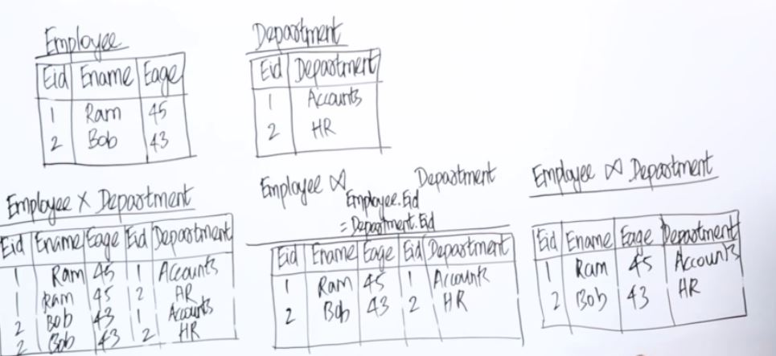

# Data Model
Used to represent the structure of data in the database.
<ul>
    <li>
        <b>ER Model</b> Diagramatic representation (Explanation given below)
    </li>
    <li>
        <b>Relational Model</b> Represented using a collection of tables (Explanation given below)
    </li>
</ul>

## Important terminologies
<ul>
    <li>
        Table (also called as relation)
    </li>
    <li>
        Row (also called as record)
    </li>
    <li>
        Column (also called as field)
    </li>
</ul>

# E-R Model (Entity Relationship Model)
<ol>
    <li>
        Entity -> objects
    </li>
    <li>
        Relationship -> association between entities
    </li>
    <li>
        Attributes -> properties of entities
    </li>
</ol>

For eg., <i>Employee</i> <b>works for</b> <i>Department</i>, Here Employee and Department are entities and "works for" is a relationship.
 

The fields or attributes are shown as below. In the image below, the id is the primary key.

The below image describes the various relationships between the entities

The below images describe the different types of attributes.

<b>Complex Attribute:</b> An attribute which is both composite and multi-valued is called complex attribute.

## Total and Partial Participation

In the below example, Total Participation means that Every department has atleast one employee working in the department. If this is not the case, then this is Partial Participation.

## Cardinality ratio and Degree
Read about the later.

# Relational Model

## Terminology

Let's say we have a table Employee with columns id, name, age.
<ul>
    <li>
        <b>Schema or Entity type: </b> Employee(id, name, age)
    </li>
    <li>
        <b>Entity:</b> This can be any record in the Employee table. For eg., (1, "Mahesh", 23)
    </li>
    <li>
        <b>Relation:</b> This is nothing but the table.
    </li>
    <li>
        <b>Degree of a relation:</b> This is the number of attributes in a relation. In case of employee table, the degree is 3.
    </li>
</ul>

## Constraints
In Relational Model, We should not use composite attributes and multivalue attributes.
For eg., If we have name as a composite attribute with First name and Last name, then in relational model, have 2 attributes each for first and last name.

And also a relation should not have duplicate records.

# Keys

## 1. Super Key
Super Key is a set of attributes which uniquely identify a tuple in a relation. Note: It need not be a single attribute. It is a set of attributes.

<table>
<tr>
    <td>
        EmployeeId
    </td>
    <td>
        Name
    </td>
    <td>
        Age
    </td>
</tr>
<tr>
    <td>
        1000
    </td>
    <td>
        Bob
    </td>
    <td>
        25
    </td>
</tr>
<tr>
    <td>
        1001
    </td>
    <td>
        Sam
    </td>
    <td>
        25
    </td>
</tr>
<tr>
    <td>
        1002
    </td>
    <td>
        Bob
    </td>
    <td>
        26
    </td>
</tr>
</table>

In this case, EmpId, (EmpId, Name) or any set which contains EmpId is a super key

## 2. Key
Key is Minimal Super Key. (It is basically minimal set of attributes which uniquely identify a record (tuple) in a relation.)
In the above example, A1 is the key.

## 3. Candidate Keys
In case, we have more than one keys for a relation, then we say that those keys are candidate keys.

## 4. Primary Key
In a relation, only one primary key can exist for a relation (table). So we can choose one candidate key as a primary key.

# Constraints in relational model (Revisit)

## Constraints
1) No 2 tuples (records) should be same.

2) Every table must have a primary key and that primary key cannot be null. (If we use composite columns as primary key, then any of them can't be NULL.)

## Foreign Key
A set of attributes in a relation which identify as a super key in another or <b>SAME</b> relation. A foreign key can be NULL also.

For eg., If we have an employee table as shown below

<table>
    <tr>
        <td>
            id
        </td>
        <td>
            name   
        </td>
        <td>
            manager_id
        </td>
</table>

In the above table manager_id would have values from id. So manager_id is a foreign key from the same relation.

## Referential Integrity Constraints

Let's say we have the two tables below where DId is a foreign key which refers DeptId in the 2nd table. Then Referential Integrity Constraints say that there cannot be a value of DId which is not present in the 2nd table.

<table>
    <tr>
        <td>
            id
        </td>
        <td>
            name   
        </td>
        <td>
            DId
        </td>
</table>

<table>
    <tr>
        <td>
            DeptId
        </td>
        <td>
            name   
        </td>
</table>

## Constraints Recap
DBMS has to ensure that below constraints are not violated. 

1) <b>Domain Constrain</b>: We can define domains for attributes in a relation and DBMS should ensure that any value outside of the domain is not assigned to the attribute.

2) <b>Key Constraint</b>: Any 2 tuples should not be same in the relation. 

3) <b>Entity Integrity Constraint</b>: Primary key should not be NULL. Because Primary keys are used to uniquely identify a record. But we can say that we can have one primary key of a record which is null and other primary keys of the remaining records as not null. So here we would be uniquely identifying a record. But what if we are using this primary key as a foreign key in some other table. There if we have NULL in the foreign key, we would have confusion whether the record with NULL primary key is linked or No record is Linked. So Primary key cannot be null.

4) <b>Referencial Integrity Constraint</b>: The foreign keys in a relation should have its values from the referred column in the other or same relation.

## On Delete Cascade and On Delete Set Null
In the below table DId refers to DeptId. Now lets say a record from 2nd table is deleted where we have the value of DeptId in the first table also. Now it would violate the reference integrity constraint because there would be some records in table 1 with DId values which does not exist in the 2nd table.

Now in this case, DBMS can either reject the delete operation or perform <b>On Delete Cascade</b> meaning, deleting the rows from 1st table whose DId values are referring the DeptId values which are deleted. Or It can perform <b>On Delete Set Null</b> meaning, we would be setting the deleted DId values to Null.
<table>
    <tr>
        <td>
            id
        </td>
        <td>
            name   
        </td>
        <td>
            DId
        </td>
</table>

<table>
    <tr>
        <td>
            DeptId
        </td>
        <td>
            name   
        </td>
</table>

# Normalization

## First Normal Form
In the image below, the first table is in first normal form and the remaining tables are not in first normal form.

The second table can be converted to FNF as shown above.

As for the 3rd table with multi value attribute, we create two tables and in the 2nd table we can have attributes A and C where (A, C) is the primary key of the table where the A in the 2nd table would act as a foreign key in the first table with (A, B) as attribute.

This decomposition of 3rd table into multiple tables is also called <b>lossless decomposition</b>. Lossless join decomposition is a decomposition of a relation R into relations R1, R2 such that if we perform a natural join of relation R1 and R2, it will return the original relation R.

## 2nd, 3rd, Boyce-Codd Normal Form
Read about this later

# Joins

## Cartesian vs Join vs Natural Join

In cartesian product, we just write all the possible combinations as shown above.

In Join, we do the cartesian product and then remove the rows that are not required. Note that we do not remove one EId columns. And also notice the symbol of join (Spiderman eyes and then we specify the join condition below the symbol)

In Normal join, we do not specify the join condition. But the attribute name should be same in both the relations on which we are doing the join operation. Also we remove the redundant column in natural join.

Also Join is called inner join.

## Left and Right outer join

In Outer Join, The below steps are followed
1) Cartesian Product
2) Filter Rows based on join condition
3) Then based on the type of join (Left, right, outer), the records are then added. For eg., if the join was a left outer join, then After filtering the rows, We have to check which rows are missed from the left table, right those rows and the attributes of the 2nd table table for those rows would be NULL.

In the above example, left outer join is performed.

And also notice the symbols of these outer joins.

# Database Indexing, B and B+ trees

## Introduction

Our Hardisk is divided into multiple memory blocks as shown below. (Note that a memory block can span multiple sectors in hardisk and in many cases, a memory block is equal to 512 bytes.)

When we are storing records, some records may be placed in memory block 1 and some records may be placed in memory block 5 etc. (So storing the records may or may not be sequential)

Now let's say one memory block size is 4 bytes and one record size is 3 bytes, then one record can be filled in the memory block but we would be left with 1 byte left.

So with remaining one byte, we have 2 choices:
1) Either to fill the one byte with one part of record (Spanned Organization).
2) Leave it empty (Unspanned organization).

Database reads and writes in terms of pages (A page size is usually in size which is multiple of size of memory block.)

Higher page sizes can result in reading unnecessary information and space wastage in RAM. whereas Lower page sizes can result in more io operations in disk. 

Now when we do CRUD operations in Database, we have to do so in Pages. Let's say we have to update a record and that record is in a page which has 16 records. So that page would be loaded in RAM, and then the update would happen and finally the page would be written in the disk.

(So for updating one record, the entire page which has 16 records would be loaded in memory.)

Now if we follow spanned organization, we may have to bring multiple memory blocks (which would be time consuming) in RAM to update a record which spans over the multiple memory blocks. But in this case, the space wastage in the blocks can be avoided.

Whereas in unspanned organization, we would be loading the particular memory block in RAM but there can be space wastage in disk (But this would not be time consuming as spanned organization).

As disk is cheap, in most of the cases, we follow unspanned organization. And also accessing multiple blocks in Hard disk is slow.

## Note for deletion and updation
Whenever we delete a record, that record is not yet deleted from the memory block, instead it is marked as deleted. So if any new record needs to be added, then it can be added in this place.

Updation is basically deletion + insertion. We delete the original record and insert a new record with updated values in a memory block which may be different. (Because this would be less costly instead of updating it in place.)

## Organization of files (tables) in disk.

1) Ordered File Organization (Where the records are sorted based on some attributes in the table).

2) Unordered file organization.

# Indexing

In Indexing we maintain a table of the attribute(s) which we index and its corresponding memory block location.

In the above image, we index the relation based on EId. So we have to store another data structure which would store the mapping of EId and the corresponding block pointer.

So when we search by the emp Id, the indexing data structure would be loaded on RAM, and then from there we would get which memory blocks to refer to and then finally those memory blocks would be loaded in RAM.

## Dense Index
If we maintain index for every record, then it is called as Dense Index.

## Sparse Index
If we do not maintain index for every record, then it is called as sparse Index. (Imagine maintaining index for only the first entry in each memory block)