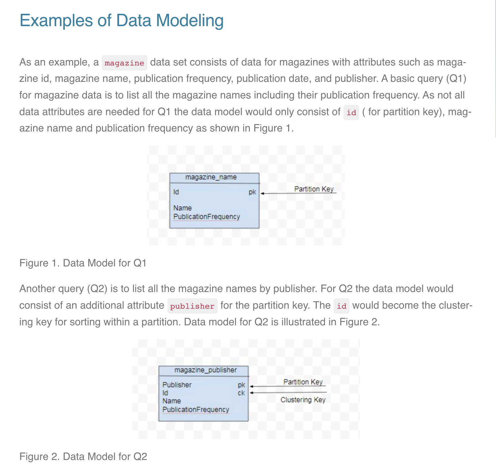
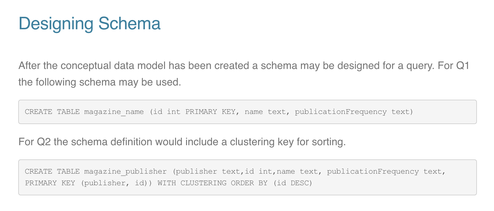
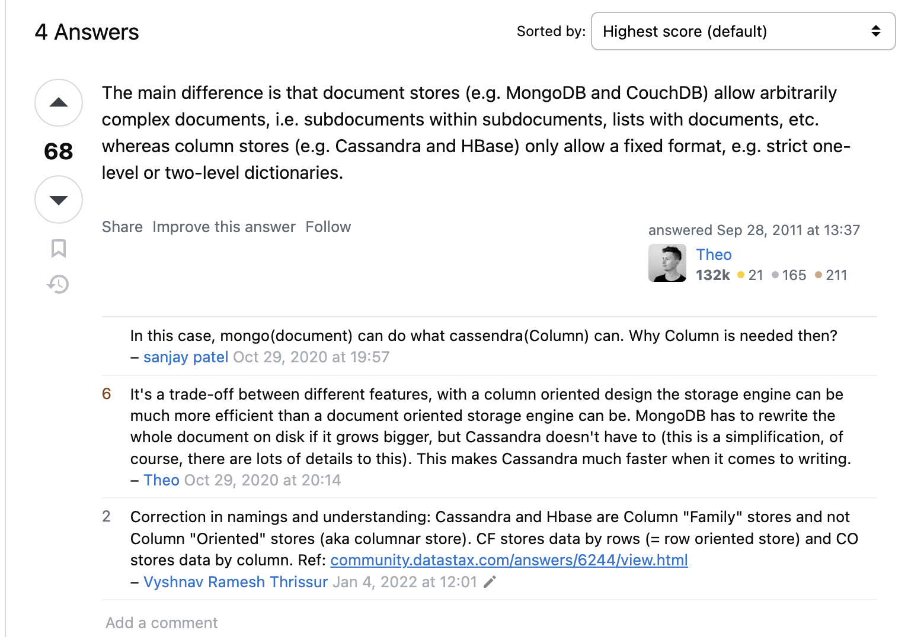

# Cassandra overview

Cassandra official documentation: [here](https://cassandra.apache.org/doc/stable/cassandra)


## Write path in cassandra

### Write operation
When a write operation occurs, the data is first written to a `commit log` for durability.
The data is then inserted into a `memtable, an in-memory data structure`.
The memtable stores the data in a `sorted order based on the clustering key`. This sorting is handled efficiently in memory.

### Flushing to SSTable:

Once the memtable reaches a certain threshold (in terms of size or time), it is flushed to `disk as an SSTable`.
The SSTable is written out as a `sorted structure based on the clustering key`.


### Immutability of SSTables:
SSTables are immutable once written. This means that they do not change, and new data does not require repositioning existing records within these files.

```
Instead of updating SSTables, new writes (including updates) are written to a new memtable and, eventually, a new SSTable.
```

### Compaction:

Over time, multiple SSTables accumulate, some of which might have overlapping data (due to updates and inserts).
Compaction is the process that merges multiple SSTables into a single SSTable. During compaction, data is read from the existing SSTables, merged, and written out in a new, sorted SSTable.

This merging process ensures that the final SSTable maintains the sorted order by clustering key and removes any obsolete data (due to updates or deletes).


### Why This Approach?
- <b>Write Performance</b>: By writing data initially to the memtable and not modifying existing SSTables, Cassandra ensures high write throughput. Writing to an in-memory structure and appending to a commit log are both fast operations.

- <b>Read Performance</b>: Since SSTables are immutable and sorted, reads can efficiently merge data from multiple SSTables. Bloom filters and partition indexes also help in quickly locating the relevant SSTables.

- <b>Compaction Efficiency</b>: Compaction is an I/O-intensive operation, but it is performed in the background. It helps maintain read efficiency by reducing the number of SSTables that need to be checked during reads.


## Comparison with Postgres
### In-Memory Structures:

- Cassandra: Uses memtables to hold in-memory data before flushing to SSTables.
- PostgreSQL: Uses shared buffers to cache data pages before flushing to disk during checkpoints.

### Durability Mechanisms:

- Cassandra: Uses a commit log (WAL) to ensure that writes are durable before they are acknowledged to the client.
- PostgreSQL: Uses a WAL to log all changes before they are applied to data files, ensuring durability.

### Flushing to Disk:

- Cassandra: Periodically flushes memtables to immutable SSTables on disk. Compaction merges SSTables over time.
- PostgreSQL: Periodically performs checkpoints to flush dirty pages from shared buffers to disk.

### Recovery:

- Cassandra: Uses the commit log to recover from crashes by replaying log entries that have not yet been flushed to SSTables.
- PostgreSQL: Uses the WAL to replay changes and recover the database to its last consistent state after a crash.

## Data modeling
- Unlike a relational database model in which queries make use of `table joins` to get data from multiple tables, `joins are not supported in Cassandra`, so all required fields (columns) must be grouped together in a single table. Since each query is backed by a table, data is duplicated across multiple tables in a process known as denormalization.

-  Consider the below statement
```
CREATE TABLE t (
   id int,
   c text,
   k int,
   v text,
   PRIMARY KEY (id,c)
);
```

For the table t with a composite primary key `the first field id` is used to generate the `partition key` (For distributing into shard) and `the second field c` is the `clustering key` used for sorting within a partition. 

Note that even though we define the schema for the table, we can insert rows with any column values (But primary key must be present) as schema is flexible.


Consider this query
```
CREATE TABLE t (
   id1 int,
   id2 int,
   c1 text,
   c2 text
   k int,
   v text,
   PRIMARY KEY ((id1,id2),c1,c2)
);
```
The `id1, id2` is used to get the `shard key` and the data is stored sorted by `c1` and if there is a conflict, then `c2`.

NOTE:
```
Apache Cassandra does not have the concept of foreign keys or relational integrity. 

Apache Cassandra’s data model is based around designing efficient queries; queries that don’t involve multiple tables. 

Relational databases normalize data to avoid duplication. Apache Cassandra in contrast de-normalizes data by duplicating data in multiple tables for a query-centric data model. 

If a Cassandra data model cannot fully integrate the complexity of relationships between the different entities for a particular query, client-side joins in application code may be used.
```


## Apache Cassandra’s data model is based around designing efficient queries; queries that don’t involve multiple tables.

In relational databases, normally we design the tables first and then plan on queries.

But in cassandra, we design the queries according to our usecase and then design the tables.

Cassandra does not support:
- <b>Joins</b>: All the data required should be in one table. This would also result in data inconsistency as data may be duplicated in other tables, but read times are faster.
- <b>Foreign keys</b>: Understandable as joins are not supported.
- <b>Order by</b>: Design the clustering index in such a way that sorting is supported because cassandra does not support order by.




In the above design, we can see that in two tables, name is duplicated.


# Design Differences Between RDBMS and Cassandra (This section is taken from cassandra offical docs)
Let’s take a minute to highlight some of the key differences in doing data modeling for Cassandra versus a relational database.

## No joins
You cannot perform joins in Cassandra. If you have designed a data model and find that you need something like a join, you’ll have to either do the work on the client side, or create a denormalized second table that represents the join results for you. This latter option is preferred in Cassandra data modeling. Performing joins on the client should be a very rare case; you really want to duplicate (denormalize) the data instead.

## No referential integrity
Although Cassandra supports features such as lightweight transactions and batches, Cassandra itself has no concept of referential integrity across tables. In a relational database, you could specify foreign keys in a table to reference the primary key of a record in another table. But Cassandra does not enforce this. It is still a common design requirement to store IDs related to other entities in your tables, but operations such as cascading deletes are not available.

## Denormalization
In relational database design, you are often taught the importance of normalization. This is not an advantage when working with Cassandra because it performs best when the data model is denormalized. It is often the case that companies end up denormalizing data in relational databases as well. There are two common reasons for this. One is performance. Companies simply can’t get the performance they need when they have to do so many joins on years’ worth of data, so they denormalize along the lines of known queries. This ends up working, but goes against the grain of how relational databases are intended to be designed, and ultimately makes one question whether using a relational database is the best approach in these circumstances.

A second reason that relational databases get denormalized on purpose is a business document structure that requires retention. That is, you have an enclosing table that refers to a lot of external tables whose data could change over time, but you need to preserve the enclosing document as a snapshot in history. 

```
The common example here is with invoices. You already have customer and product tables, and you’d think that you could just make an invoice that refers to those tables. But this should never be done in practice. Customer or price information could change, and then you would lose the integrity of the invoice document as it was on the invoice date, which could violate audits, reports, or laws, and cause other problems.
```

In the relational world, denormalization violates Codd’s normal forms, and you try to avoid it. But in Cassandra, denormalization is, well, perfectly normal. It’s not required if your data model is simple. But don’t be afraid of it.


## Query-first design
Relational modeling, in simple terms, means that you start from the conceptual domain and then represent the nouns in the domain in tables. You then assign primary keys and foreign keys to model relationships. When you have a many-to-many relationship, you create the join tables that represent just those keys. The join tables don’t exist in the real world, and are a necessary side effect of the way relational models work. After you have all your tables laid out, you can start writing queries that pull together disparate data using the relationships defined by the keys. The queries in the relational world are very much secondary. It is assumed that you can always get the data you want as long as you have your tables modeled properly. Even if you have to use several complex subqueries or join statements, this is usually true.

By contrast, in Cassandra you don’t start with the data model; you start with the query model. Instead of modeling the data first and then writing queries, with Cassandra you model the queries and let the data be organized around them. Think of the most common query paths your application will use, and then create the tables that you need to support them.

Detractors have suggested that designing the queries first is overly constraining on application design, not to mention database modeling. But it is perfectly reasonable to expect that you should think hard about the queries in your application, just as you would, presumably, think hard about your relational domain. You may get it wrong, and then you’ll have problems in either world. Or your query needs might change over time, and then you’ll have to work to update your data set. But this is no different from defining the wrong tables, or needing additional tables, in an RDBMS.

## Designing for optimal storage
In a relational database, it is frequently transparent to the user how tables are stored on disk, and it is rare to hear of recommendations about data modeling based on how the RDBMS might store tables on disk. However, that is an important consideration in Cassandra. Because Cassandra tables are each stored in separate files on disk, it’s important to keep related columns defined together in the same table.

A key goal that you will see as you begin creating data models in Cassandra is to minimize the number of partitions that must be searched in order to satisfy a given query. Because the partition is a unit of storage that does not get divided across nodes, a query that searches a single partition will typically yield the best performance.

## Sorting is a design decision
In an RDBMS, you can easily change the order in which records are returned to you by using ORDER BY in your query. The default sort order is not configurable; by default, records are returned in the order in which they are written. If you want to change the order, you just modify your query, and you can sort by any list of columns.

In Cassandra, however, sorting is treated differently; it is a design decision. The sort order available on queries is fixed, and is determined entirely by the selection of clustering columns you supply in the CREATE TABLE command. The CQL SELECT statement does support ORDER BY semantics, but only in the order specified by the clustering columns.


## How does document oriented defer from columnar databases since both offer flexible schema

Refer [this stackoverflow](https://stackoverflow.com/questions/7565012/how-does-column-oriented-nosql-differ-from-document-oriented).




