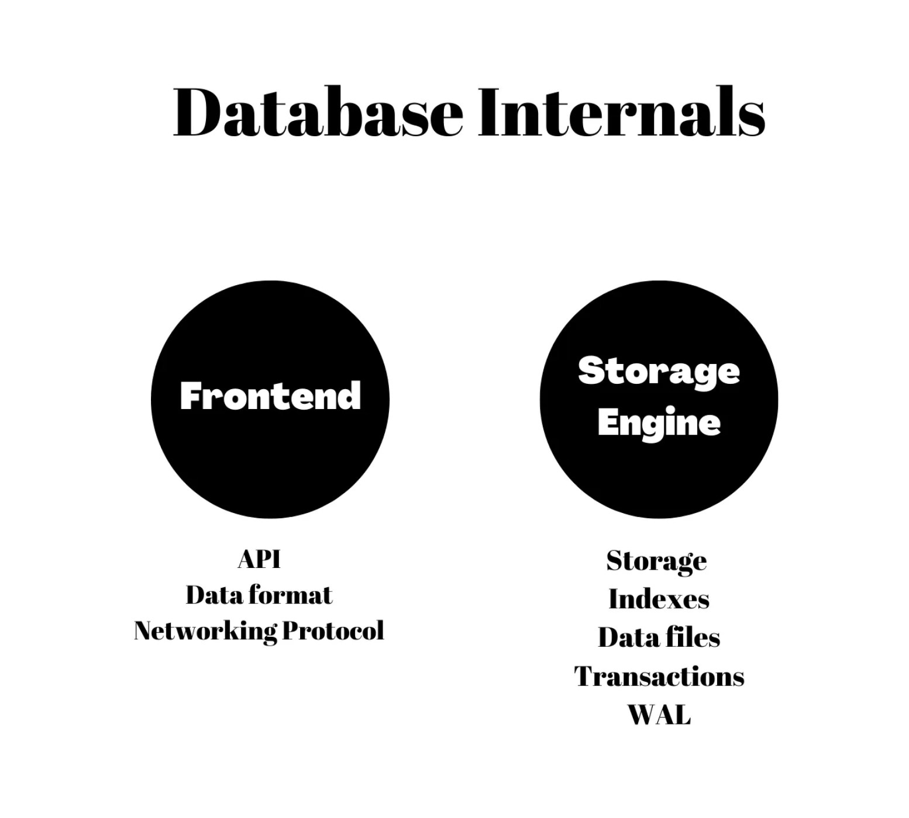
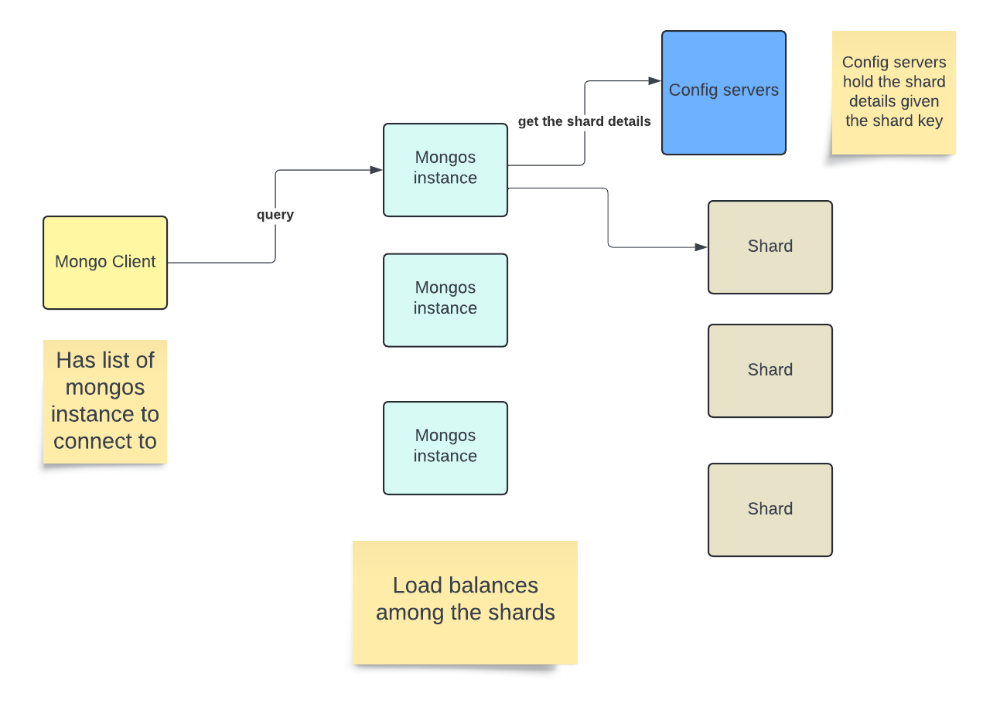

# Mongo Internals Overview

Refer: [Hussein Nasser's medium post.](https://medium.com/@hnasr/mongodb-internal-architecture-9a32f1403d6f)

An important line from him:

<b><i>A database to me is two parts. A frontend and a backend. The frontend is the API (SQL vs get/set) & data format (tables vs documents). The backend is the storage engine defines how data is stored on disk, indexes, WAL etc.

The core difference between SQL/NOSQL is the frontend.</i></b>




## Documents and collections
MongoDB is a document based NOSQL database which means it doesn’t deal with relational schema-based tables but rather non-relational schema-less documents.

Users submit JSON documents to Mongo where they are stored internally as `BSON` (Binary JSON) format for faster and efficient storage. Mongo retrives BSON and cover them back to JSON for user consultation.

BSON stands for `Binary JSON`

## BSON 

Refer [BSON spec.](https://bsonspec.org/)

```
BSON was de­signed to have the fol­low­ing three char­ac­ter­ist­ics:

Lightweight
Keep­ing spa­tial over­head to a min­im­um is im­port­ant for any data rep­res­ent­a­tion format, es­pe­cially when used over the net­work.

Traversable
BSON is de­signed to be tra­versed eas­ily. This is a vi­tal prop­erty in its role as the primary data rep­res­ent­a­tion for Mon­goDB.

Efficient
En­cod­ing data to BSON and de­cod­ing from BSON can be per­formed very quickly in most lan­guages due to the use of C data types.
```

### JSON VS BSON

JSON Representation
```json
{
  "name": "John Doe",
  "age": 30,
  "isMember": true
}
```

BSON Representation of the same
```bson
\x16\x00\x00\x00            // total document size (22 bytes)
\x02                        // type: string
name\x00                    // field name
\x08\x00\x00\x00            // string length (8 bytes)
John Doe\x00                // string value
\x10                        // type: int32
age\x00                     // field name
\x1e\x00\x00\x00            // int32 value (30)
\x08                        // type: boolean
isMember\x00                // field name
\x01                        // boolean value (true)
\x00                        // end of document
```

### Characteristics in the above BSON
- Lightweight: The BSON representation is compact, adding minimal overhead with type bytes and field names, but no additional encoding like `JSON's quotation marks and delimiters`.

- Traversable: BSON's prefixing with type and size information allows MongoDB to efficiently `skip over parts of the document` without parsing every byte.

- Efficient: BSON uses native C data types, making encoding and decoding fast in most programming languages.


## Compression of BSON
Mongo further compresses BSON to reduce the size.

## Flexibility
MongoDB is a schema less database, meaning two documents in the same collection may have completely different fields.

## _id index
Mongo official documentation: [here](https://www.mongodb.com/docs/manual/reference/method/ObjectId/)

When we create a document in the collection, a `primary key` is created which is also inserted in the `B+ tree` so that search is faster.

The primary key in mongo is of `12 bytes`.

The 12-byte ObjectId consists of:

- A 4-byte timestamp, representing the ObjectId's creation, measured in seconds since the Unix epoch.

- A 5-byte random value generated once per process. This random value is unique to the machine and process.

- A 3-byte incrementing counter, initialized to a random value.

```
The 5-byte random value which is unique to the machine is used to uniquely identify the document across shards.
```

```
User can override the _id field with a value of their choosing which could make the key even larger. 
```

## Mongo's first database engine MMAPV1
MMAPV1 stands for `Memory Map files Version 1`.

Major problems with this storage engine:
- BSON documents are stored directly on disk uncompressed.
- Single global database lock for writes, which means only 1 writer per database can write at at time, signfically slowing down concurrent writes.

## Mongo's current database engine WiredTiger

Mongo acquired `WiredTiger` in 2014 and it solves the limitations which were present with `MMAPV1`.




Also refer Kafka design [here](../../../Kafka/Kafka%20Theory/README.md).

```
In Kafka clients handle the logic of broker selection and direct communication based on metadata, MongoDB clients rely on mongos instances to abstract and manage the routing of queries to the appropriate shards. 

This design simplifies the client-side logic for MongoDB applications, allowing mongos to handle the complexities of shard key distribution and query routing.
```


