# Section 2: ACID

## What is a Transaction?
A transaction is basically collection of queries. 
For eg., If we want to deposit some amount in an account, We will have a transaction which has the following queries:
1. SELECT (The from and to accounts)
2. UPDATE (The from and to accounts)

### Transaction lifetime
1. BEGIN: Begin the transaction and execute the queries in memory. (There are also databases which would write in disk while queries are getting executed)
2. COMMIT: After the execution of queries is complete, commit all the changes in the database. (If the data is already in disk, then the database may just a set a flag indicating that the commit has been successful)
3. ROLLBACK: (Anything goes wrong in the commit phase or while executing the query, rollback would have to handle it)

### Example
Transfer 1000 dollars from account 1 to account 2.
```
BEGIN TRANSACTION

SELECT balance of account1
balance >= 1000
    UPDATE balance of account1
    UPDATE balance of account2

COMMIT TRANSACTION
```

## Atomicity
Atomicity simply means that all the queries in the transaction must either succeed completely or if any one of the query in the transaction fails, the the entire transaction should fail. All the prior successful queries would have to rollback.

(The name of the concept is derived from the word "atom" because atom cannot be split. Well, now using nuclear fission, we can split, but in 1970s when this concept was introduced, then there was no concept of atom splitting)


Case 1: Before commit, if one of the queries fail, then the database would have to flush everything which is in memory.

Case 2: During commit, if the commit fails, then the database would have to rollback the existing commit changes which were in disk.


(See there are some databases which would write in disk while the queries are getting executed. In this case, when we commit, the database system may have a commit flag which it would set to 1. And in this case, the commits are faster, but rollbacks are a pain if they are needed to be done before committing)

Lets say we have 2 accounts: Account1 and Account2 with balance 1000 and 500. And we want to deposit 100 from account1 to account2.

```
BEGIN TRANSACTION
    SELECT BALANCE from Account1
    BALANCE >= 100
        UPDATE BALANCE from Account1
        ... database crashed here
```

Now when our database restarts, there can be 2 cases:
1. The database persists in disk before commiting. In this case, it has to check, whether the commit was successful or not, and if the commit was a failure, then it would have to rollback.
2. The database persists in memory before commiting. In this case, the memory has already been flushed, so there are no problems.

## Isolation

### 1. Read phenomenon
#### (a). Dirty reads
Reading something which other transaction has written but not committed yet. So there is a chance that this change that we just have read, could be rolled back also (Because it has not been committed yet). 
NOTE: If there are no uncommitted changes to be read, then the transaction reads the committed changes.

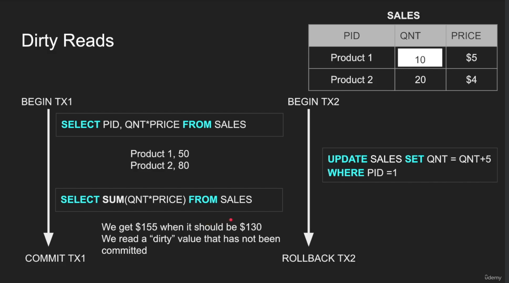

#### (b). Non repeatable reads
Non repeatable reads are the reads in a transaction where a row is fetched twice and the values in the row are different because some other transaction changed this row which this transaction was going on.
```
Example:
First Read: We read the balance, which is 1000.
Meanwhile, a separate transaction (Transaction 2) is executed, which deducts 200 from the same account.
Second Read: We read the balance again, and now it is 800.
```

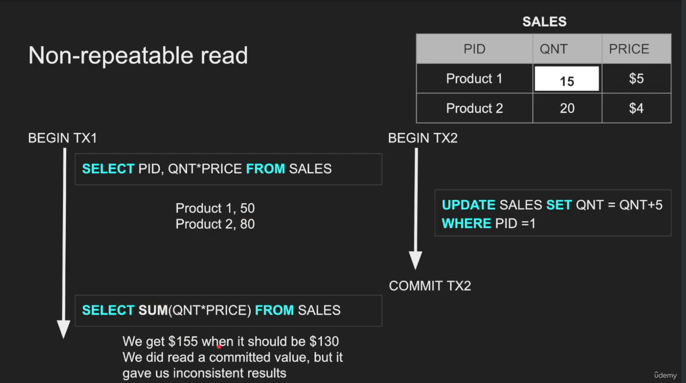

#### (c). Phantom reads
Phantom reads are the reads which occurs when a transaction re-executes a query returning a set of rows and finds that the set of rows has changed because another transaction has committed which involved adding or deleting some rows.
<b>NOTE: This is different from non repeatable reads because in non-repeatable reads, values in same row changes, but in phantom reads, new rows are added or deleted</b>.

```
Example:
Transaction 1 reads 10 rows which have balance over 1000
Transaction 2 adds a new row wich balance 2000
Now when transaction 1 reads the rows which have balance over 1000, it finds that there are 11 rows (1 row committed by the transaction 2)
```
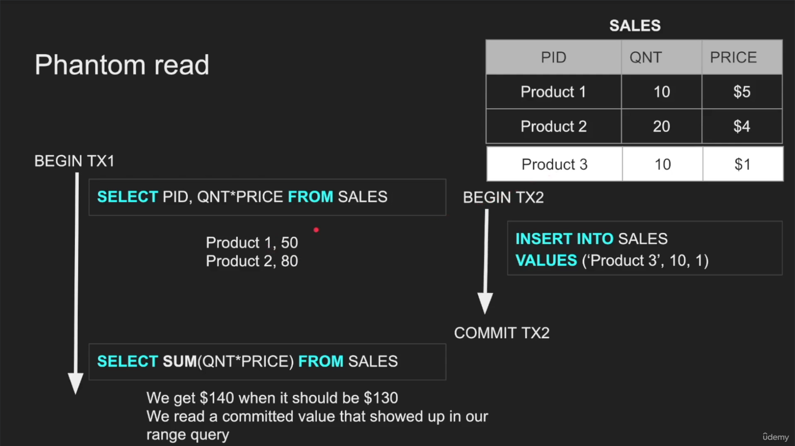

#### (d). Lost Updates
Lost updates happen when changes made by a transaction are overwritten by the changes made by other transactions.

```
Example:
Transaction 1 reads balance of 1000 and adds 100, to update it to 1100
Transaction 2 reads balance of 1000 and adds 200, to update it to 1200
Transaction 1 commits
Transaction 2 commits (Overwrites the update made by transaction 1)

And now balance is 1200. It should have been 1300.
But in this case, if dirty read is enabled, then this would not happen.
```

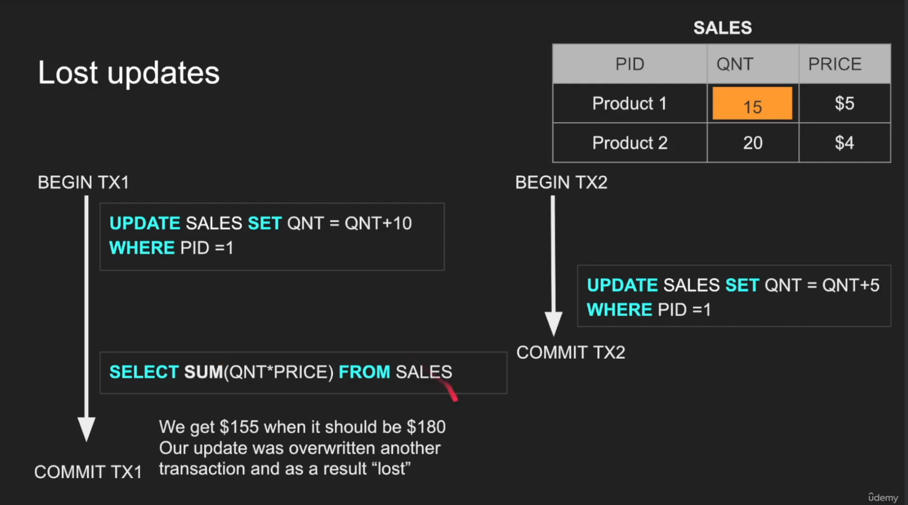

### 2. Isolation Levels
(READ MORE ABOUT THESE LEVELS IN SECTION 8: CONCURRENCY CONTROL)
#### (a) Read Uncommitted
Any change from outside is visible to an inflight transaction (Committed or not).


#### (b) Read Committed
Each query in a transaction only sees the committed changes made by other transactions.


#### (c) Repeatable reads
The transaction will make sure that when a query reads a row, that row will remain unchanged until the transaction is running.


#### (d) Snapshot
Each query in a transaction only sees the changes that have been committed before the transaction starts. It's like a snapshot version of the database. We don't get phantom reads here.

#### (e) Serializable
This is the highest level of isolation. Each transaction runs as if they are serialised one after the other even though they are running concurrently.

## Isolation levels vs Read Phenomena
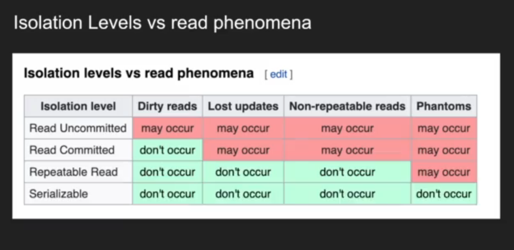

```NOTE: Each database implements the isolation levels differently. Which means that the result we get for an isolation level in a database may not necessarily match with the result in other database with the same isolation level```


## Consistency
Consistency in ACID is about correctness and integrity of the data within a <b>single database</b>. (For eg., in account update, both sender and receiver balance should be updated otherwise there would be inconsistency in the data). This is different from Consistency in CAP where it refers to same data across a <b>distributed system</b>.

## Durability
Durability is basically persisting the data in a non volatile storage system. Even if the database crashes, when the database is up, all the data which was previously committed should show up.

A lot of databases play around with it. One example is that a database writes to memory and ocassinally writes the snapshot to the disk (Because writing everytime to the disk is slow).

### Durability techniques
#### WAL - Write ahead log
In this technique, before committing to the database, logs are written in the log file and once the changes are written to the database, then a checkpoint is made in the log file which signifies that this commit or transaction was completed.

Now if any error happens during the commit phase, then the logs are replayed from the last checkpoint on the latest committed database to restore.

#### Asynchronous snapshot
Here as we write, we keep everything in memory and periodically we persist in the disk. If any crash occurs, then last snapshot of the database and the logs from that time are used to restore. 

Redis uses both WAL and Asynchronous snapshot.

### OS Cache
When the database tells os to write the changes to the disk, OS writes all the changes to its own cache called OS cache and tells the database that it has written successfully. (OS does this because it wants to write to disk in batches since writing to disk is slow). Now if the system crashes during this period, We will still face data loss even though we got commit as success, because OS never wrote to disk from its cache.

To resolve this, database uses ```Fsync OS command```, which forces writes to always go to disk.

Fsync can be expensive and slows down commits.

## ACID Quiz
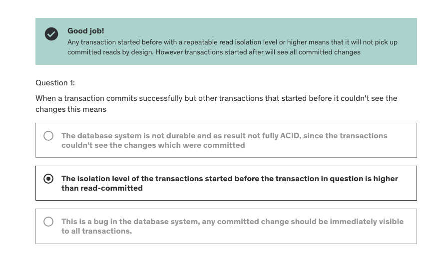
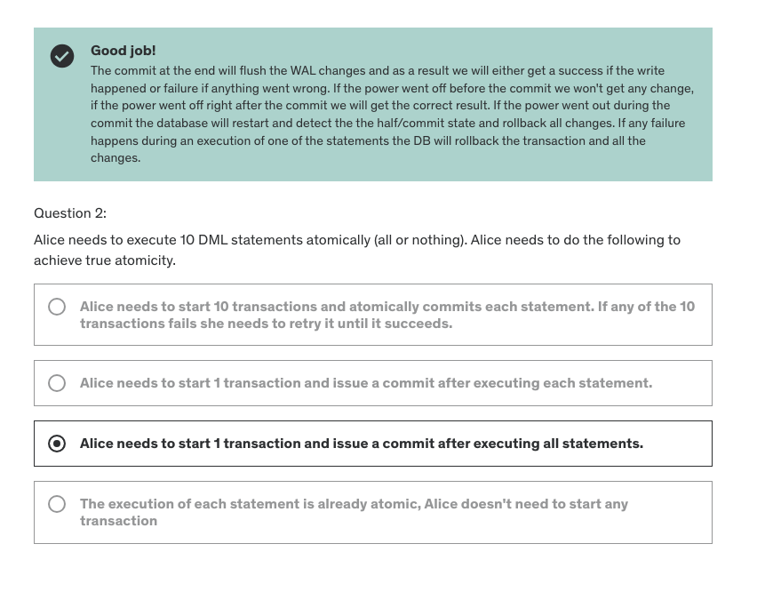
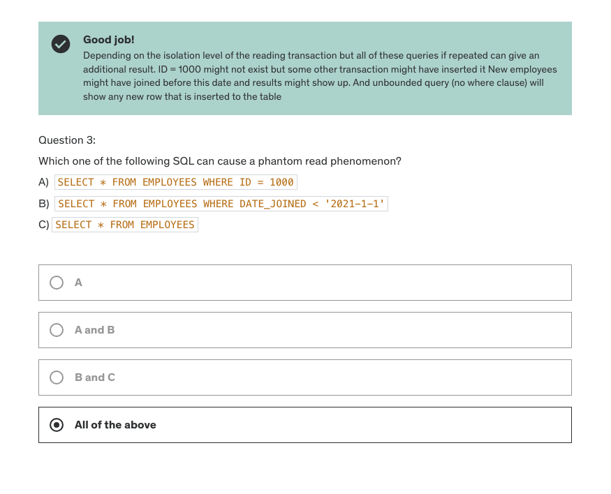
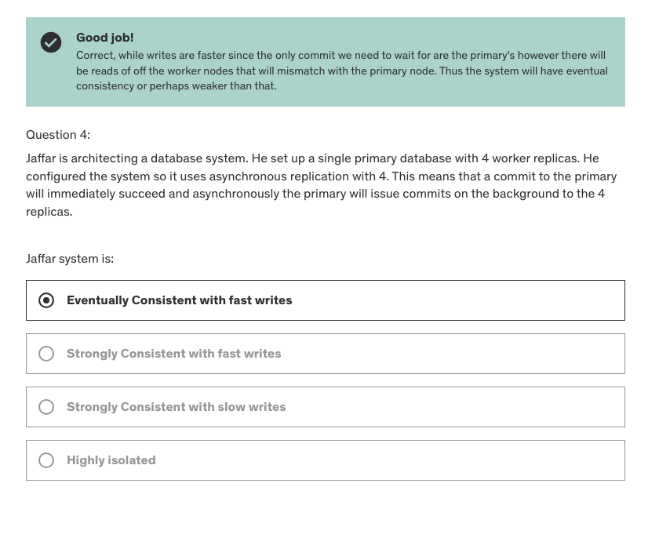
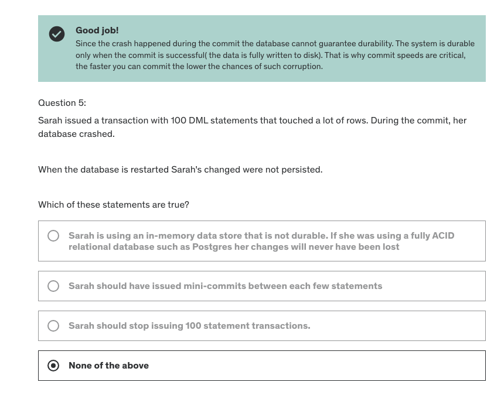
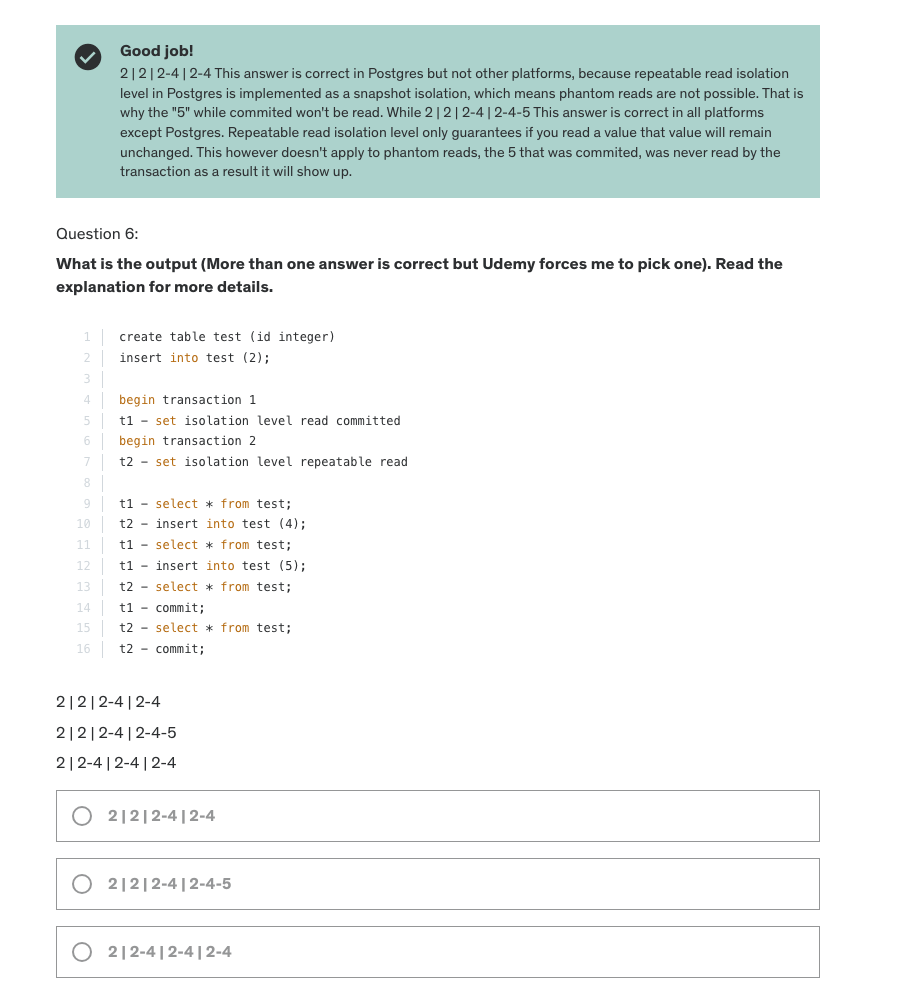
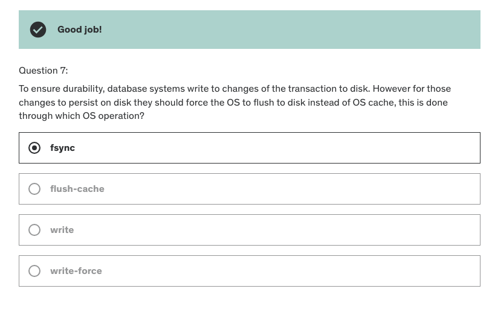
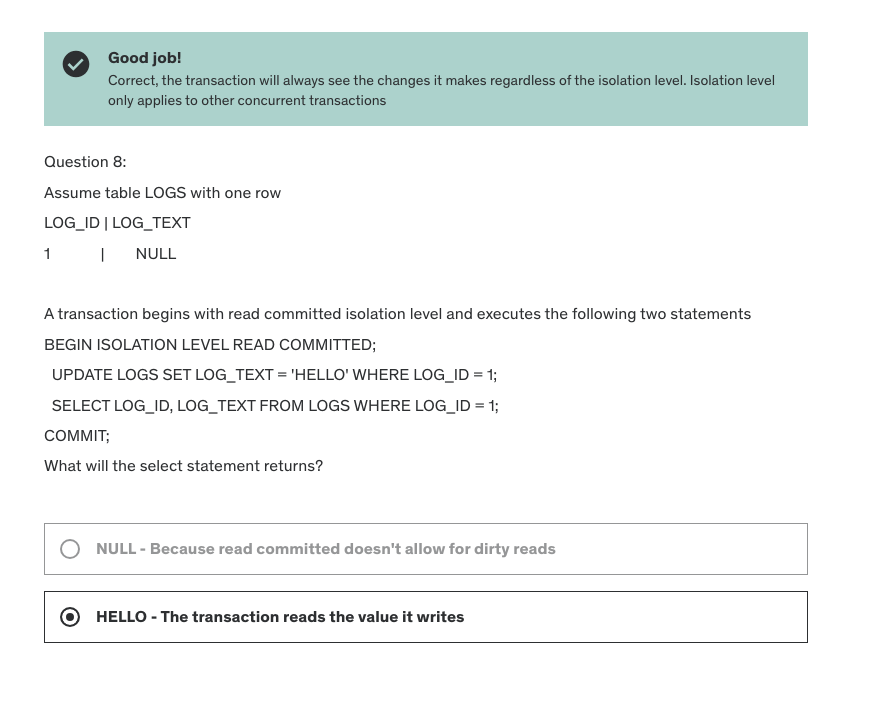
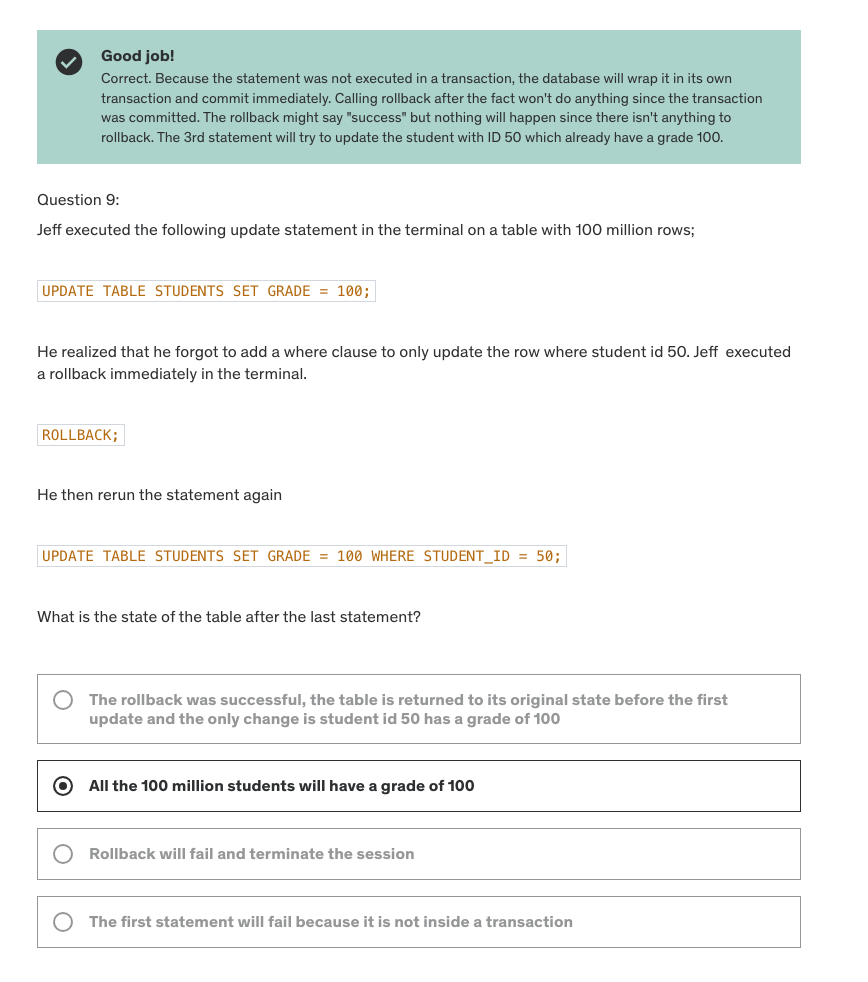
