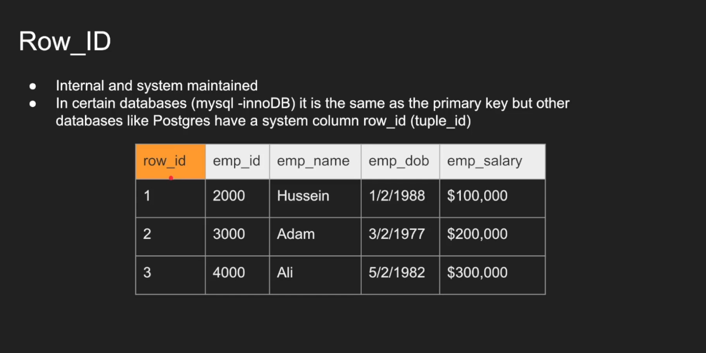

# Database Internals
## Storage concepts
1. Table
2. Row_id
3. Page
4. IO
5. Heap data structure
6. Index data structure b-tree
7. Example of a query

### Table


### Row id


### Page
Pages are nothing but fixed size memory location where rows are stored.


Pages are fixed-size units in a database where rows of data are stored. This structure allows databases to manage and access data in an organized and efficient way.

Database Reading in Pages:

Databases read and write data in terms of pages. When a specific row is needed, the database retrieves the entire page containing that row from the disk to memory. This approach is more efficient than reading individual rows directly from the disk.

Efficiency of Reading Pages vs. Individual Rows:

Reading entire pages reduces the number of I/O operations compared to reading individual rows. It minimizes disk seek time, as fewer disk accesses are required to retrieve the same amount of data. Databases also strive to store pages in contiguous memory locations on disk to reduce fragmentation and further decrease seek times.

Large Page Size and Unnecessary Data:

If the page size is too large, there's a risk of reading more data than necessary. This can lead to inefficient use of memory and potential performance issues, as significant portions of the large pages might not be relevant to the current data access requirements.

Small Page Size and Increased Seek Time:

Conversely, if the page size is too small, the database may incur higher seek times because it needs to perform more I/O operations to access an equivalent amount of data spread across more pages.

Additional Considerations:

Cache and Buffer Management:

Modern databases use sophisticated cache and buffer management strategies. They keep frequently accessed pages in memory to speed up data access and reduce the need for disk reads.

Balance in Page Size:

Finding the optimal page size is a matter of balancing these factors. It often depends on the specific workload, access patterns, and the characteristics of the underlying hardware.

### IO
Note: An IO often corresponds to a single page read. If for finding a record, the DBMS goes through 500 pages, then that means there were 500 IO requests.


### Heap
In databases, a heap refers to a heap file organization where data (pages) are stored in no particular order. As new data is added, they are placed in the first available location in the memory (Note: The heap in database is different from the heap data structure).


### Index
Indexes are data structures which have pointers to the pages present in the heap. It makes searching very efficient.


In Page 0 for indices, the first entry is 10 (1, 0). It means that employee id is 10, which is present in row 1 in page 0 of employee data.


#### Example

If there are no indices created, then database system has to search through all the pages in the heap to get the data. Some databases do threading to efficiently search through all the pages.


With indices on ```EMP_ID```, the database would know which page and which row to search for, from the index and then the database would exactly pull out that page and the row.

### Notes


## Row-Based vs Column-Based databases 
Let's say we have the below table


And now we want to execute the below queries


Now for row oriented database, the below would be the case


Now for the first query, the dbms searches for the pages one by one (Assuming no threading and no indices), and then once it finds the page, it gets all the columns of that row (Note: We wanted only the first_name)


If we execute the second query


Now for the third query, we want only the sum of the salary, but we have to read every column for all the rows. And that's a lot of IO and it becomes very expensive.


### Columnar databases


If we execute the first query in the columnar database, we notice that the number of IO operations is much less than row based database


In the above table, we first search for the primary id for which ssn is 666, and then we search for first_name page with the corresponding id.

But notice that if we delete any id, then it has to be deleted from all the pages of all columns.

Now, lets execute the second query


Notice how many IO operations it takes it get the data for id = 1, It is far more than that of row based database. 

```If your database has frequent select *, then please don't use columnar database```

And lets execute the third query


Only one IO is needed. That's it. Compared to row based database, this is much optimal.

### PROS and CONS
Note: OLAP stands for Online Analytics processing and OLTP stands for Online Transaction Processing (Optimized for transactions like INSERT, UPDATE and DELETE operations)
 

## Primary Key And Secondary index
A primary key (Primary index) is a single or collection of fields that uniquely define a record

A secondary index is an index that is created on keys that is not a primary key.

For eg., Lets say a primary key on a table is (order_id, product_id), then a secondary index can be just product_id or any other field but not the primary key which is (order_id, product_id)

### Characteristics of primary key:
<b>Uniqueness</b>: Since the primary key is unique for each record, the primary index also enforces this uniqueness.

<b>Ordering</b>: In many cases, the primary index is a clustered index. This means that the physical order of the rows in the storage medium is the same as the order of the primary key. In such cases, the table can have only one clustered index.

How does the dbms maintain ordering? Some databases may allocate bit of extra space on each page to allow for some amount of data insertion without needing to reorganise the entire table.

Over time, as rows are inserted and deleted, the data can become fragmented. Periodic maintenance tasks, like reorganizing or rebuilding indexes, are used to manage this fragmentation.

<b>Trade-offs</b>: The decision to use a clustered index, especially on multiple columns, involves trade-offs. While it can speed up certain types of queries (like range scans), it can also slow down insert, update, and delete operations, particularly if these operations frequently involve middle-of-the-table data in a large table.

<b>Efficiency</b>: The primary index is highly efficient for queries that involve the primary key, such as finding a row by its primary key or finding range queries involving the primary key.

<b>Usage</b>: It's used for fast access to a record when the primary key is known. For example, looking up a customer's details using their customer ID.

Not all databases automatically create the clustered index if you have a primary key in the table. MySQL does it, but postgres does not.

