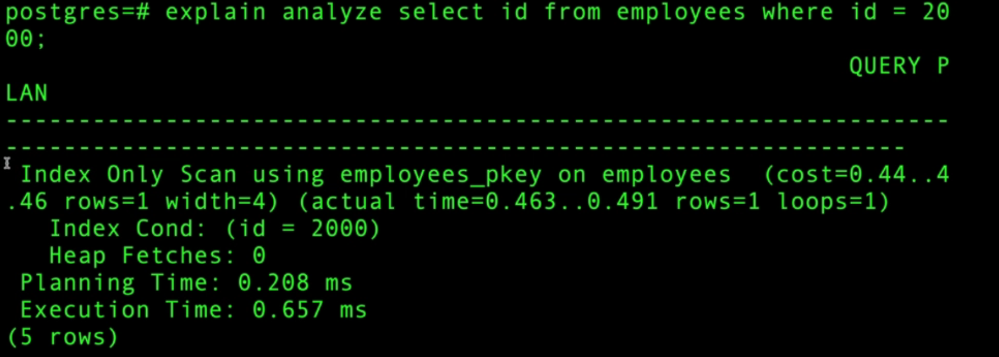

# Database indexing
## Create Postgres table with million rows
Step 1: Spin up postgres using the following command

```docker run -e POSTGRES_PASSWORD=postgres --name pg postgres```

```docker exec -it pg psql -U postgres```

Step 2: Next create table and insert the millon rows

```
create table temp(t int); 

insert into temp(t) select random() * 100 from generate_series(0, 100000);
```

## Getting started with indexing
Suppose We have an employees table, ```\d employees``` gives the below info


id is not null and sequencial (as we can see from the image) and also the primary key is an index by default. It is a btree index.

Now in postgres, we have ```explain``` and ```explain analyze``` commands. Explain command tells us the query plan and explain analyze tells the query plan along with the planning time and execution time.

Now if we execute ```explain analyze select * from temp limit 10```, we get the below result.


If we only used the ```explain``` command, we would have just gotten the query plan and not the planning time and execution time info.

Let's go through the above image step by step.
1. The dbms lists down the query plan. Basically it lists down the ways it can take to achieve the same result and then selects the minimum cost way. In this case, it only lists down only one way
2. Next we can see in the query plan, it lists down the sequences with ```->``` arrow (Refer the below image for the significance)

3. ```cost``` signifies the operation cost in ms. Whichever operation has the lowest cost, the dbms would go with that. ```cost=0.00..0.14``` means the start cost is 0.00 and end cost is 0.14 and the total cost is ```end_cost - start_cost``` which is 0.14. (Note this is an estimate cost. The actual cost may significantly differ). The start cost is basically the time it starts to fetch the first page. If the start cost is more, then the dbms is doing some work before starting to fetch the first page.
5. Then we have ```actual time=0.046...0.052 rows=10 loops=1```, which means the limit operation took a time of 0.006 seconds (```end_time - start_time = 0.052 - 0.046```) and It iterated through 10 rows only for 1 time.
6. ```->``` arrow signifies that the result from ```Seq scan``` is fed into the ```Limit``` operation.
7. In the seq scan, we can see that cost is 1443.01 and rows is 100001, but the actual cost is way less and actual rows is 10 (This is an optimization done by dbms for the ```limit``` operation) 
7. We can also see that before the ```Seq scan``` ended, the ```Limit``` operation started. Actually What may have happened is that, once seq scan started returning the rows, the ```Limit``` operation started processing, instead of waiting for all the rows to be returned.
8. Next we have ```planning time``` (Basically the time taken to compute the most efficient way to achieve the result)
9. And then we have the ```execution time``` which is the total time from the start of the transaction to the end of the transaction. (It includes everything such as query parsing, planning, execution etc)


And If we execute the same query again just after query, then the execution time may be much lower because dbms may store the results in cache.

Now for the below query



We can see that heap fetches are 0, which means the dbms did not go through the pages as we had just selected id which is already there in the index data structure.

And for the below query, we are searching by name, which is not an index, so dbms will do a full table scan, (We can see that there is parallel seq scan on employees). The time for the below query took around 3 seconds.


And if we use queries which has ```like '%{search_string}%```, indexes also cannot save us. This is the worst.

And notice the below query (We already created the index on name in employees table)


In the above image, we can see that BitMap index scan is done, and then the result is fed into the bitmap heap scan for the result. (We can also see the ```expected_rows = 563``` and ```Heap Blocks: exact=560```), These are two different things. Heap blocks is the page count it took to extract the rows.

Also We can see two things here. (Bitmap Index Scan and Bitmap heap scan). 
```Bitman index scan```: Here the db engine is going through the index and finding the pages that it needs to look into to get the data and adding those pages in the bitmap (More on bitmap below).
```Bitmap Heap Scan```: Now database goes through the bitmap and plucks the necessary pages.

And notice the below query:


In the above image, we can see JIT (Just in time compilation)
1. Functions: The number of functions which has been identified for JIT compilation
2. Options: Inlining (Refers to function inlining), optimzation (Loop unrolling, caching etc), expressions (Whether to compile expressions like arithmetic expressions to machine code before hand), deforming (JIT compiling the deformation process that optimizes the extraction of specific columns once we have the page)
3. We can see ```Gather``` at the start. This is because, there are threads spawned for execution of the queries and then we merge the results returned by the threads and this is done in the ```Gather``` step.

## Understanding the SQL Query Planner and Optimizer with Explain

Let's say we have the below table


Query 1:


The cost, rows, width are also estimations. The first number in cost is basically ```time dbms starts to fetch the first page``` and the last num is basically ```the time when the dbms fetches the last page```. If the start time is more, then that means dbms is doing some work to before fetching the first page. ```width``` is also an estimation of the size of the fields selected in the query, as we can see we have a ```name``` field, so most probably, it does an average for all the sizes for this entry to get the row size.

Query 2:


## Bitmap index scan vs index scan vs table scan

Lets say we have the following grades table 


Query 1:


Query 2:

In the below query, as we have many many rows, the dbms decides not to do index scan, and directly do sequencial scan because it is almost equal to getting the complete data from the table.


Query 3:

In the below query, we can see that there is something called bitmap index scan and bitman heap scan


WHAT IS A BITMAP

Bitmap is basically an array of bits where bitmap[i] = 1 denotes that we have to pull page i from the disk. So what happens here is that we construct the bitmap while scanning the index and use the bitmap to pull out all the required pages from the heap.


In normal index scan, what happens is, we pull out the first matching page location, then go to the heap to fetch the page, and then go back again to the index to fetch the page location and then go back to the heap again and so on...


So normal index scan is beneficial when we have less pages to pluck from the heap (We do not create bitmap here because there is overhead in creating the bitmap).

And bitmap index scan is beneficial when we have number of pages to pluck but the number is sort of between the index scan and seq scan. bitmap index scan sits between normal index scan and the sequencial scan.

```
And also notice there is something called RECHECK COND, In normal indexes, they store the page location as well as the row location. But in bitmap, only the page location is stored and not the row location. So that is why once the dbms gets the pages in bitmap heap scan, it then rechecks the condition to pull out the specific rows it needs.
```

In normal bitmap, it is also easier to do OR, AND operations etc (Refer the below query).


```
NOTE: As we know, query results are often stored in cache for efficient performance.

To know whether a query or a part of the query is using cache to fetch the results, use "buffers" in the query.

Eg: explain (analyze, buffers) select id from table;

```
 
Example result for buffers in query:


From the above image, we can see that ```Buffers: shared_hit = 32```, this means that all the data was pulled from the cache. 32 signifies that the result was present in 32 blocks of memory (32 pages)

If some part of the data is pulled from cache and the remaining part is pulled from disk, we may get output like this: ```Buffers: shared_hit=20, read=15```, which means 15 blocks (15 pages) were read from disk.


Let's say we have the following query now:
```
select id, g_idx from students where g_idx > 10 and g_idx < 100
```
What happens is that, we do an index scan (maybe create a bitmap for index also?), and then go to the heap because we have to fetch the id also right?

But if we know before hand that this is the type of query which would be executed frequently, we can include the id along the the g_idx indices using the below query.

```
create index g_idx on students(g) include (id);
```
Now, while executing the said query, we dont have to go to the heap at all. And It becomes Index only scan.

### Vaccum
The vaccum command is used to recover space and maintain the health of the database. 
Transactions know not to read the dead rows by checking the state of the transaction that created them. This is however an expensive check, the check to see if the transaction that created this row is committed or rolled back.

(a) Reclaiming Storage Space: Over time, as rows are deleted, Postgres marks the rows deleted rows as deleted, but it does not physically remove them. The ```vaccum``` command cleans up the obselete rows and frees up space.

To use vaccum, refer the below commands

```vaccum table_name```: This command cleans up dead tuples but does not return the space to OS

```vaccum FULL table_name```: This command locks the table, rewrites the entire table to a new disk file and returns the space to OS

```vaccum VERBOSE table_name```: If we want to see the detailed output with the vaccum process.

Note: Postgres automatically runs vaccum in intervals, so manual vaccumming would be seldom required.


## Index Scan vs Index Only Scan

Let's say we have a grades table and we create an index based on the id and execute the given query


In the above image, we can see that ```Index Scan```, BUT THIS ALSO INCUDES THE HEAP SCAN FOR NAME AFTER SCANNING THE ID INDEX (As opposed to the bitmap index scan where bitmap heap scan is explicitly mentioned). (Don't know why it is not implemented as the bitmap index scan for the normal index scan).

And for the index only scan, refer the below image


 


## Combining Database Indexes for Better Performance
Now when we have frequent and queries on specific columns, It would be very helpful if we create composite indices.

For eg., if we create indexes on a and b on a table like this

```create index on table(a, b)```

This will create a composite index. Now the queries become faster if we have ```a and b filter``` or ```a filter```. Even if we search for rows based on only a, the dbms can use this index for efficient searching because the index is created on a first. THIS IS NOT THE CASE WITH b.

So if we have an ```a_and_b_idx``` already, DO NOT CREATE ```a_idx``` separately. Because anyhow the dbms will use the ```a_and_b_idx``` to search for rows with filter only a.

So be careful not to create unnecessary indexes.

## How database optimizers decide to use indexes
Having an index does not mean that the database will use the index to search. Imagine we have an index and we search the table based on some index value. Now say that there are many rows with the same index value (Closer to the full table), In that case, Parallel scan or seq scan would be much better than having to scan the index first to get the page and row location and then searching the heap.

```
Also lets say we have an empty table and we insert 1 or 2 rows....And all of a sudden we insert a million rows and create an index and then if we query, The database might do a full table scan because the analytics of the table might not have updated. The query planner still thinks that there are only 1 or 2 rows and that is why it may noy use the index structure.

What happens is ANALYZE and VACCUM operations run periodically and whenever we do a bulk operation, It may be beneficial to run the ANALYZE command. (The analyze command is used to gather statistics to help the query planner plan its execution)
```

## Create index concurrently - Avoid blocking Production database writes
Now if we have the following index creation command

```create index g on grades(g)```

What this does is, It blocks the writes on this table until the index is created, However, we can read from the table.

To unblock the writes, we can write the command like this

```create index concurrently g on grades(g)```, 

But this takes so much time compared to the first query, because whenever there is a write, it has to go back and update the index also.

## Bloom Filters
Bloom Filter (Bloom is named after the inventor) is a data structure, basically an array of bits, that says whether an element is definitely not present or probably present.

For eg., let's say we have an array of bits of size 64. Now we have to check whether an element was present or not. So this element's index in bit array is calculated using ```hash(element) % 64```, and the bit array is checked at that index. 

1. If the bit is 0 in the filter, then that element was definitely not there before.
2. Else, element MAY BE present.

Now bloom filter is used in many places:
1. Akamai CDN: According to Akamai, most of the urls are one time hits, So what they did was, they maintained a bloom filter, and only cached the url data, when the corresponding bit in the filter was 1.

2. Database: Some databases use bloom filters to check whether a field exists or not in the database.

Now there is always a tradeoff, if we have a small size bloom filter, then there can be many cases of false positives, and if we have a large size filter, then more memory would be required (The number of false positives would be low in this case).

```
Some of the bloom filters use 2 - 3 hashing algorithms to calculate corresponding bit positions of the element. Let's say a filter uses 2 hashing algorithms to calculate 2 positions, then that filter sets the bits at those 2 positions to 1. This is done to reduce the probability of collision.
```

## Microsoft SQL Server Clustered Index Design
https://jlri.udemy.com/course/database-engines-crash-course/learn/lecture/30175448#overview

## Index Quiz


