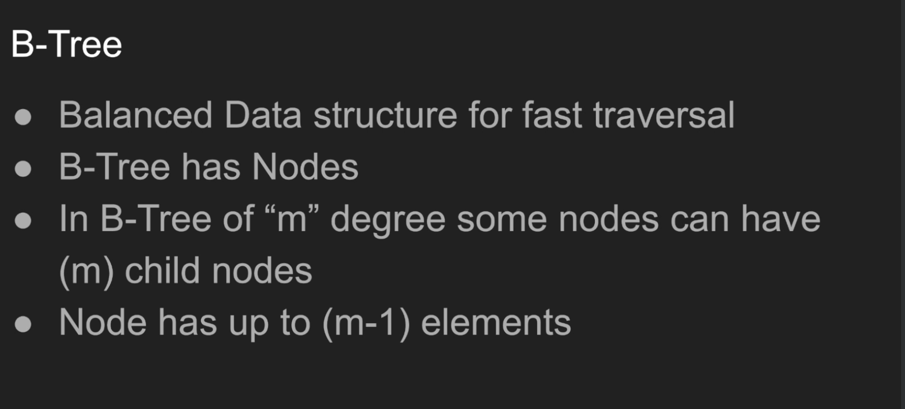
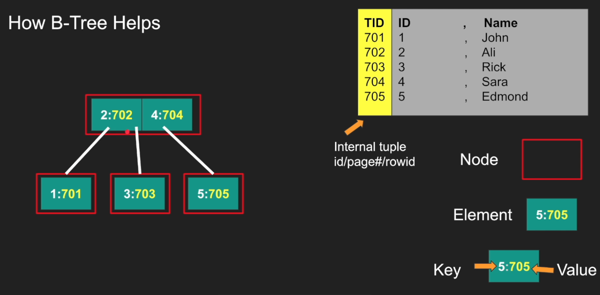
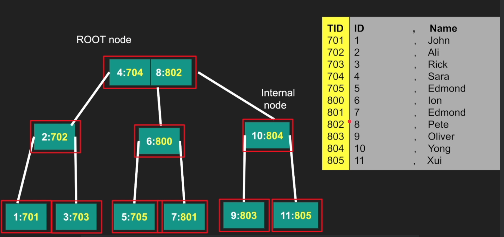
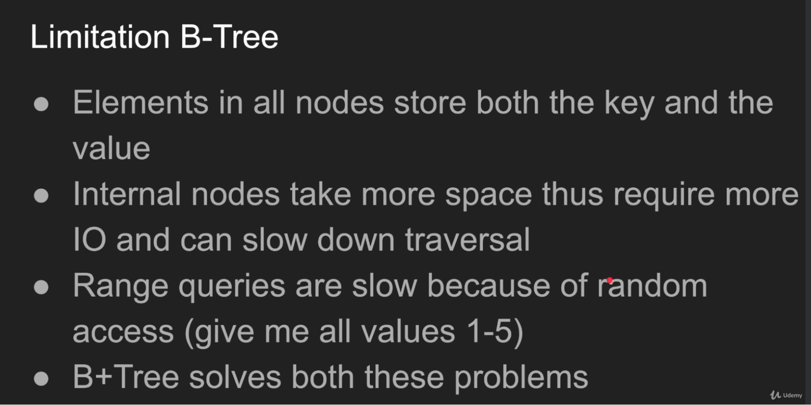
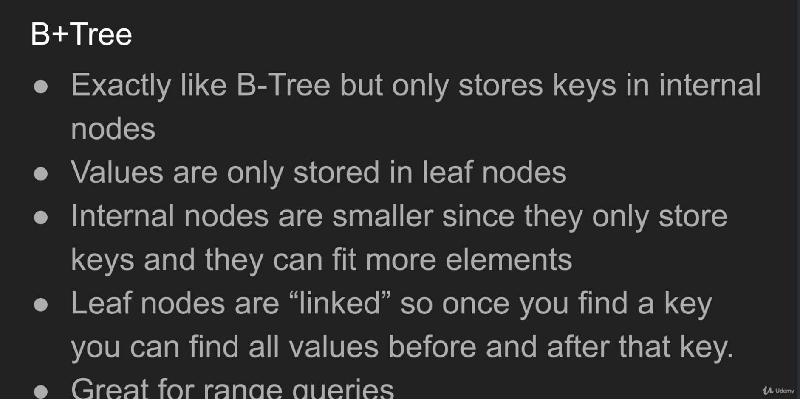
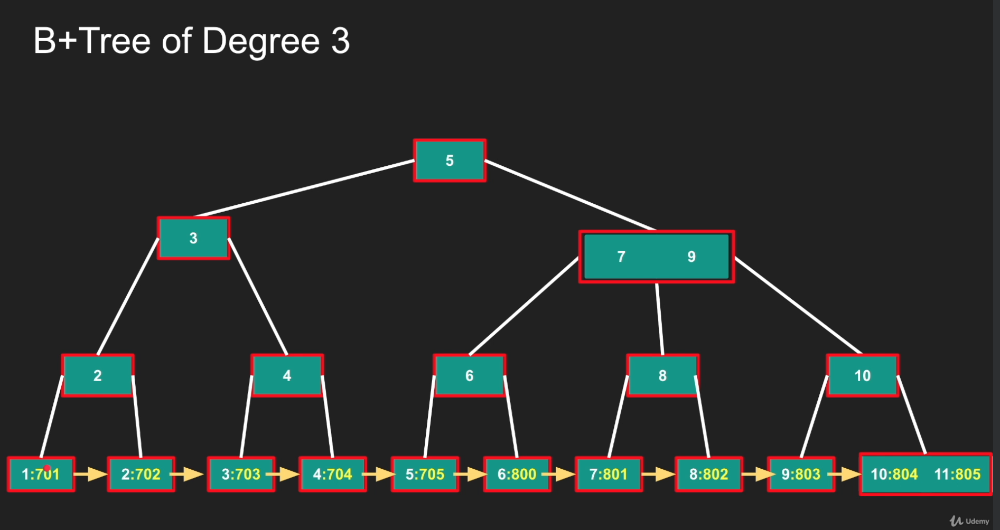
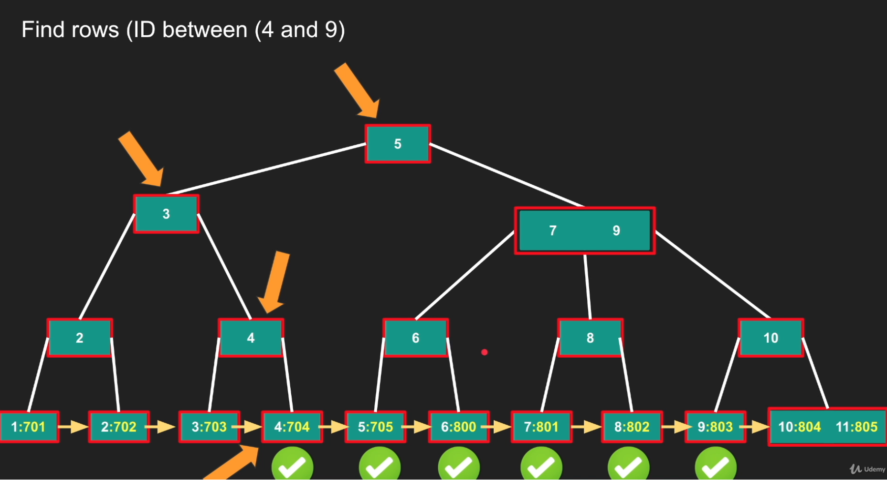
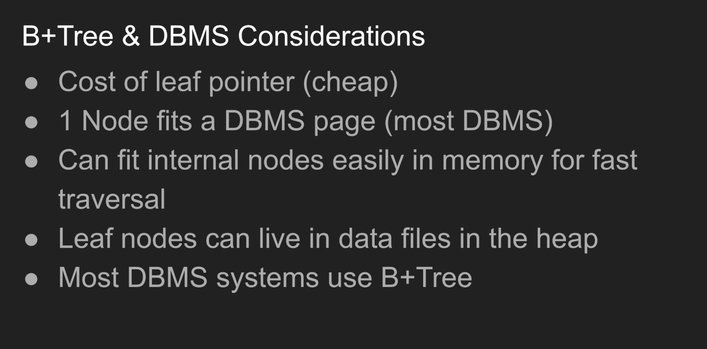
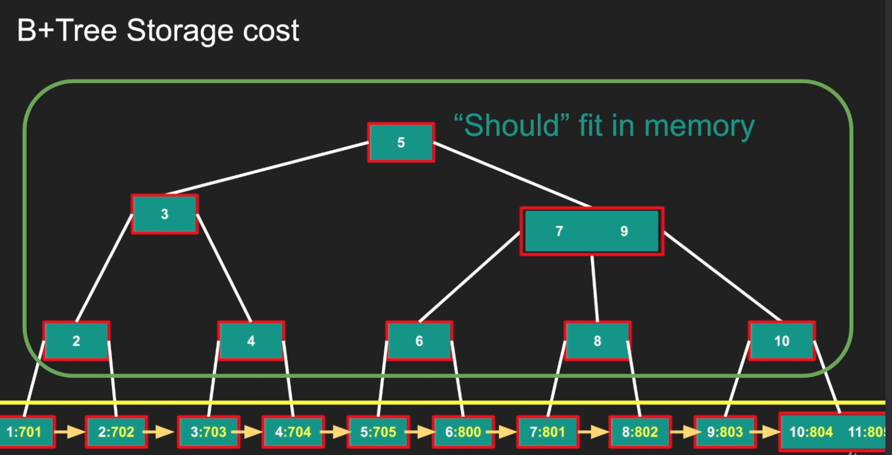

# B-Tree vs B+Tree in Production Database Systems 



```
Note: Each node in the btree correspond to a page (generally).
```

Each element in the B-Tree Node contains (key, value) pair, the Key is generally thew value based on which we search (The index) and the value is basically the pointer to the page and the row.



As database reads in pages, we can see that a Node can contain multiple elements in it. And root in the example has 2 elements, So it can have max 3 children.

One difference with AVL we can see here is that the BTrees can contain many elements in a single node (Because dbms reads in terms of pages).

```
Time complexity for adding, inserting, deleting is logarithmic
```



## B-Tree Limitations


1. <b>Nodes take up more space</b>: Nodes have elements with (key, value) pairs, pointers to the children nodes etc and even if we want to read a single element, we have to read the whole page.

2. <b>Range queries are slower</b>: When we have a range query, (For eg., find all ids between 4 and 9), then we have to scan the B-tree. Now when we are scanning, it is not necessary the already scanned node would be there in memory. It may be removed also. Specially if we have a large index structure. So there would be cases, where we are scanning the previously scanned nodes again which makes it slow.

## B+Trees






```
Note: In case of multiple entries with same keys in the table, The index structure may be created by creating duplicate entry in the index b tree or also an element in the node of the btree can have a value as linkedlist of entries. 
```

## B+Tree And DBMS Considerations


