# Partitioning

Partitioning breaks the table into multiple tables and when we have multiple tables, we would have index structures for each table. So this makes CRUD operations efficient, but we would have an overhead of calculating which query should go in which table(s) based on the partition key.

Also during an update, a row can move from one partition to another partition.

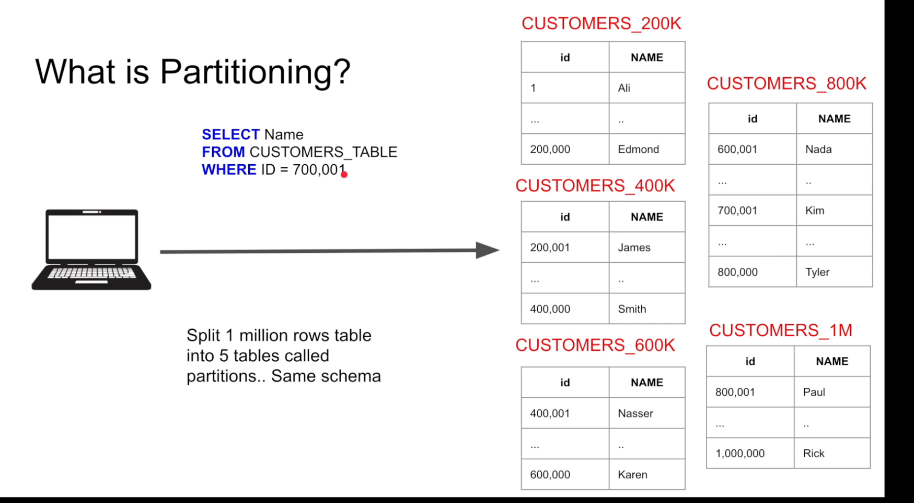

## Vertical vs Horizontal Partitioning

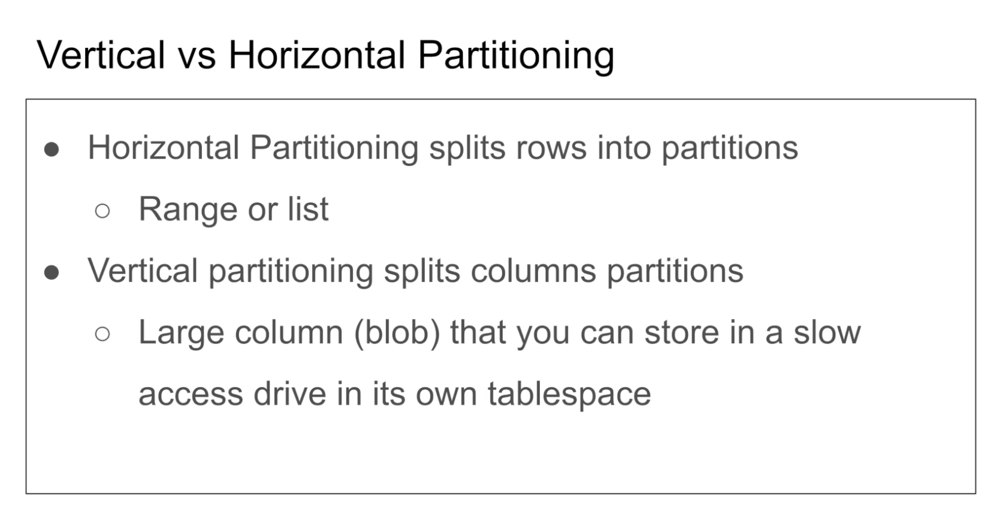

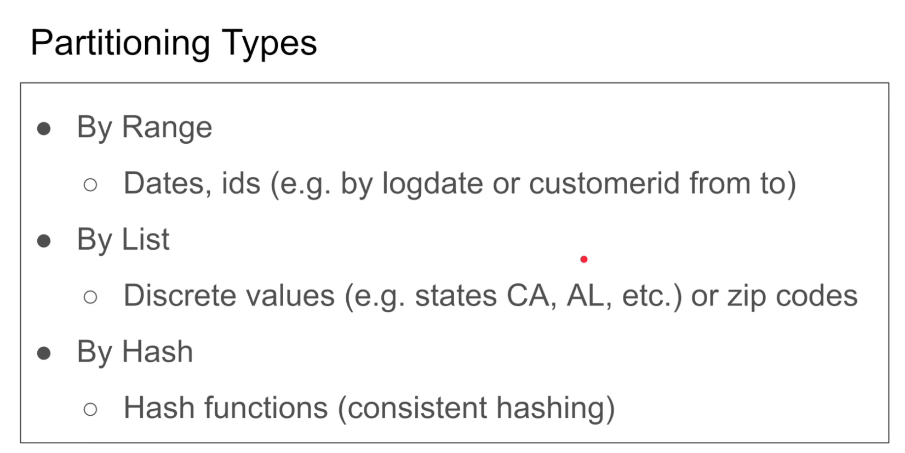

NOTE: READ ABOUT CONSISTENT HASHING.

## Partitioning vs Sharding

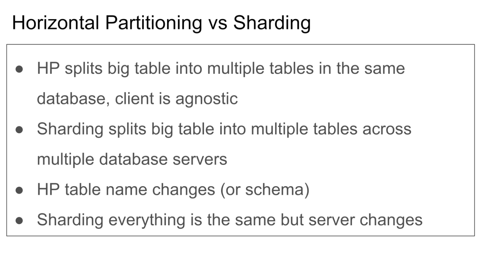

In Partitioning, we split the table in the same database server, whereas in sharding, we split the table across multiple database servers.

## Demo with postgres
First create a table with

```create table grades_org (id serial not null, g int not null);```

Then insert some rows using

```insert into grades_org(g) select floor(random() * 100) from generate_series(1, 1000000);```

Now create an index on g field of grades_org

```create index grades_org_index on grades_org(g);```

Now after creating index notice the below query plans, 

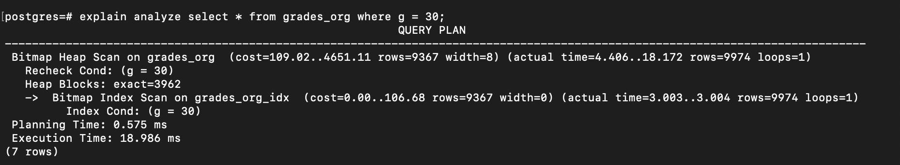

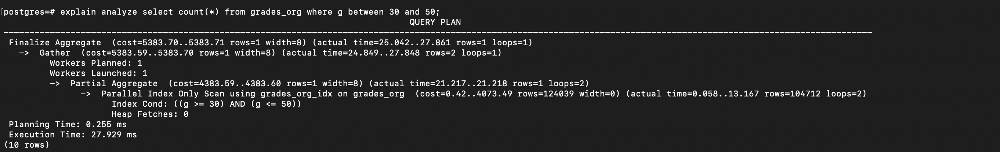

Now to create partition on tables, Follow the below steps

1. Create a new table first: ```create table grades_parts (id serial not null, g int not null) partition by range(g);```

2. Then create the partitions of the created table using: ```create table g00_35 (like grades_parts including indexes)```. The table ``grades_parts`` is sort of a virtual table which points to the partitions of the table. (Notice we have written ```including indexes``` in the command, that means it will automatically create indexes based on the indexes of the virtual table.)

3. Similarly, create partitions for other ranges of grades also.

4. Now attach the created partitions to the virtual table: ```alter table grades_parts attach partition g00_35 for values from (0) to (35);```

5. Insert data into grades_parts using the following command: ```insert into grades_parts select * from grades_org;```, This command will populate the partitioned tables (g00_35, g35_60 etc). (Remember grades_parts is only a virtual table which points to the assigned partitions)

6. Now if we create an index on ```grades_parts```, the index will also be reflected in the mapped partitions also.

7. So now, notice the below query plan, when we are searching for entries with grade < 30, the DBMS is actually searching it in the first partition.

    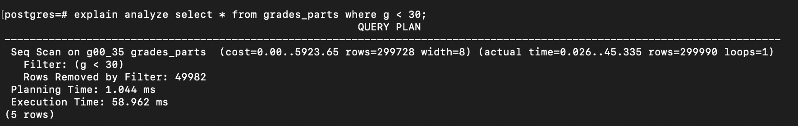


```
We may not notice significant difference in performance with or without partitions . But partitions can really shine when we have huge number of entries and we cannot fit the whole index structure in memory, because we would have separate index trees and separate partitions which can make the query faster.
```

```
NOTE: To know the size of the tables or index structures in our database, use the following command:

select pg_relation_size(oid), relname from pg_class order by pg_relation_size(oid) desc;

pg_relation_size is the function which takes in object id (oid) and returns the size in bytes. and relname is the relation name.
```

There is a partition setting in postgres which is ```ENABLE_PARTITION_PRUNING```, and by default it is set to enabled. We can check the value using ```show ENABLE_PARTITION_PRUNING;``` command.

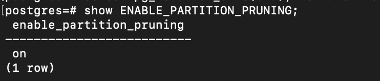

We can also set the value to ```off``` using ```set ENABLE_PARTITION_PRUNING = off;```. What this setting does is, if it is set to off, it will just scan all the partitions for the subsequent queries instead of just querying the specific partition.

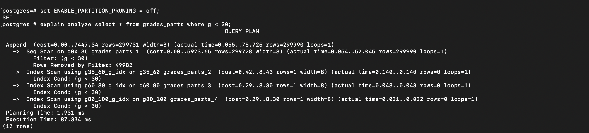

PLEASE DO NOT SET THIS SETTING TO OFF. IT SHOULD BE ALWAYS ENABLED.

## Pros And Cons of partitioning
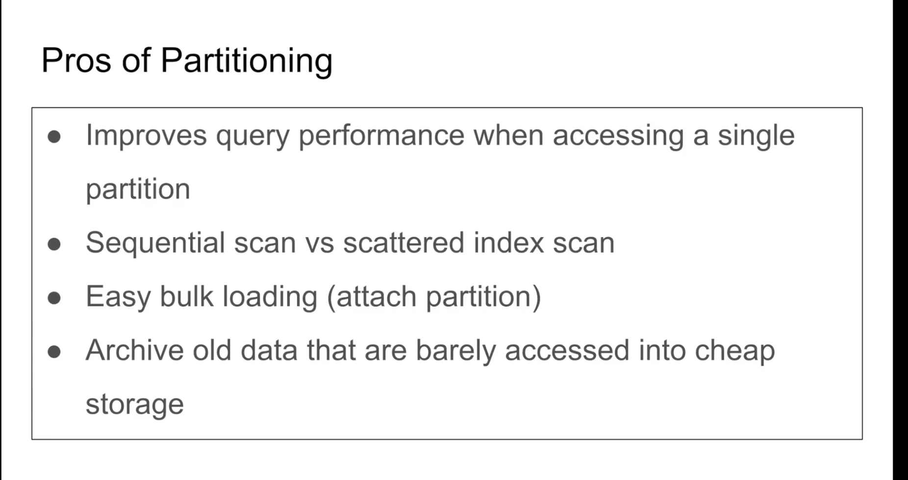

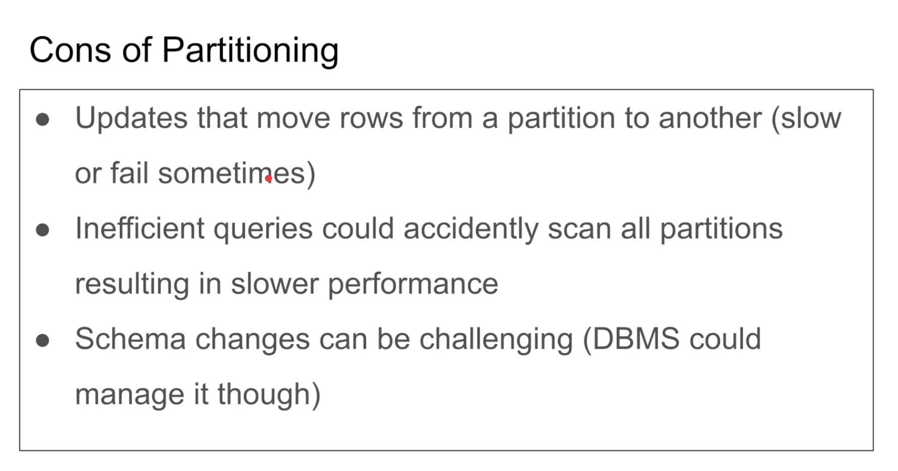