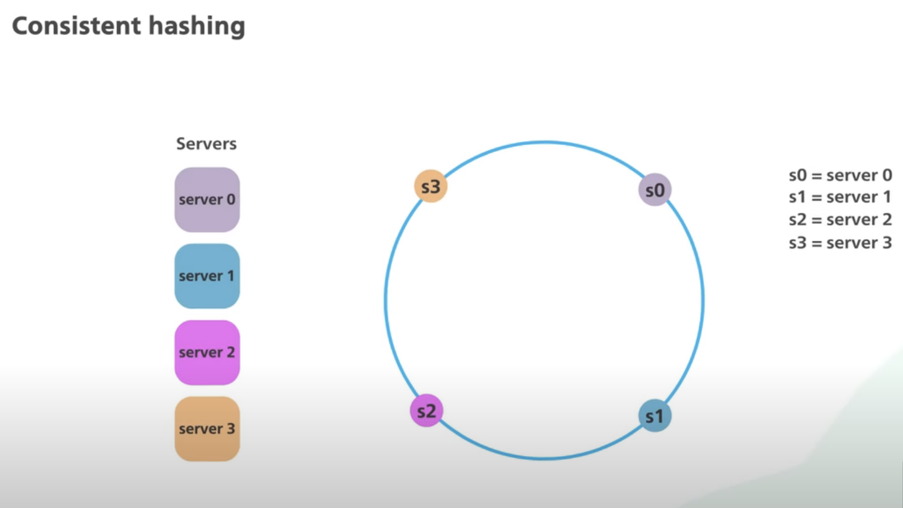

# Sharding

Sharding is basically partioning the table into multiple database servers. Whereas in partition, we divide the database table into small database tables in the same server.

## Consistent Hashing
When we shard our database, we can route the queries to our shards in many ways, (For eg., If we have name field in our table, we can do something like "the names starting with A belong to a shard", or "the names starting with B belong to another shard" and so on). But this can bloat up some of the shards (For eg., let's say many rows have names that start with 'A').

To distribute data evenly, ```Consistent Hashing``` algorithm is used.

Refer this: https://www.youtube.com/watch?v=UF9Iqmg94tk

### Motivation
To distribute data evently, we can use a hash function to map the data to a server. Let's say we have 10 servers. And any time a query comes for Create or read or update (assuming in update query, we are not updating the shard key), then we would calculate the shard number using

```shard_no = hash(shard_key) % num_servers```

But in this case, if we remove or add a server (This usecase comes frequently when we need to scale up during an event like IPL, Big Billion Day Sale etc or scale down after the event), then ```WE WOULD NEED TO REARRANGE ALL THE EXISTING DATA IN ALL THE SHARDS```. And this is a very costly operation.

If we know that number of servers are not going to change or will change in very less frequency, we can go ahead with this simple hashing.

### What is consistent hashing
To avoid rearranging all the data in all the shards when new / existing servers are added / deleted, we use consistent hashing.

1. We use a robust hash function that normally returns 128 bit or 256 bit hash.
2. We calculate the hash of all the servers and now imagine placing them on a ring (In increasing order of the hash from clockwise).



3. Now when we get a query which consists of the shard key, we use the same hash function to calculate the hash of the key. And then, we just find a server which has hash_server >= hash_key.

4. What happens if a server is now added / removed. If the server is added, we calculate the hash of the server and then we just shift the data to this server from another shard (The amount of data would be significantly smaller than that of normal hashing where all the data was needed to be reordered.)

    ```
    How this can be implemented? When a new server is added:
    (a) Calculate the hash of the server.
    (b) Get the information of next and previous servers to the added server.
    (c) Now Get the Keys which have hashes > hash(previous server) and hash <= hash(new_server). Remove the data of those rows from next server and add it to the new server.

    Maintaining of these hashes of servers and shard_keys can be implemented in B-trees.
    ```

5. But by using this also, we can encounter non-uniformity, Refer the below image.

    

    As we can see from the above image, all the keys are directed to S2 only.

6. To solve the problem of non uniformity, virtual nodes are used. For eg., for a server S1, 4-5 virtual nodes (S1_v1, S2_v2, S3_v3 etc) can be created and added to the ring. And these virtual nodes point to the same server S1. And when we do this, we would be able to reduce the non uniformity.

    

### Examples of consistent hashing
1. DynamoDB, Cassandra uses consistent hashing to evenly distribute there data.
2. Akamai CDN uses this hashing to distribute content to their servers.

## Pros and Cons of Sharding


NOTE: As of now, Postgres does not natively support sharding, we would have to implement consistent hashing in the application code itself to distribute the data accross multiple database instances. (Mongo or Cassandra have sharding inbuilt.)


## Steps to consider while designing database systems
Please proceed incrementally. Starting with a table:
1. If your queries are getting slow, Create indexes.
2. After this, the next step would be to create partitions (I am talking in the same database server).
3. Even after this, if your queries are slow, then we can look for master-slave replication. But be careful that there would be replication lag among master-slave nodes and we would have to depend on eventual consistency of the data. 
4. And finally, if we still have issues, then go for sharding. Because when we go for sharding, we would have to maintain the data of which record points to which shard and we introduce coupling in our systems. Some SQL databases do not support sharding natively (Like postgres), So we would have to write the logic ourselves.


