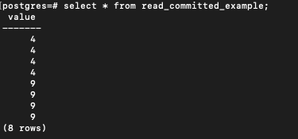
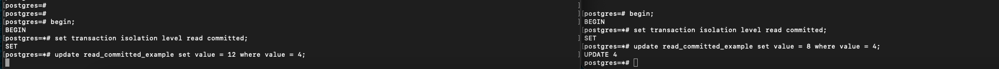
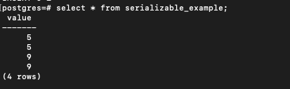
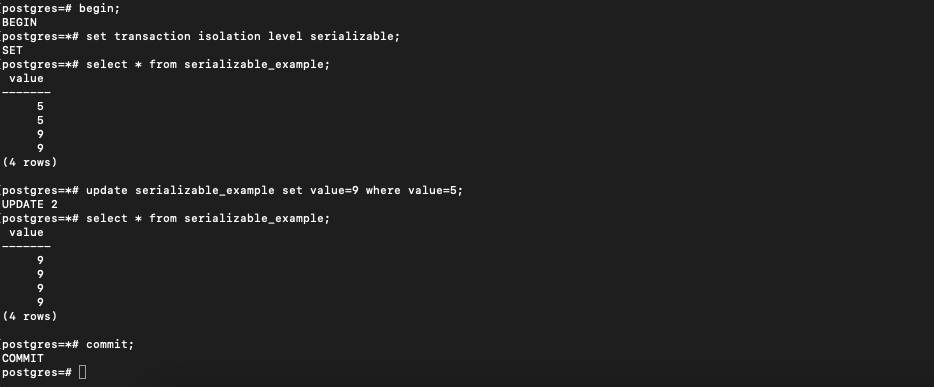
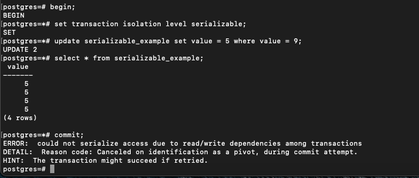
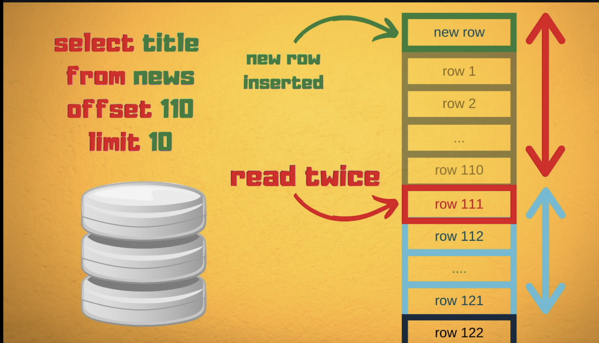
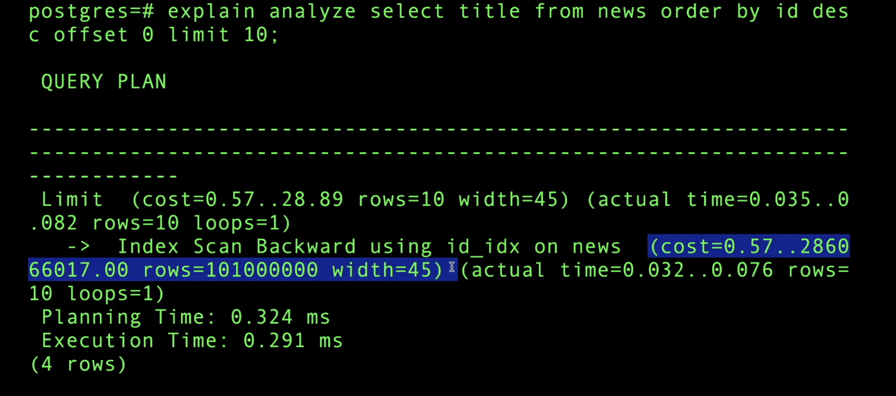
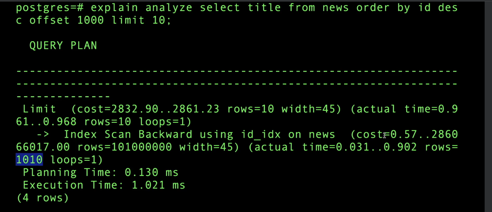

# Concurrency Control

## NOTE: The below explanation of MVCC is for POSTGRES only. Other databases would most likely have different implementations.

## MVCC (Multi-version concurrency control)
Postgres uses Multi-version concurrency control model for consistency in their data. This involves creation of multiple versions of the same row. ```Each row version has 2 internal fields: xmin and xmax. xmin is the transaction id which did create, read, update operation on this row and xmax is the transaction id which deleted the particular row version```.

The behaviour of MVCC is different for different isolation levels:

### Read committed isolation:
In this isolation level, <b>EACH QUERY IN THE TRANSACTION</b> reads those row versions whose ```xmin is latest and xmax is not set (i.e, the row version with latest xmin given that version is not deleted)```. However, if two transactions are modifying the same row, then a row lock is put on the row and one of the transactions would block until the transaction has finished execution to avoid conflicts (Note I have mentioned transaction execution and not query execution).

See below examples:

I created a table using ``` create table read_committed_example(value int not null);```
Then I inserted some data and table looks like this



Now I start two transactions T1 and T2 concurrently. In the below image, let's say left transaction is T1 and right transaction is T2. Now I do an update on T2 transaction (I have not committed yet). So what this does is, it puts a exclusive lock on that row and When I do an update on T1 transaction, my update query is blocked. So T1 now waits for the completion or rollback of T2 to apply updates. (Note that this lock won't block reads, we would still be reading older versions of the row)



Now when I commit T2, the transaction T1 now operates on the updated row.


### Serializable isolation:
In this isolation level, <b>THE TRANSACTION ONLY</b> reads those row versions which were available before the start of the transaction. (Notice the difference, in read committed, before the start of processing each query, the dbms reads the latest version, but here, the dbms reads those version before the start of transaction). The chances of failures are high in this case compared to read committed. It is upon the application to retry. ```When a transaction starts, it gets a snapshot of all the current running transactions are currently running. And based on this, while executing the query, it decides on which row version to read. (As there is no timestamp included in the row version and it has to read those versions which were available before the start of the transaction). Also If a row is currently being updated by some other transaction, then a query in the current transaction which updates the row is also blocked like the read committed isolation. So when the dbms wants to read the row, it would read the version whose xmin < the txId of the current transaction and xmin is not equal to any of the txId available in the snapshot (which were running at the start of the transactions).```

In this isolation level, the concurrent transactions must produce the results in each step of the transactions as if they were executed serially. If they fail to do so, then this transaction would fail.

Example:

I have below table



Now again I have two concurrent transactions running

<b>Transaction 1</b>



<b>Transaction 2</b>



Here we get a serialization error because there would be a serialization error while committing in this case.

NOTE: When a transaction fails, In postgres, it is the responsibility of the application layer to take the decision of retrying. There is no retrying in the dbms.

I also tried the below cases:
1. Two parallel transactions, modifying different rows using primary keys => Transactions were successful.
2. Two parallel transactions, modifying two different rows based on other fields (not primary keys) => One transaction failed due to serialization error.
3. Two parallel transactions, modifying same row => One transaction failed due to concurrent update.
4. Two parallel transactions, one reading a row and the other modifying the same row => Transactions were successful and the one which reads a row, reads the row version which was present before the start of the transaction.
5. Two parallel transactions, one reading a row and the other modifying different row => Transactions were successful.
6. Two parallel transactions, both reading rows (same or different) => Teansactions were successful.

## Solving the double booking problem
Now lets say we are building a ticket booking application and no two users can book the same seat. So we have to avoid multiple transactions booking the same seat.
1. One solution could be that we do the transactions in ```read-committed``` isolation level and when two transactions are concurrently getting processed with same row updates, then one of the update query would get blocked until other transaction gets finished. (Note this is specific to Postgres where postgres acquires an implicit row level exclusive lock).
2. We cannot depend upon internal implementation of dbms right? So what we can do is, we can manually lock the row when we are starting the transaction. In postgres, if we want to lock specific rows, we use the ```for update``` command.
    Eg: ```select * from booking where isBooked = 0 for update;```. This command puts an exlusive lock explicity.
3. Note If we include values with indices, which may lead to ```index only scan```, please first check whether locks are also aquired on the index or not.


## Exclusive and Shared Locks

Exclusive lock is a lock on an entity during which other transactions can neither read / write to that entity.

Shared lock is a lock on an entity during which other transactions can only read the entity but not write to that entity.

These locks help in achieving consistency in our data.

## Deadlocks
When we use locks like exclusive locks, we may encounter dead locks. Most database detect these deadlocks and can fail some transactions in order to eliminate the deadlock.

## SQL Pagination with offset is very slow

How offset command works is, it selects all the rows which satisfies the condition and then filters out the starting unnecessary rows. If we are ordering by an index, it does not use the index btree to efficiently find the starting row.

Standard SQL Behavior: SQL standards define OFFSET as a clause that simply skips a set number of rows.

Offset by design means ```Fetch and drop the first x number of rows.```


```
select title from news offset 100 limit 10;
In the above query, the database would fetch 110 rows and then remove the first 100 rows.
```

As the offset increases, the database has to do more work, which makes the operation extremely slow.

Also pagination with offset can give wrong results (For eg., if someone inserted a new row in between, a row which was shown before can be showed again or if a row is deleted, then a row can be skipped while showing the paginated data).



See the below query plans for the performance analysis.





### Then how to do pagination

One way to implement it is to get the id of the last element read, and after getting the id, we can run the below query

```select * from table where id > last_read_id order by id limit page_size;```

Make sure to do order_by, because ordering of the rows cannot be guarenteed by the database. The above query may use b+ tree indexes to efficiently find the node and once it finds, it can then travel to the leaf node to get the data. (Remember that the subsequent leaf nodes are connected)
