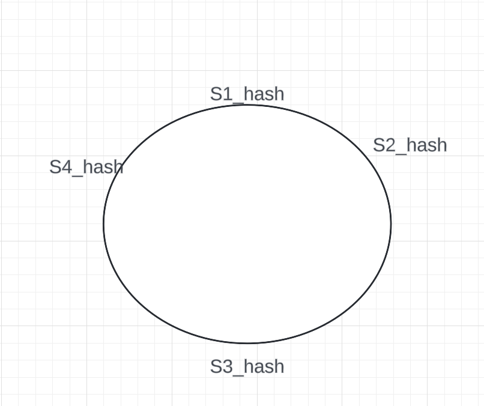

# Design Consistent Hashing

- To achieve horizontal scaling, it is very important to distribute requests / data evenly across servers.

## The rehashing problem

If we have n cache servers, the most common way to find the server where a key is stored is

```
serverIndex = hash(key) % N
```

This approach works well when there is fixed number of servers. But problems arise when we need to add or delete a server. If we add / delete, then we have to redistribute almost all the data in the servers.

## Consistent hashing
- To solve the above problem, we put the hash(server) of all servers on a ring



Normally for hash calculation, `A combination of server_ip and server_name is used`

- Now for a given key, calculate hash(key), and `find the right most server with the hash value <= hash(key)`. I guess we can use treemaps in this case.

### Adding a server
- Suppose a server is added whose `hash(server)` lies between `S1_hash and S2_hash`, then all the entries in S1 server which lies between `S1_hash + 1 and new_server_hash` is moved to `new_server`

- Similar strategy is used for removing a server.

## Balancing the load
- In the above ring, we can see that S2 server contains less data compared to S3 server because the arc for S3 is greater in size than that of S2.

- To solve this problem, we introduce virtual nodes, i.e
```
For each server, We can generate multiple hashes by appending a incremental version to the server name, like S1_1, S1_2 etc, and place in the ring to balance the load among the servers.
```