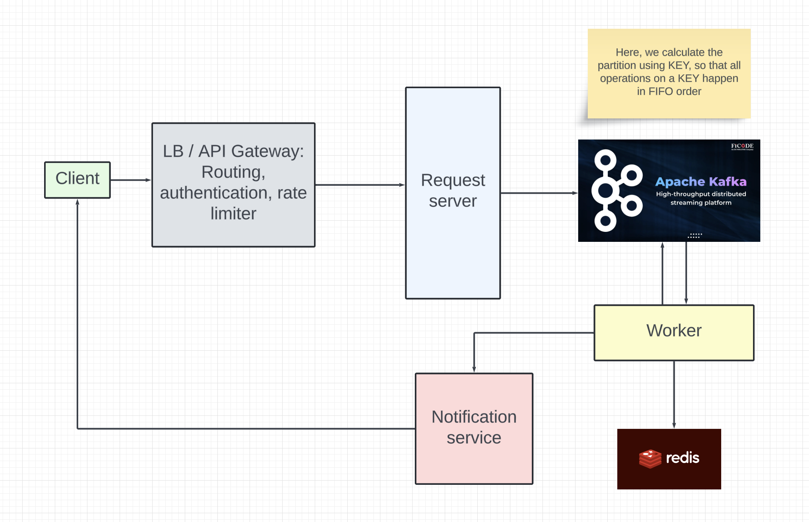

# Distributed Configuration Management System

## Functional requirements
- Multiple users can add key value pairs 
- Read traffic is around 1.5 GB/sec and write is 0.5GB/sec. 
- At a time only one user can update or read a key value pairs for a key. 
- Requests order should maintain FIFO order. 
- User doing read or write should be an async process. 
- if there are 5 requests pending on a particular key and 6th request comes, then 6th request will get response after previous 5 requests on that key has been processed.
- User can subscribe for key's update notification also.

## Non functional requirements
- Low latency.
- The service should be available.

## Capacity estimations
As given in the problem statement, the read traffic is 1.5 GB / sec and write traffic is 0.5 GB / sec

## Entities
- User
```
id, name, email
```

- Request
```
id, userId, operation (GET | PUT), key, value (Only if operation is PUT), subscribe (true / false)
```

## API Endpoints
- POST `/dcm/v1/requests`
```
accesstoken in headers for user id

{
    operation,
    key,
    value
}
```

## Design

