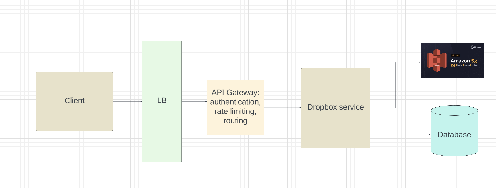
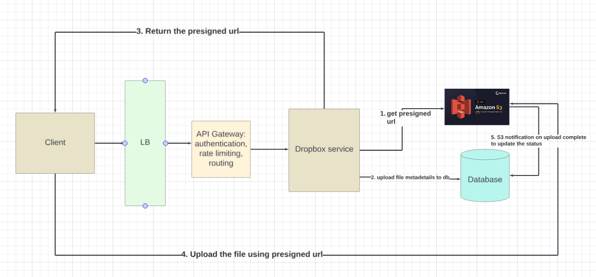
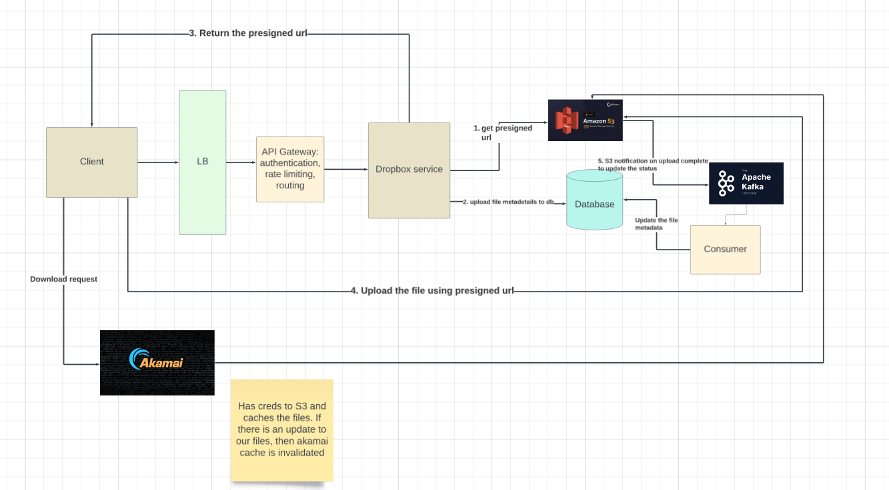
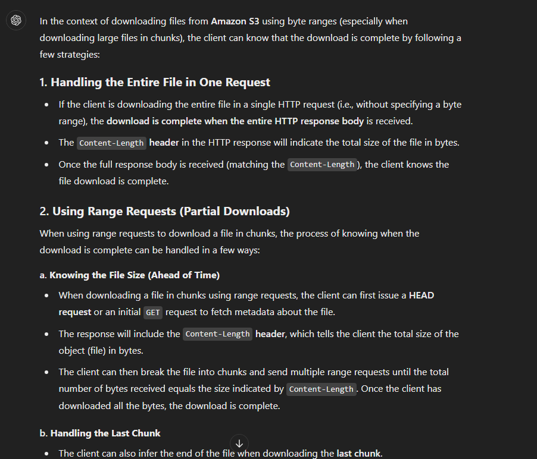
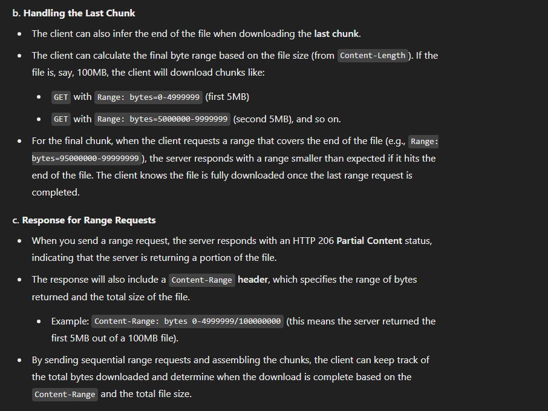
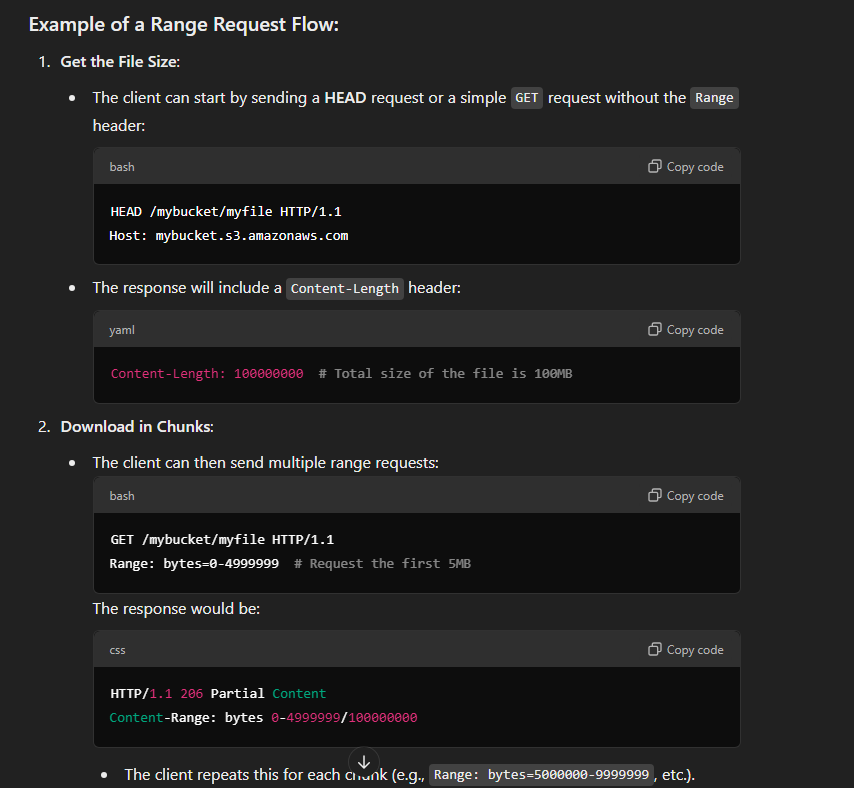
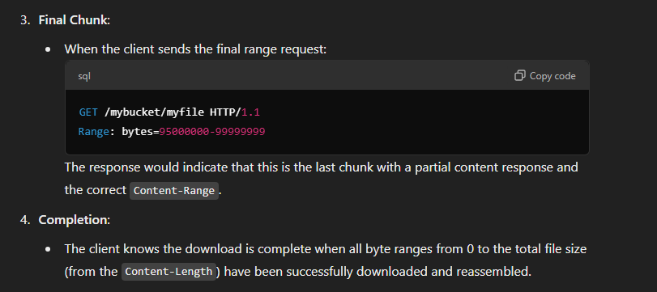

# Dropbox
## Functional requirements
- User should be able to upload a file.
- User should be able to download a file.
- Share files.

## Non functional requirements
- Available
- Scalable
- Low latency

## QPS estimations
```
- Files worth 100 PB is uploaded per month
- Upload QPS: 100 * 10^15 / (30 * 86400) = 385 MBPS
- Files are to be stored for 5 years
- Total storage needed: 6000 PB
```
## Entities
```
User

user_id | username | email
```
```
file_metadata

id | file_name | file_size | uploaded_by | file_type | status | fingerprint
```

```
share table used for tracking which files are available to the users
file_id | user_id
```

```
chunk table for tracking the chunks of a file which is being uploaded. This would be used to track the progress as well as resume the upload

file_id | chunk_id | fingerprint


A fingerprint is a mathematical calculation that generates a unique hash value based on the content of the file. This hash value, often created using cryptographic hash functions like SHA-256, serves as a robust and unique identifier for the file regardless of its name or the source of the upload. By computing this fingerprint, we can efficiently determine whether the file, or any portion of it, has been uploaded before.
```

## Interface or API endpoints
- POST `/dropbox/v1/files`
```
Request body
{
    file,
    file_metadata
}
```
- GET `/dropbox/v1/files/:file_id`
- POST `/dropbox/v1/files/share`
```
Request body
{
    "users": users
}
```

## Data flow
### 1. User uploads the file to our service and then our service uploads the file to S3

In the above approach, we are uploading the same file twice (To our service and then to S3)

### 2. Use presigned urls to avoid uploading twice
Normally S3 objects are private and only the service which have the keys can access the S3 objects.

But we can also have `presigned urls` which allow temporary access to S3 objects without needing the S3 creds.

```
When you create a presigned URL, you must provide your security credentials, and then specify the following:

An Amazon S3 bucket

An object key (if downloading this object will be in your Amazon S3 bucket, if uploading this is the file name to be uploaded)

An HTTP method (GET for downloading objects or PUT for uploading)

An expiration time interval
```

- Now when the user wants to upload a file, our service would request presigned url from S3, and return the presigned url to the client. And then client would upload the file directly to bucket using the presigned url.

- If the presigned url expires, then the client would detect this and request for another presigned url and continue the upload process.



### 3. User should be able to download files
For this usecase, we would be using a CDN instead of presigned urls to scale better



### 4. User should be able to share files

For this we would be using the share table we have in the entities section.


### How do we upload large files
- The client will chunk the file into 5-10Mb pieces and calculate a fingerprint for each chunk. It will also calculate a fingerprint for the entire file, this becomes the fileId.

- The client will send a GET request to fetch the FileMetadata for the file with the given fileId (fingerprint) in order to see if it already exists -- in which case, we can resume the upload.

- If the file does not exist, the client will POST a request to get a presigned URL for the file. The backend will save the file metadata in the FileMetadata table with a status of "uploading".
- The client will then upload each chunk to S3 using the presigned URL. After each chunk is uploaded, S3 will send a message to our backend using S3 event notifications. Our backend will then update the chunks field in the FileMetadata table to mark the chunk as "uploaded".
- Once all chunks in our chunks array are marked as "uploaded", the backend will update the FileMetadata table to mark the file as "uploaded".

`The above process is also known as Multipart upload on S3`

<b>Client side code for uploading files</b>
```js
async function uploadFileInChunks(file, presignedUrl) {
    const chunkSize = 5 * 1024 * 1024; // 5 MB per chunk (minimum for S3)
    const totalChunks = Math.ceil(file.size / chunkSize);

    // 1. Initiate the multipart upload (you'll need to implement this on your server)
    const uploadId = await initiateMultipartUpload(file.name);

    // 2. Loop through and upload each chunk
    const etags = [];
    for (let chunkIndex = 0; chunkIndex < totalChunks; chunkIndex++) {
        const start = chunkIndex * chunkSize;
        const end = Math.min(start + chunkSize, file.size);
        const fileChunk = file.slice(start, end);

        // Upload the chunk to the presigned URL
        const etag = await uploadChunk(presignedUrl, fileChunk);

        // Save the ETag for later (needed to complete the multipart upload)
        // The chunk index that we pass needs to be greater than the previous chunk index (It does not need to be consecutive)
        etags.push({ PartNumber: chunkIndex + 1, ETag: etag });

        console.log(`Uploaded chunk ${chunkIndex + 1}/${totalChunks}`);
    }

    // 3. Complete the multipart upload (you'll need to implement this on your server)
    await completeMultipartUpload(file.name, uploadId, etags);

    console.log('File upload completed successfully!');
}

// Helper function to initiate multipart upload
async function initiateMultipartUpload(fileName) {
    const response = await fetch('/api/initiate-upload', {
        method: 'POST',
        headers: { 'Content-Type': 'application/json' },
        body: JSON.stringify({ fileName: fileName })
    });

    const data = await response.json();
    return data.uploadId;
}


// Helper function to upload a single chunk to S3 using the presigned URL
async function uploadChunk(presignedUrl, fileChunk) {
    const response = await fetch(presignedUrl, {
        method: 'PUT',
        body: fileChunk,
        headers: {
            'Content-Type': 'application/octet-stream'
        }
    });

    if (!response.ok) {
        throw new Error(`Failed to upload chunk: ${response.statusText}`);
    }

    // The ETag header contains the MD5 hash of the uploaded chunk, needed for multipart upload completion
    return response.headers.get('ETag');
}

// Helper function to complete the multipart upload
async function completeMultipartUpload(fileName, uploadId, parts) {
    const response = await fetch('/api/complete-upload', {
        method: 'POST',
        headers: { 'Content-Type': 'application/json' },
        body: JSON.stringify({ fileName: fileName, uploadId: uploadId, parts: parts })
    });

    if (!response.ok) {
        throw new Error(`Failed to complete multipart upload: ${response.statusText}`);
    }
}

document.getElementById('fileInput').addEventListener('change', function (event) {
    const file = event.target.files[0];
    if (file) {
        uploadFileInChunks(file).catch(error => {
            console.error('File upload failed:', error);
        });
    }
});
```


## Download flow






