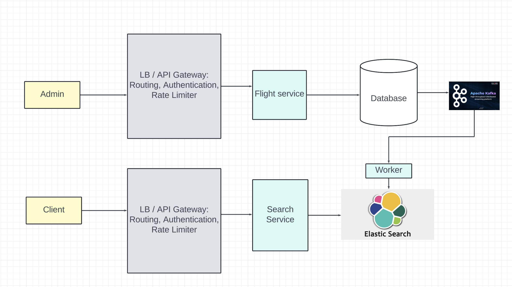
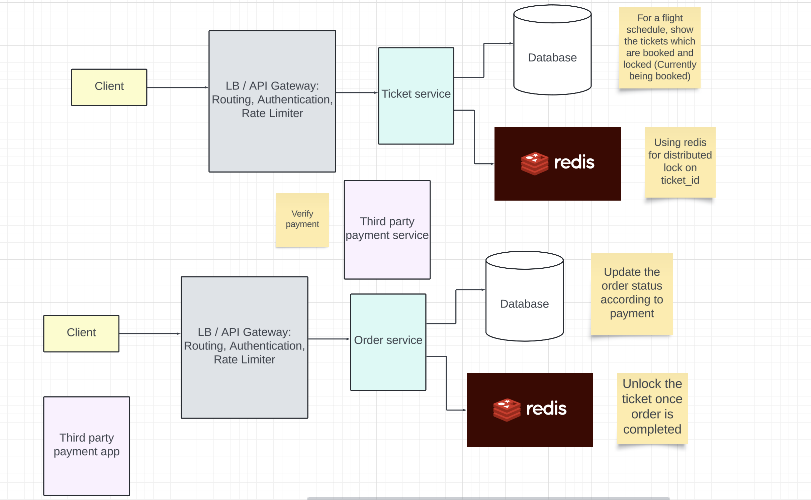

# Flight Booking Service
## Requirements
- User should be able to search for flights.
- User should be able to book a seat in flight.
- User should be able to view all bookings

## Non functional requirements
- The service should take care that the same seat is not booked by 2 people.
- Available
- Low latency of booking / searching of events

## Capacity estimations
```
100 M monthly users
50% of them are daily users => 50M DAU

Each user places 1 booking
total bookings per day = 50M Bookings

Booking QPS: 600 QPS
```

## Entities
- Users
```
id, name, email
```

- Airports
```
id, name, address
```

- Flight
```
id, name, type, capacity, seat_map
```
- Flight Schedule
```
id, airport_id, flight_id, source, destination, start_time, end_time
```

- Tickets
```
ticket_id, flight_id, event_id, seat_num, status (Booked, available), passenger_details, last_updated_at
```

- Bookings
```
id, user_id, ticket_ids: [], status (PAYMENT_INITIATED | PAYMENT_COMPLETED), price
```

## API Endpoints
GET `/fbs/v1/flight_schedules/search?lat={lat}&long={long}&page_size={page_size}&page_num={page_num}&start_time={start_time}`
```
{
    flight_schedules: {
        [
            id,
            name,
            airport,
            source,
            destination,
            start_time,
            end_time
        ]
    }
}
```

GET `/fbs/v1/tickets?flight_schedule_id={flight_schedule_id}`
```
{
    tickets: {
        [
            id,
            seat_num,
            booked: true | false,
            price
        ]
    }
}
```

PUT `/fbs/v1/tickets/:ticket_id`
```
accesstoken in headers for user id
{
    action: "LOCK"
}
```

POST `/fbs/v1/bookings`
```
accesstoken in headers for user id
{
    action: "PAYMENT_INITIATE",
    tickets: [
        {
            id, seat_num, passenger_details
        }
    ]
}

Returns a booking id
```

PUT `/fbs/v1/bookings/:booking_id`
```
{
    action: "PAYMENT_COMPLETE",
    payment_id
}
```

GET `/fbs/v1/bookings`
```
accesstoken in header for user id,

{
    id,
    flight_schedule,
    flight,
    booking_time
}
```

## Design

## Flight Searching Service


## Ticket selection and order service


