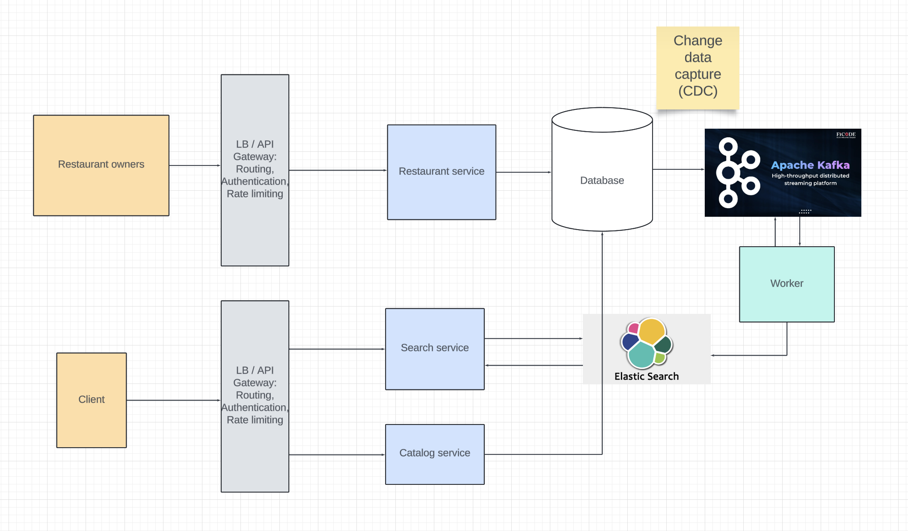

# Food Delivery
## Functional requirements
1. Users can search for restaurants and view catalog in homepage.
2. User can select the items from a restaurant. 
3. User can checkout.
4. Delivery partner should get assigned.
5. Order should get delivered.

## Non functional requirements
1. Low latency for driver assignment.
2. The system should be available.

## Capacity estimations
```
Assuming 100M monthly users
Assuming 50% DAU = 50M daily users

Each user orders 1 order
50 M orders per second

Order QPS: (50 * 10^6) / 86400 = 600 QPS

Storage: (We can come back to this later)
```

## Entities
1. User
```
{
    id,
    name,
    email
}
```

2. Driver
```
{
    id,
    name,
    email,
    vehicle_details,
    license_details,
    reviews
}
```

3. Restaurant
```
{
    id,
    name,
    address,
    lat,
    long,
    menu: []
}
```

4. Trip
```
{
    id,
    user_id,
    driver_id,
    order_id,
    source,
    destination,
    status (CREATED, IN_PROGRESS, COMPLETED, CANCELLED),
    last_updated_at
}
```

5. Orders
```
{
    id,
    user_id,
    restaurant_id,
    items: [],
    status : (PAYMENT_INITIATED, PAYMENT_COMPLETED),
    price
}
```

6. Location
```
{
    driver_id,
    lat,
    long,
    status
}
```

## API
GET `/food_delivery/v1/restaurants?lat={lat}&long={long}&page_size={page_size}&page_num={page_num}`
```
accesstoken in headers for user id

{
    restaurants: [
        {
            id,
            name,
            stars,
            address
        }
    ]
}
```

GET `/food_delivery/v1/restaurants/search?keyword={keyword}&lat={lat}&long={long}`
```
accesstoken in headers
```


POST `food_delivery/v1/orders`
```
accesstoken in headers,
{
    items,
    restaurant
}
```

PUT `/food_delivery/v1/orders`
```
accesstoken in headers
{
    action: "Payment completed",
    payment_id: {payment_id}
}
```

PUT `/food_delivery/v1/trips/:trip_id`
```
accesstoken in header

{
    action: "Complete"
}
```

PUT `/food_delivery/v1/trips/:trip_id`
```
accesstoken in headers for driver_id
{
    action: accept | decline
}
```

PUT `/food_delivery/v1/locations`
```
accesstoken in headers for driver_id
{
    lat,
    long
}
```

## Design

## Catalog and searching the restaurants


## Create, complete order and assign driver


