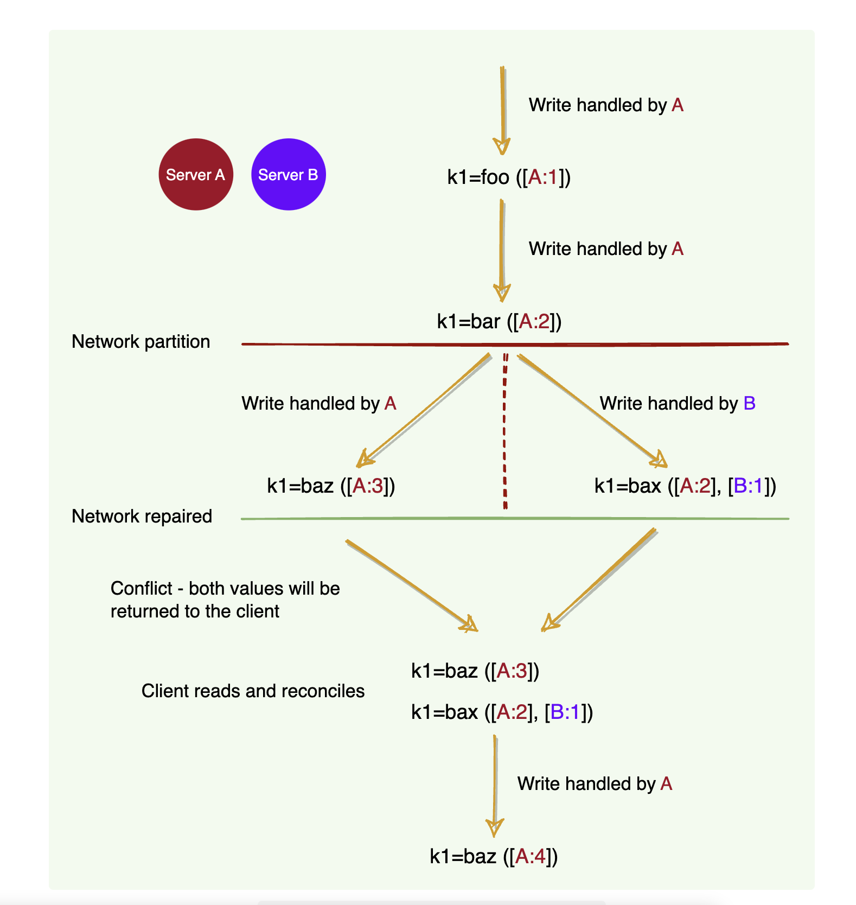
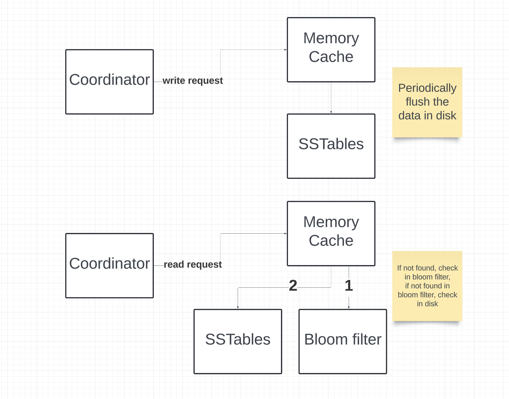

# Key value store

## Requirements
```
- put(key, value)
- get(key)
- Highly scalable (Distributed)
- Highly available
```

## Single server key value store
- Brute force is to have a hash table to store the entries.

## Building a scalable key value store
### Data Partition
- Use consistent hashing for distributing data 
- Scalable (Adding / removing a server requires minimal data movement)

### Data replication
- Add data replication to the servers in the consistent hashing ring.

### Consistency
- For consistency, we would be using Quorum consensus
```
N: Denotes number of servers

W: Write operation must be successful in atleast W servers before the write operation is said to be completed succesfully.

R: For a read operation to be successful, read operation must wait for response from R servers.

The values of N, W, R has to be configured in the coordinater which talks with our replicated servers.


W + R > N: This means that the server ensures strong consistency
Eg: 

W = 1, R = N: Fast writes, slow reads, but guarenteed consistency
W = N, R = 1: Slow writes, fast reads, but guarenteed consistency


W + R <= N: Strong consistency is not guarenteed.
```

Strong consistency is not highly available and many key-value stores like DynamoDB settle for eventual consistency.

### Conflict resolution

On a single machine, all we need to know about is the absolute or wall clock time: suppose we perform a write to key k with timestamp t1 and then perform another write to k with timestamp t2. Since t2 > t1, the second write must have been newer than the first write, and therefore the database can safely overwrite the original value.

In a distributed system, this assumption does not hold. The problem is clock skew, i.e., different clocks tend to run at different rates, so we cannot assume that time t on node a happened before time t + 1 on node b. The most practical techniques that help with synchronizing clocks, like NTP, still do not guarantee that every clock in a distributed system is synchronized at all times. So, without special hardware like GPS units and atomic clocks, just using wall clock timestamps is not enough.

```
For conflict resolution on multiple servers, we use vector clocks

Server A serves a write to key k1, with the value foo. It assigns it a version of [A:1]. This write gets replicated to server B.

Server A serves a write to key k1, with value bar. It assigns it a version of [A:2]. This write also gets replicated to server B.

A network partition occurs. A and B cannot talk to each other.

Server A serves a write to key k1, with the value baz. It assigns it a version of [A:3]. It cannot replicate it to server B.

Server B sees a write to key k1, with the value bax. It assigns it a version of [B:1]. It cannot replicate it to server A.

The network heals. 

Either server gets a read request for key k1. It sees the same key with different versions [A:3] and [A:2][B:1], but it does not know which one is newer. It returns both and tells the client to figure out the version and write the newer version back into the system.
```




### Problems with vector clocks
- Adds complexity in conflict resolution techniques.
- The `[Sx, Vx]` pairs can grow rapidly for a data item. We can set a thresold on the length and remove the older pairs. But removing them may not allow us to correctly find the relationship between the same data item in 2 different servers. Amazon DynamoDB highlights this problem but has not faced this problem in production yet.


## Sequence
We would have to select a cache eviction policy like LRU, that means least recently used data would be evicted from cache. But the data would be stored in disk. Below is the write and read sequence for the memory db.



