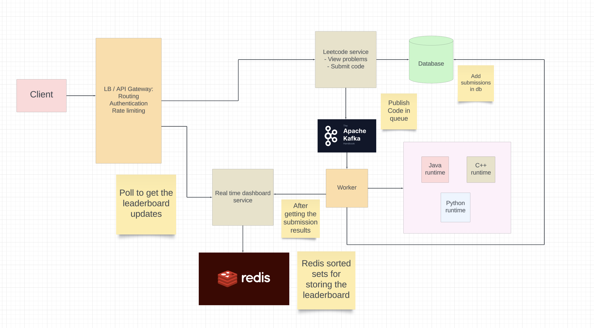

# Design Leetcode
## Functional requirements
- User must be able to view problems
- User should be able to submit their solution to a problem
- User can view real time leaderboard of a contest

## Non functional requirements
- Available
- Scalable
- Low latency for realtime leaderboard

## QPS Estimations
```
- Leetcode has 600000 users total
- Assuming 50% monthly users
- Assuming 50% daily users from montly - 150000 users daily
- Users submit an average of 2 submissions daily
- 300K submissions daily
- Submission QPS: 300K / 86400 = 4 QPS

- Storage:
- Assuming each submission is 500 KB = 5 * 10^5 Bytes
- 300K submissions daily = 15 * 10^10 Bytes = 150 GB / day
```

## Entities
```
Question

{
    id,
    name,
    desc,
    codeStubs: {
        java,
        python,
        c++
    },
    sampleCases: [

    ]
}
```

```
Submission

{
    submission_id
    user_id,
    question_id,
    timestamp,
    code
}
```

```
User

{
    id,
    name,
    email
}
```

## Interfaces or API endpoints
GET `/leetcode/v1/problems?page_number={page_number}&page_size={page_size}`
```
{
    code: 200,
    message,
    data: {
        problems: [
            {
                id,
                name,
                difficulty
            }
        ]
    }
}
```

GET `/leetcode/v1/problems/:problem_id`
```
{
    code: 200,
    message,
    data: {
        id,
        name,
        desc,
        codeStubs: {
            java,
            python,
            c++
        },
        sampleCases: [

        ]
    }
}
```

POST `leetcode/v1/submissions`
```
Request header: token -> user_id
Request body
{
    code,
    problem_id,
    language
}
```

GET `leetcode/v1/submissions?problem_id={problem_id}`
```
Request header: token -> user_id
{
    code: 200,
    message,
    data: {
        submissions: [
            submission_ids
        ]
    }
}
```

GET `leetcode/v1/submissions/:submission_id`
```
Request header: token -> user_id
{
    code: 200,
    message,
    data: {
        submission: {
            id,
            code,
            language,
            status: PASSED | FAILED
        }
    }
}
```

## HLD


### Basic implementation in java
```java
import java.util.*;

public class Leaderboard {
    private Map<String, Integer> userScores = new HashMap<>(); // Store user scores
    private TreeMap<Integer, List<String>> scoreMap = new TreeMap<>(Collections.reverseOrder()); // Sorted map of scores to users

    // Add or update user score
    public void addOrUpdateScore(String userId, int newScore) {
        // Get the current score
        Integer currentScore = userScores.get(userId);
        
        // Remove the user from the score map if they have an existing score
        if (currentScore != null) {
            scoreMap.get(currentScore).remove(userId);
            if (scoreMap.get(currentScore).isEmpty()) {
                scoreMap.remove(currentScore);
            }
        }

        // Update the user score
        userScores.put(userId, newScore);

        // Add the user to the score map
        scoreMap.computeIfAbsent(newScore, k -> new ArrayList<>()).add(userId);
    }

    // Get top N users
    public void getTopUsers(int N) {
        int count = 0;
        for (Map.Entry<Integer, List<String>> entry : scoreMap.entrySet()) {
            for (String userId : entry.getValue()) {
                System.out.println("User ID: " + userId + ", Score: " + entry.getKey());
                count++;
                if (count >= N) return; // Only print top N
            }
        }
    }

    public static void main(String[] args) {
        Leaderboard leaderboard = new Leaderboard();

        // Adding users and scores
        leaderboard.addOrUpdateScore("user1", 100);
        leaderboard.addOrUpdateScore("user2", 200);
        leaderboard.addOrUpdateScore("user1", 300); // Update user1's score

        // Getting top 2 users
        leaderboard.getTopUsers(2);
    }
}

```


