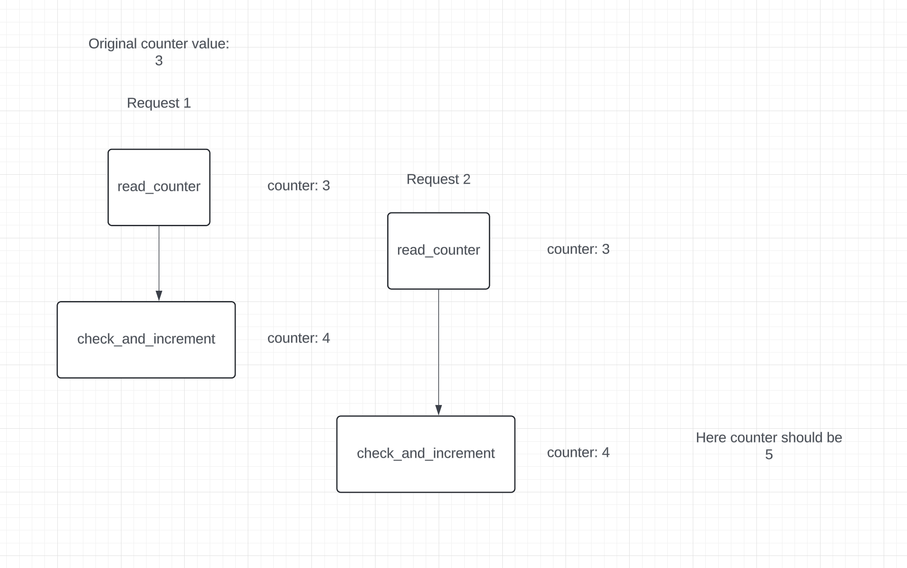

# Design a rate limiter

## Uses of rate limiter
- Prevent denial of service attacks (DOS)
- Reduces costs

## Questions
1. Type of rate limiter: Client side or server side?
```
Go with server side because we won't have the control over client side code.
```

2. Properties used for rate limiting
```
Basic properties are user id, ip. But the properties should be configurable.
```

3. Should be scalable.
4. Do we need to inform users whose requests are throttled?
```
Yes, we need to inform the users.
```
5. Should the rate limiter be a separate service?
```
Yes because the same limiter can be used for other services also.
```

## Basic Design


If the number of requests are more than the limit, the rate limit service should return 429 HTTP status code.

```
429: This status code means too many requests.
```

### API Gateway
In many companies, rate limiting is implemented in API gateway which basically handles
- Authentication
- Authorization
- Rate limiting
- IP Whitelisting
- Caching 

## Algorithms for rate limiting
### Token bucket
- Widely used by companies.
- For each entity, we assign a bucket with four constraints: 
```
1. bucket limit 
2, refill rate
3. current number of tokens
4. last timestamp when the bucket was filled.
```

#### Demonstration with example
- Suppose we need to rate limit by user id.
- We create a bucket for each user id with the following constraints
```
Bucket size: 4
Refill rate: 4 / sec
Current number of tokens: 4
last timestamp: time.now()
```

- We get 3 requests for a particular user id
```
Bucket size: 4
Refill rate: 4 / sec
Current number of tokens: 4 - 3 = 1
last timestamp: No change because bucket is not refilled
```

- We get 2 requests for the same user id
```
Bucket size: 4
Refill rate: 4 / sec
Current number of tokens: 0 (1 token which was previously there was used by 1 request)

Now to process the last request, we check the time elapsed since last refill

time elapsed = time.now() - last timestamp

if time elapsed >= 1
    refill the bucket with 4 - 1 tokens
    process the request
else 
    send 429 status code

```

#### How many buckets do we need
- Depends upon the rate limiting rules
- Normally we have different rate limiting rules for different endpoints
```
For eg., 
An user can make 2 posts / minute
And the user can follow 150 people / minute

So for this requirement, we would need 2 buckets for this particular user
```

- If we want global rate limiting, then we can have only ONE bucket.


### Sliding window log
In this algorithm, we need 
```
- A queue for each entity where the timestamps for a particular entity is stored.
- Suppose the rate limit is 4 / sec
- Whenever a request comes, we check the queue, 
  if the queue size < rate limit:
    Add the timestamp in queue
  else 
    pop all the expired timestamps
    check if the timestamp can be added in queue
    if not,
        then send 429 status code
```

- This algo is easy to implement but is very memory extensive than the token bucket algorithm.

## High level architecture
- We need to keep track of number of requests sent from a user, ip.
- Using disk based database is not a good idea due to slowness of disk seeks.
- In memory databases are generally chosen.

### Defining rate limiting rules
Lyft open sourced their rate limiting component where they define their rules like this in `configuration` files.
```
domain: messaging
descriptors:
    - key: message_type
    - Value: marketing
    - rate_limit:
        unit: day
        requests_per_unit: 5

domain: auth
descriptors:
    - key: auth_type
    - Value: login
    - rate_limit:
        unit: minute
        requests_per_unit: 5
```

Normally in rate limited responses, these headers are added:
```
1. X-Ratelimit-Remaining: The remaining number of requests in the window For token bucket, this would be
(time.now() - last_refill_timestamp) < 1 unit? number_of_tokens: rate_limit

2. X-Ratelimit-Limit: This indicates the number of requests the client can make per unit. (Basically the refill rate)

3. X-Ratelimit-Retry-After: This indicates the number of seconds to wait for retrying
```

## Detailed design


## Problems in distributed environment
- In single cluster, this would work fine. But if there are multiple rate limiting servers, we have to take care of `race condition`.

```
A race condition is a software bug that occurs when multiple processes or threads access shared data simultaneously, without proper synchronization or sequencing. This can lead to unexpected results, such as incorrect outputs
```

### Race condition in our design


To solve this issue:
- Locks are the obvious solution, but this significantly slows down the system
- `Sorted sets in redis` and `Lua script` are the strategies used to solve this problem.

#### How does lua script work
```
Redis processes all commands, including Lua scripts, in a single thread. This means that when a Lua script is running, no other Redis commands (including other Lua scripts or standard operations) are processed at the same time.

Since the Lua script is executed as a single unit, all operations within the script are guaranteed to complete without being interrupted by other commands, effectively preventing race conditions without needing explicit locks.
```

#### Lua script for token bucket algo
```lua
-- Define parameters
local key = KEYS[1]                -- Redis key for user-specific token bucket (e.g., "user:123")
local max_tokens = tonumber(ARGV[1]) -- Maximum bucket size (e.g., 4 tokens)
local refill_rate = tonumber(ARGV[2]) -- Refill rate (e.g., 4 tokens per second)
local current_time = tonumber(ARGV[3]) -- Current time in milliseconds
local refill_interval = 1000  -- Refill interval in milliseconds (1 second = 1000ms)

-- Fetch the current token count and last refill time from Redis
local bucket = redis.call("HMGET", key, "tokens", "last_refill")
local tokens = tonumber(bucket[1]) or max_tokens -- If tokens do not exist, assume full bucket
local last_refill = tonumber(bucket[2]) or current_time -- If no last refill, assume current time

-- Calculate the time elapsed since the last refill
local time_elapsed = current_time - last_refill

-- Calculate the number of tokens to add based on the time elapsed and refill rate
if time_elapsed >= refill_interval then
    tokens = max_tokens
    -- Update the last refill time
    last_refill = current_time
end

-- Process the request
if tokens > 0 then
    -- There are enough tokens, so allow the request by deducting one token
    tokens = tokens - 1
    -- Update the bucket in Redis with the new token count and last refill time
    redis.call("HMSET", key, "tokens", tokens, "last_refill", last_refill)
    return 1 -- Request allowed (HTTP 200)
else
    -- No tokens left, request is denied
    return 0 -- Request denied (HTTP 429)
end
```


