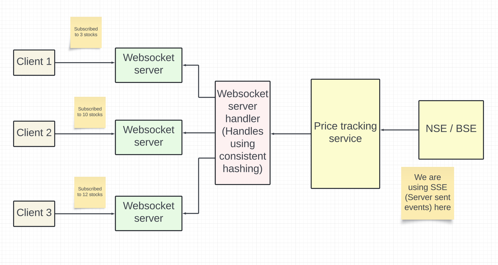
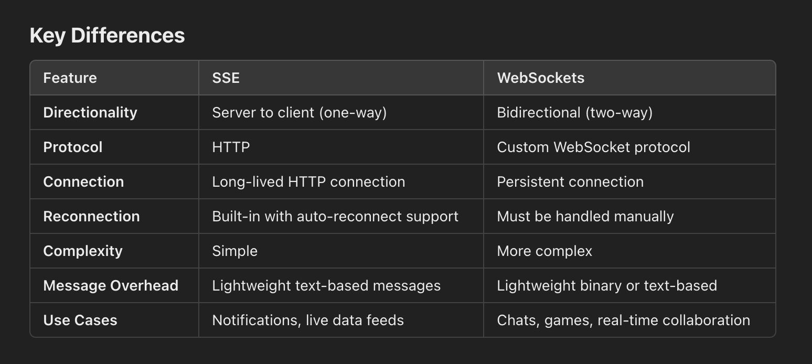
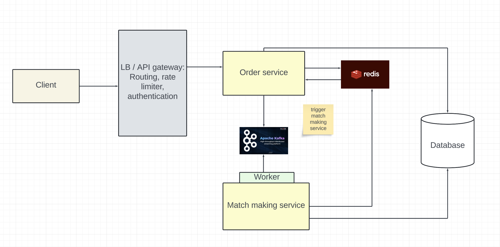

# Stock Broker
## Functional Requirements
- Watchlists
- Market depth (See how many orders are getting processed for a particular stock and at what price)
- Portfolio
- Buying / Selling
- View past orders

## Non Functional Requirements
- We want low latency in these cases
- Available
- Data consistency

## Capacity estimations
```
- 5000 Stocks
- We have to prepare for 2 * total stocks = 10000 stocks
- Each stock update is 100 byte
- Total size of the update per second = 10^6 = 1 MB / sec (For only updation of stock prices)

- 100M monthly users
- 10% daily active users
- 10M users daily
- Each user executes 1 order on average
- Order QPS = 10M / 86400 = 100 QPS
```


## Entities
- Stock
```
name, price, quantity
```

- Order book of a stock
```
stock: {
    buy_orders: [{quantity, buy_price}],
    sell_orders: [{quantity, sell_price}]
}
```

- Orders
```
id, 
user_id,
order_type: BUY / SELL,
stock,
quantity,
price,
status: CREATED / PARTIALLY_EXECUTED / EXECUTED
```

## How does match making work
- Match making for a stock works by using the order book of the stock.
- Lets say there are 5 users looking to buy a stock at prices : `[10 (price) / 2 (quantity), 9 / 4, 5 / 5, 12 / 1, 13 / 6]`
- And lets say there are 5 users looking to sell the stock at prices: `[12 / 2, 6 / 4, 13 / 5, 8 / 1, 7 / 6]`


- Now one way to execute the order is to have a sorted list of `buy orders in descending order of buy prices` and have a sorted list of `sell orders in ascending order of sell prices`.

- So now buy orders are `[13 / 6, 12 / 1, 10 / 2, 9 / 4, 5 / 5]`

- And sell orders are `[6 / 4, 7 / 6, 8 / 1, 12 / 2, 13 / 5]`

- And now we can execute them one by one.

## API 
GET `/stock_broker/v1/portfolio`
```
accesstoken in headers for user id

{
    portfolio: [
        {
            stock, 
            current_price, 
            quantity, 
            buy_price, 
            total_profit
        }]
}
```

POST `/stock_broker/v1/orders`
```
accesstoken in headers for user id

{
    stock,
    quantity,
    action: SELL / BUY,
    price
}
```
- When users want to buy multiple stocks simultaneously, the broker apps create an order for each stock here to handle them individually. (Some of the orders may be completely fulfilled, or partially executed also)

GET `price_updates_of_current_stocks_in_screen`. This can be done using websocket. In request body, we would be sending the list of stocks and then in response, we would be getting the prices.

```
Example request

{
  "action": "subscribe",
  "stocks": ["RELIANCE", "IOCL", "TCS"]
}

Example response
{
    [
        stock: "RELIANCE",
        price: 12
    ]
}
```

## Design

### Price / Portfolio tracking service
- We are using SSE here because we have only `server to client updates`



Example code for SSE
```js
const express = require('express');
const app = express();

app.get('/events', (req, res) => {
    // Set headers for SSE
    res.setHeader('Content-Type', 'text/event-stream');
    res.setHeader('Cache-Control', 'no-cache');
    res.setHeader('Connection', 'keep-alive');

    // Send an initial message
    res.write('data: Connected to server\n\n');

    // Send data every 2 seconds
    const interval = setInterval(() => {
        const message = JSON.stringify({ time: new Date() });
        res.write(`data: ${message}\n\n`);
    }, 2000);

    // Cleanup on client disconnect
    req.on('close', () => {
        clearInterval(interval);
        res.end();
    });
});

app.listen(3000, () => {
    console.log('SSE server running on http://localhost:3000');
});
```

## Order place


