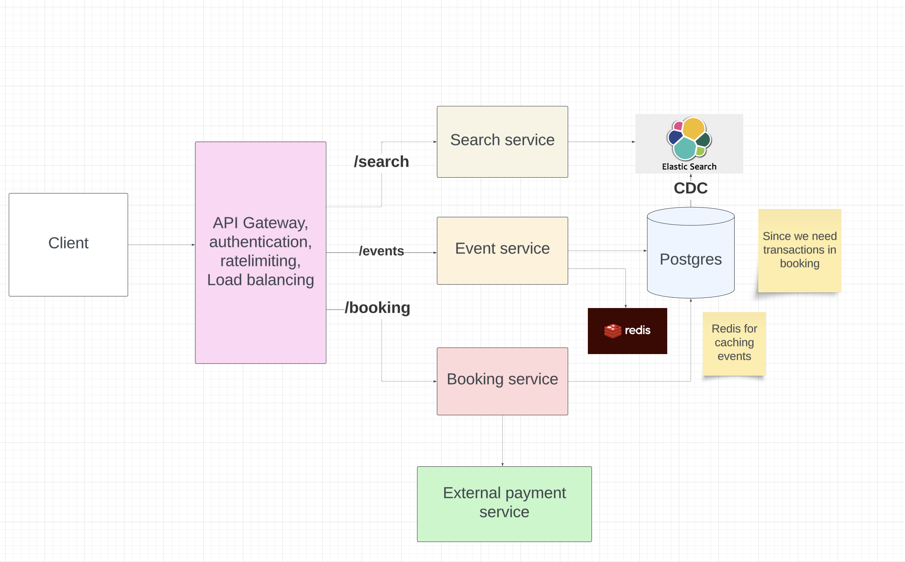

# Ticket Master

## Functional requirements
- Design a system which allows users to search / book events on a given day
- The users should also be able to view events.

## Non functional requirements
- No double booking
- Fault tolerant
- Available / scalable (For this, we need horizontal scaling, caching in cdn or in memory db like redis)

## Entities
```
Event schema

event_id | date | description | type
```

```
User schema

user_id | email | username
```

```
Venue schema

venue_id | address | capacity | seat_map
```

```
Ticket schema

ticket_id | event_id | venue_id | seat_id | status (sold | available | in_progress) | status_updated_at
```

```
Booking schema

booking_id | user_id | total_price | booking_status | created_at | status_updated_at
```

```
Line items schema

booking_id | ticket_id | price | discount | tax
```

## Interface or API endpoints

- GET `/ticket_master/v1/events/:event_id`
```
{
    "status": 200, 
    "message": "Event fetched successfully",
    "data": {
        "event_name",
        "event_desc",
        "event_type",
    }
}
```

- GET `/ticket_master/v1/search?keyword={keyword}&start={start_date}&end={end_date}&pageSize={page_size}&page={page_number}`
```
{
    "status": 200, 
    "message": "Events fetched successfully",
    "data": [{
        "event_name",
        "event_desc",
        "event_type",
    }]
}
```

- GET `/ticket_master/v1/events/:event_id/venues?start={start_date}&end={end_date}&pageSize={page_size}&page={page_number}`
```
{
    "status": 200,
    "message": "Venues fetched successfully",
    "data": [{
        "venue_id",
        "venue_name",
        "address",
        "capacity",
        "seat_map"
    }]
}
```

- POST `/ticket_master/v1/bookings/create`
```
Request body
{
    "user_id": user_id
    "line_items": [
        {
            "ticket_id",
            "ticket_details",
            "price"
        }
    ],
    "total_price": total_price
}
```

- POST `/ticket_master/v1/bookings/complete`
```
Request body
{
    "payment_id",
    "payment_method",
    "amount",
    "order_id"
}
```

## Data flow
- User invokes the `search` api to view events
- User clicks on an event
- The service fetches the seat map and the seats from the `ticket table` whose status is `available` or `in progress` which is expired.
- User selects the seats.
- The service marks the ticket status to `in progress` with the `status_updated_at` to current timestamp.
- User creates the booking. The booking status is `in progress`
- User has limited time to complete the booking. The service initiates a payment with an expiry (Phonepe provides this). If the user tries to do a payment after expiry, then the payment fails.

## HLD


Another great solution is to implement a distributed lock with a TTL (Time To Live) using a distributed system like Redis. Redis is an in-memory data store that supports distributed locks and is well-suited for high-concurrency environments. It offers high availability and can be used to implement a distributed lock mechanism for the ticket booking process. Here is how it would work:

When a user selects a ticket, acquire a lock in Redis using a unique identifier (e.g., ticket ID) with a predefined TTL (Time To Live). This TTL acts as an automatic expiration time for the lock.

If the user completes the purchase, the ticket's status in the database is updated to "Booked", and the lock in Redis is manually released by the application after the TTL.

If the TTL expires (indicating the user did not complete the purchase in time), Redis automatically releases the lock. This ensures that the ticket becomes available for booking by other users without any additional intervention.

Now our Ticket table only has two states: available and booked. Locking of reserved tickets is handled entirely by Redis. The key-value pair in Redis is the ticket ID and the value is the user ID. This way we can ensure that when a user confirms the booking, they are the user who reserved the ticket.

