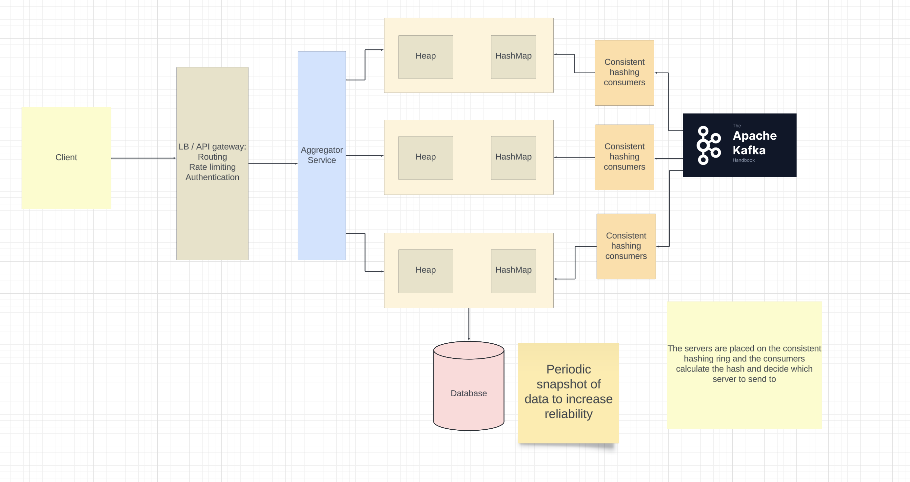

# Top K design
Refer: 
- https://systemdesignschool.io/problems/topk/solution
- https://www.hellointerview.com/learn/system-design/answer-keys/top-k

## Requirements
Find top K videos in youtube by
- All time.
- Month
- Day
- Hour

And the top K videos should be fetched in sliding window approach.

## Non functional Requirements
- Scalable
- Available
- Low latency

## QPS estimations
```
1 B users monthly
Assuming 50% daily users
500 M users daily
Each user watches 1 hour of content daily (Average of 2 videos)

1 B media clicks daily
View QPS = 10^9 / 86400 = 12K QPS

For storage, we need ID and count
ID: 128 bit
count: 64 bit

Total size for an entry: 192 bits = 24 bytes
Storage for 10 years.
Number of videos = 1B in 10 years
Total storage = 24 GB.

We can use in-memory if we are smart enough.
```

## Entities
MediaId, count, window

## API or interfance
- GET `/top_k/v1/views?K={k}&window={window}`
```
{
    "code": 200,
    "message",
    "data": {
        "videos": [
            {
                "mediaId",
                "views"
            }]
    }
}
```

## Design for top K views for all time
### Design 1


Problems: 
- Single point of failure.
- Not Scalable

### Design 2


## Design 3


We can do the same using `Redis Sorted Sets`.

## Design 4 (Handling time windows)
This requires having two consumers per partition and then one of the consumer keeps track of the starting offset in the partition. In the second consumer, while `current_time - event[offset].time > window`, consumer prepares a request to send to the server to decrement the count as well as increment the offset.

Note we have different servers to handle different time windows.


We can also add a cache to lower the latency. (We have to decide how much inconsistency we are fine with here.)


## Follow up: Handle arbitary time windows now.