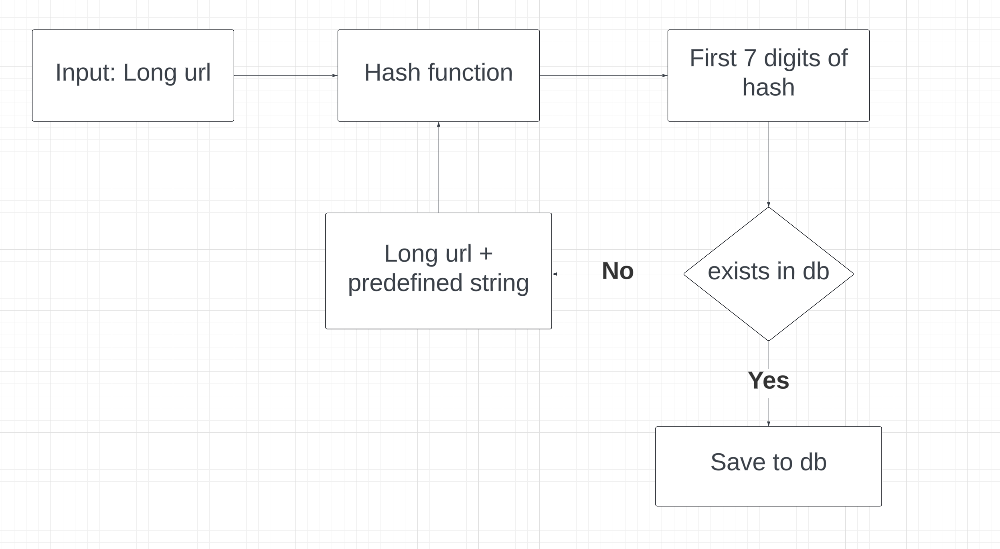
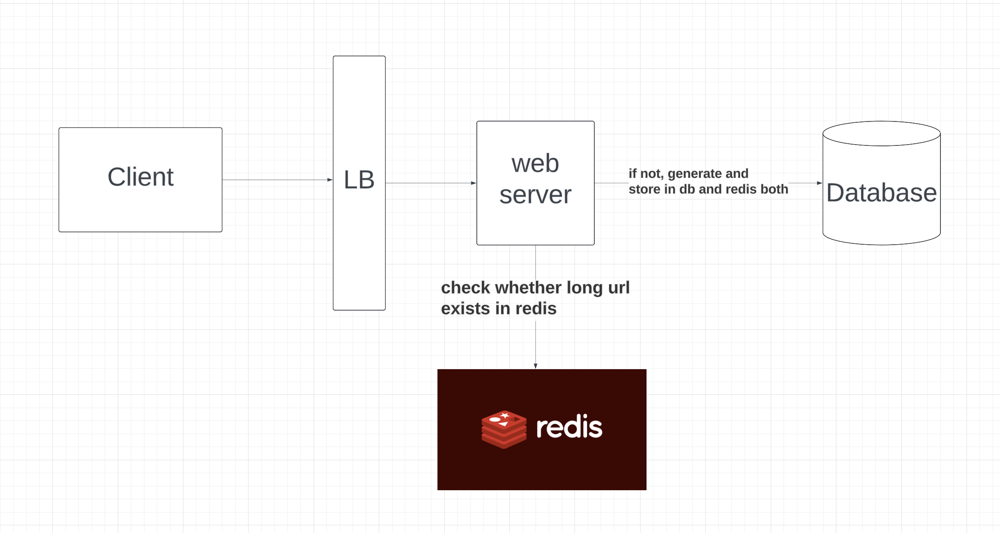

# URL Shortener

## Requirements
```
Long url -> short url
Short url -> Redirect to long url

Number of characters in short url = 7
Characters to be used in short url = [a-z][A-Z][0-9]

We have to store the data for 5 years

Scalable
```

## Capacity and qps estimations
```
Monthly active users: 10M
Assuming 50% daily users: 5M

Users convert 2 urls on average = 10 M urls / day
Long to short url QPS = 10^7 / (24 * 60 * 60) = 120 QPS

Users convert 5 short urls to long urls on average = 25 M urls / day
short to long url QPS = 300 QPS

Total number of urls that can be generated = 62 ^ 7 = 3.5 * 10 ^ 12
Total number of urls generated in 5 years = 18000 * 10^6 = 1.8 * 10^9

Assuming long url length = 100 bytes
short url length = 7 bytes

Total storage = 107 * 1.8 * 10^9 bytes = 1.8 * 10^10 bytes = 18 * 10^9 bytes = 18 GB
```

## Entities
- Long url
- Short url


## Interface or API Endpoints

```
POST /url-shortener/v1/urls
Body: {url: <url>}
```


```
GET /url-shortener/v1/urls/:id

Response headers:
location: <long-url>
status code: 301 / 302

301 means permanently moved. Browser caches the response. Is not helpful for analytics 

302 means temporarily moved. Browser does not cache the response. Helpful for analytics 

```

## Data flow
- Use hash functions like `MD5, CRC32, SHA1` and get first 7 digits. 



- Use base62: No collision guarentee, but the short url is not guarenteed to have 7 digits and It is easy to guess the next values.

## HLD 


