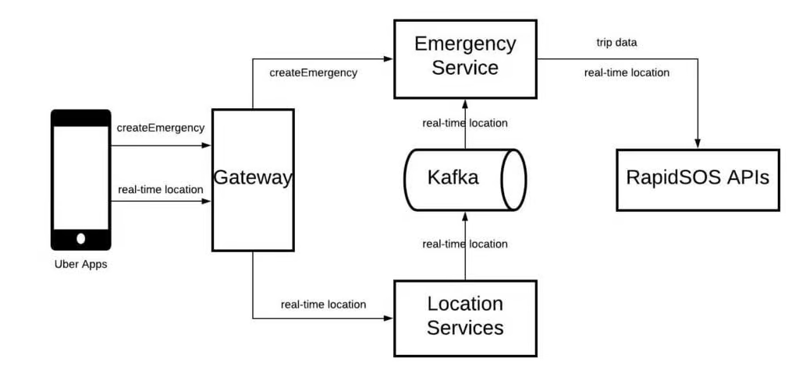

# Uber SOS Design

Refer: [Uber's blog here](https://www.uber.com/en-IN/blog/ubers-emergency-button-and-the-technologies-behind-it/)

Refer: [Arpit's walkthrough here](https://www.youtube.com/watch?v=gpzGpPiRoCo)

# Design
NOTE: The below design is taken from Uber's blog

# Main takeaways

- To ensure high availability, In case <b>Kafka</b> cluster is down, `sync apis` were used as <b>fallback</b>.

- Uber used `reverse geocoding`, which is deducing address from Lat and Long which can be shared with the police.

