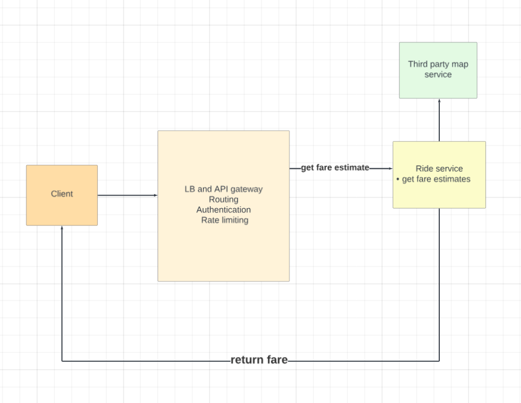
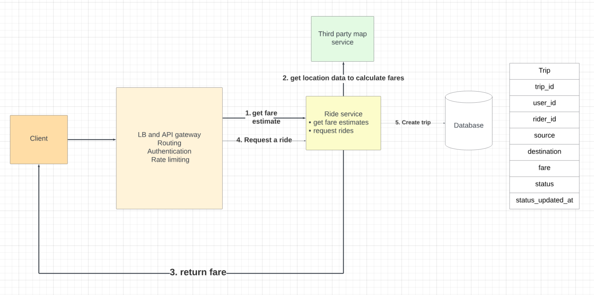
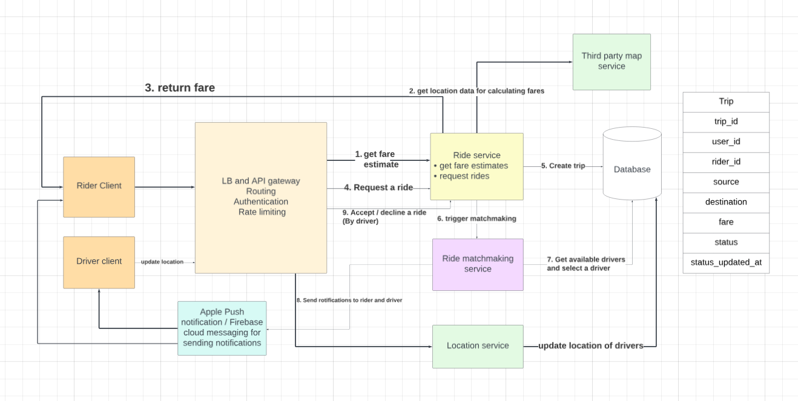
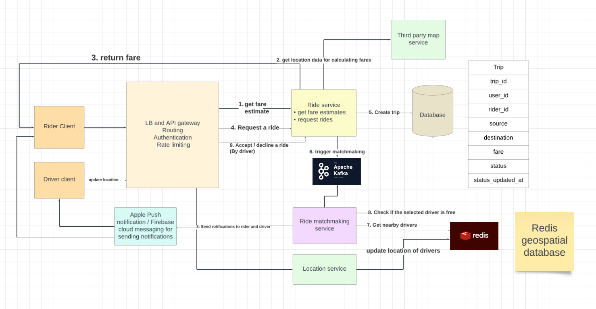
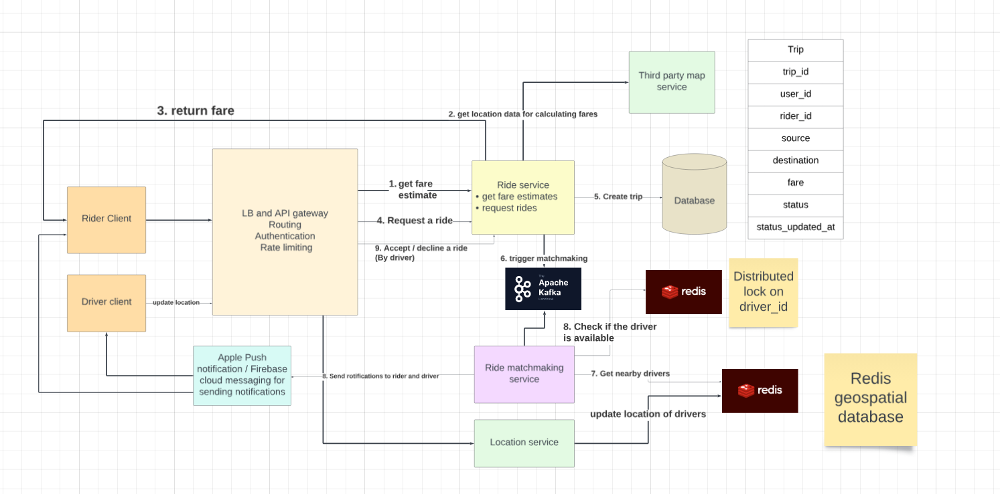

# Uber
## Functional requirements
- User can input source and destination.
- User should be able to view their fares.
- User should be matched with a driver.
- Driver has the option to accept / refuse a ride.

## Non functional requirements
- Available
- Scalable

## QPS estimations
- 100 M monthly users
- Assuming 50% daily active users
- Assuming 2 rides per user
- Daily 100M rides.
- Ride QPS: 10^8 / 86400 = 1200 QPS

## Entities
```
User

user_id | name | email
```

```
Rider

rider_id | name | email | rider_desc
```

```
Trip

trip_id | user_id | rider_id | source | destination | fare | status | created_at | updated_at
```

```
Location

rider_id | lat | long | updated_at
```

## Interface or API endpoints

- GET `/uber/v1/fares?source&destination`

- POST `/uber/v1/trips`
```
user_id is present in the token.
Request body
{
    source,
    desitination,
    fare
}
```

- PUT `/uber/v1/locations`
```
Rider id is present in headers
Request body
{
    lat,
    long
}
```
- PATCH `/uber/v1/trips/:trip_id`
```
Rider id is present in headers
Body 
{
    accept / deny
}
```

## Data flow
### User gets the fare for source and destination


### User requests a ride


### Riders should be matched with a driver who is nearby and available


## Deepdives
### How do we handle location updates and matching with the drivers
- Drivers send location update every 5 seconds
- If there are 10 million drivers, that means 2 M writes / sec in db.

#### Solution 1 (Bad)
- Direct writes to our db like postgres.

#### Solution 2 (OK)
- Batch processing with the help of a queue and then writing them in db.
- We would be storing the location in `geospatial databases` which is optimised for searching proximity locations.
- Postgres offers `PostGIS` for this.

#### Solution 3 (Good)
- Writing to in-memory db like redis.
- Redis provides `geospatial` commands like `GEOADD` for adding location data and `GEORADIUS or GEORADIUSBYMEMBER` for querying nearby locations within a given radius. These commands are highly optimized for geospatial data and can be used to efficiently handle real-time driver location updates and proximity searches.
- We would not need batch processing for this.
- For `durability`, we would enable redis persistance mechanisms to periodically save data in disk.

### How do we prevent drivers to overload the system with location updates
if the driver is stationary or moving slowly, updates can be less frequent. Conversely, if the driver is moving quickly or changing direction often, updates are sent more frequently.

### How do we prevent multiple ride requests from being sent to the same driver simultaneously?
- When a driver is selected, the status in the `trip` table is updated to `outstanding_request` with a `current_time` entry.
- If the driver accepts, the status is changed to `matched`
- If the driver denies, the status is changed to `denied`
- If the driver ignores, then nothing would happen, but the ride match making service would select a driver who is available or whose status is outstanding_request but time period is expired. (Similar to ticket master design)


## Final design



## Instead of relying on the expiration time for drivers, we can use redis distributed locks
- Redis distributed locks work on `redlock` algorithm where redis tries to attain lock on `majority` of the instances.
- Say there are 5 replicas, then redis would try to acquire lock in atleast 3 replicas.
- Now If another service wants to acquire lock for the same key, then redis would try to acquire lock in majority of the replicas and fail since the lock is previously acquired.

