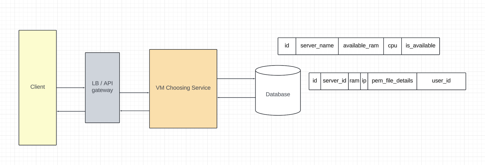
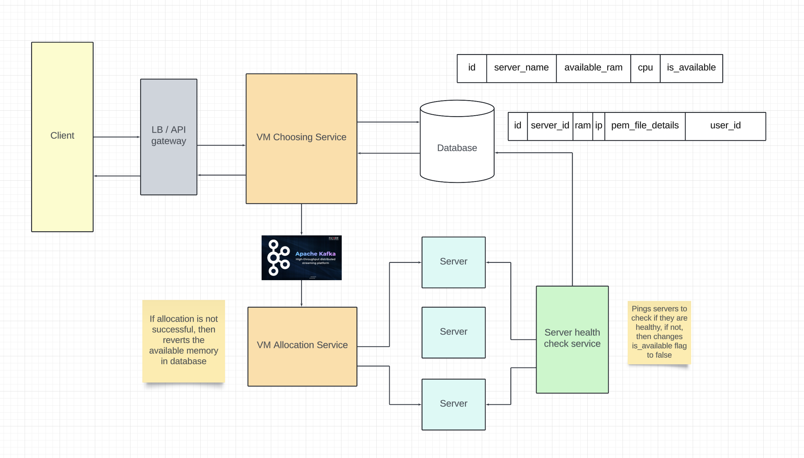

# VM Allocation Service
## Functional requirements
- Input would be cpu and memory.
- Output would be the allocated vm details.

## Non functional requirements
- The service should be available.
- The service should have low latency.

## Capacity estimations
```
- 1M monthly users.
- 50% DAU = 0.5M DAU.
- On average users require 2 GB memory.
- Per month memory usage = 0.5 * 10^6 * 2 * 10^9 = 10^15 = 1 PB memory.
```

## Entities
- servers
```
id, server_name, available_ram, cpu, is_available
```

- vm
```
id, server_id, ram, ip, pem_file_details, user_id
```

pem_file_details contain `certificate, key` in `PRIVACY ENHANCED MAIL` format.

## API Endpoints
GET `/vms/v1/server?ram={ram}&cpu={cpu}`
```
accesstoken in headers for user id

{
    ip,
    pem_file_details
}
```

## Design

## VM Choosing service

Here to choose vm, we have several strategies

```
When dealing with conflicts, we have two options:

1. We can try to avoid the conflict, and that's what Pessimistic Locking does.
2. We could allow the conflict to occur, but we need to detect it upon committing our transactions, and that's what Optimistic Locking does.
```

### Read lock vs write lock
Lets say there are two transactions
- Both transactions have read lock on same row: Can read without blocking.
- But a transaction cannot acquire write lock if the other transaction has a read lock or vice versa.

### 1. Pessimistic locking
```sql
BEGIN;

-- Lock the row matching the criteria
SELECT id, server_name 
FROM table 
WHERE available_ram >= input_ram AND cpu = input_cpu
LIMIT 1
FOR UPDATE;

-- Update the locked row
UPDATE table 
SET available_ram = available_ram - input_ram
WHERE id = selected_id;

COMMIT;
```

Here we are locking the row, so the other transactions may get blocked.

### 2. Optimistic locking
```sql
BEGIN;

-- Fetch row and note the current version
SELECT id, server_name, available_ram, version
FROM table 
WHERE available_ram >= input_ram AND cpu = input_cpu
LIMIT 1;

-- Attempt to update if the version hasn't changed
UPDATE table
SET available_ram = available_ram - input_ram, version = version + 1
WHERE id = selected_id AND version = current_version;

-- Check if the update was successful
IF row_count = 0 THEN
  ROLLBACK; -- Conflict occurred, retry the operation
ELSE
  COMMIT;
END IF;
```
The above operation does not block other transactions but retry logic needs to be implemented in application layer and retry operation would also take time.

### Pessimistic vs Optimistic Locking
- If conflicts are `frequent`, then optimistic locking would not be very much useful because there would be `frequent rollbacks`. But if conflicts are not frequenct, then `Optimistic locking` is a great option.

## Skip locked rows
```sql
BEGIN;
SELECT id, server_name
FROM table
WHERE available_ram >= input_ram AND cpu = input_cpu
FOR UPDATE SKIP LOCKED
LIMIT 1;

UPDATE table
SET available_ram = available_ram - input_ram
WHERE id = selected_id;

COMMIT;
```

## VM Allocation Service


