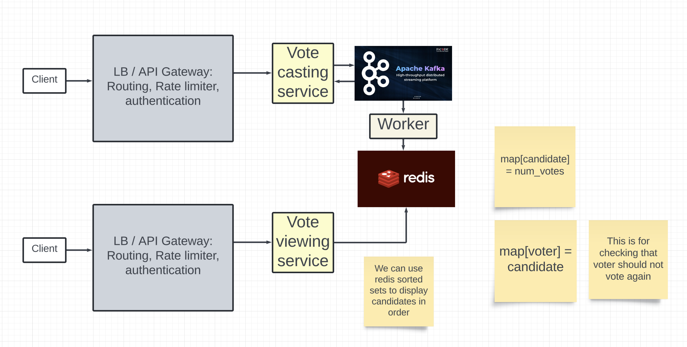

# Voting application
## Requirements
- Users can vote for a person
- Users can see the realtime leaderboard with the idea of eventual consistency
- People cant change their vote.
- People cant vote for multiple people.

## Non functional requirements
- The service should be highly available.
- Voting operation should have low latency.

## Capacity estimations
```
- 100 M people 
- window is 5 minute to vote
- 10% of people vote: 10M votes


Vote QPS = 10M / 300 = 33000 QPS
```

## API
POST `/voting_app/v1/votes`
```
accesstoken in headers for user id
{
    id: user_id of the contestant
}
```

GET `/voting_app/v1/votes`
```
{
    votes: [
        {
            candidate,
            num_votes
        }
    ]
}
```

## Design

