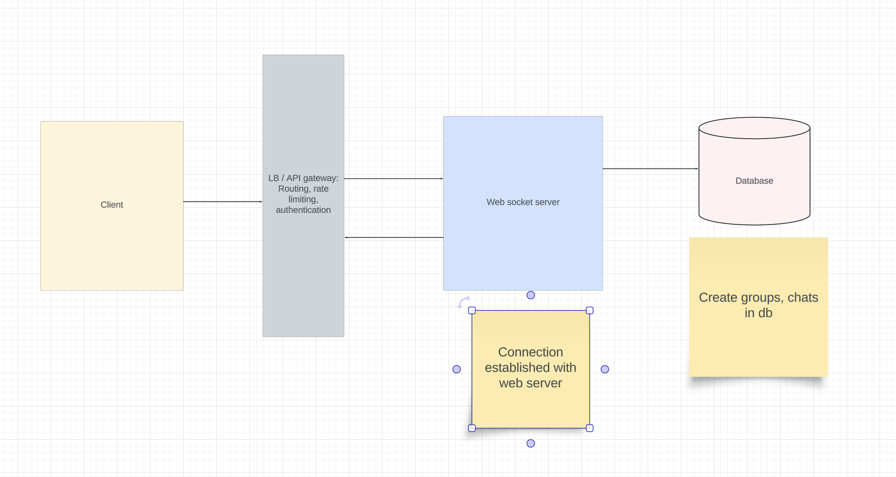
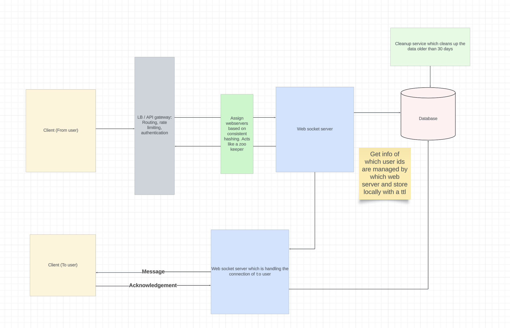
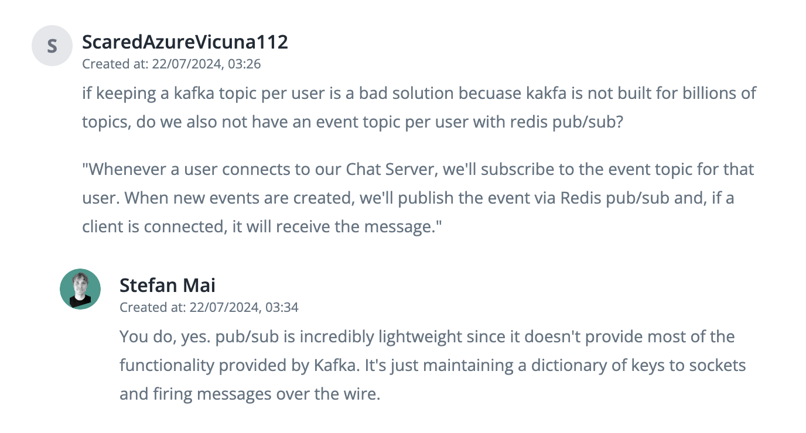
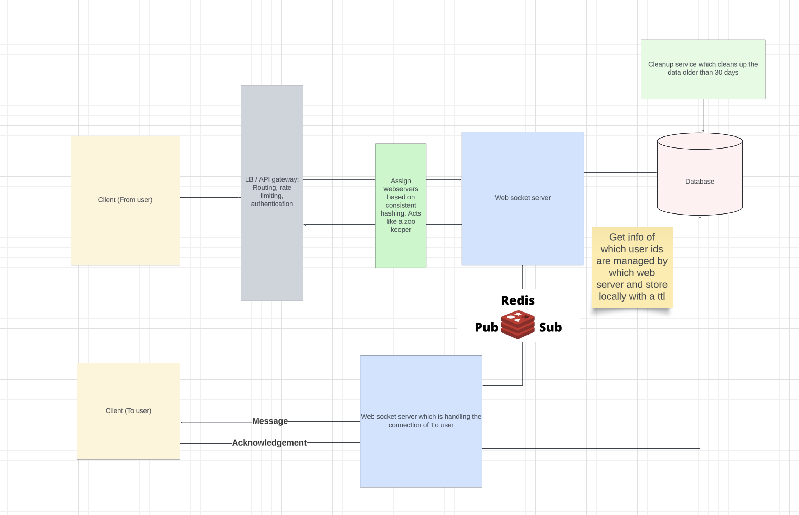

# Whatsapp
## Functional requirements
1. Create user, groups
2. Message one to one / group message
3. Send images / videos

## Non functional requirements
- Low latency of sending messages
- Scalable under traffic
- Remove messages older than 30 days (Clear this up with interviewer)

## QPS and storage estimations
- 100 M monthly users
- 50% of them daily users = 50M users
- Users send 10 messages daily and 20% is media content.
```
Chat QPS:
50 * 10^6 * 10 / 86400 = 6000 QPS

Storage estimations
Each message is roughly 20 Bytes in size and media is 200 bytes in size
Each user sends 560 bytes of data.
Daily storage = 50 * 10^6 * 560 = 28 * 10^9 = 28 GB / day
```

## Entities

1. user - id, name, email, phone
2. groups
```
{
  id,
  name,
  participants,
  img
}
```

3. message
```
{
  id,
  message,
  type (text / image / video)
  from,
  to (group_id | user_id),
  is_group,
  timestamp
}
```

4. events
```
{
  id,
  from,
  to (user_id),
  message_id,
  status (delivered / not delivered)
}
```

- We would be creating an event for every user.
- In case a message needs to be sent to every group user, then we would be creating individual events for each user.


## API endpoints
- POST `/whatsapp/v1/groups` (We can do this via websocket protocol also)
```
accesstoken in headers

{
    "group_name",
    "users"
}
```

- PUT `/whatsapp/v1/groups` => Add or remove users (We can do this via websocket also)

- Send a message (This will be done via websockets)
```
{
    chat_id,
    group_id,
    from,
    to,
    timestamp
}
```

## Design 1


## Sending messages to other user when both are online


## Sending messages to other user when the other user is offline
In this case, we would be reading the `events` table for the `to` user and sending these updates to the offline user once they are online.

## Scaling even more
Instead of direct server to server connection for sending messages, we would be offloading to queue where `every user would correspond to a topic`. 

We would be having billion users and Kafka is not made for billions of topics. So we would be using `Redis Pub/Sub` here as redis pub/sub is incredibly lightweight since it doesn't provide most of the functionality provided by Kafka. (Answered in one of the comments here: https://www.hellointerview.com/learn/system-design/answer-keys/whatsapp)






