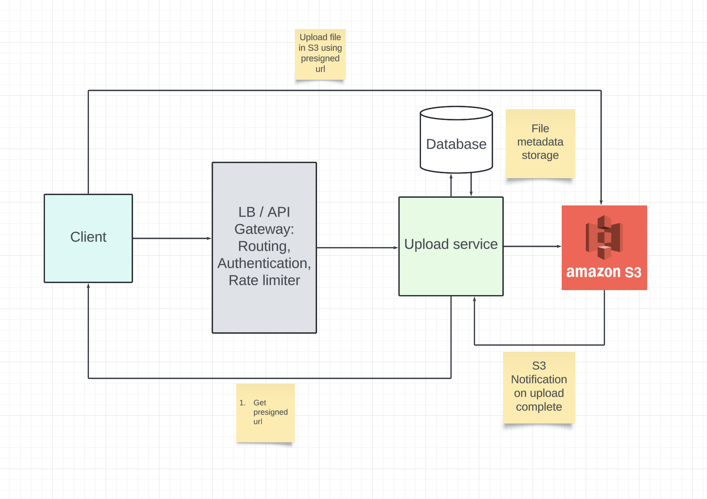
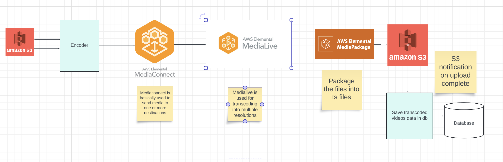
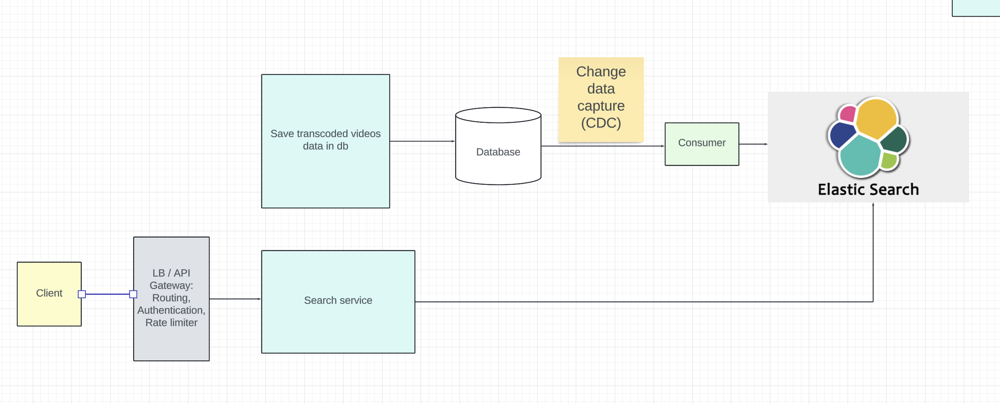
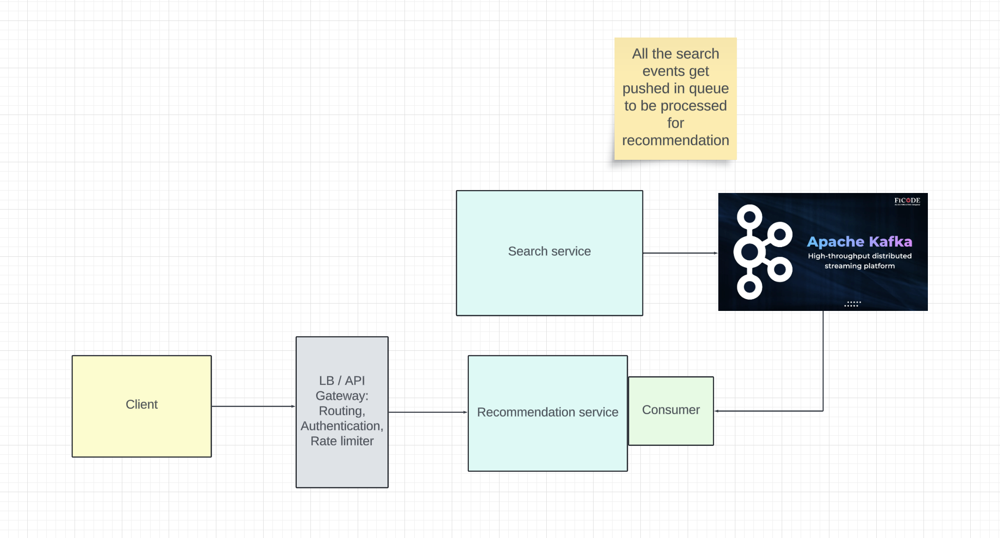
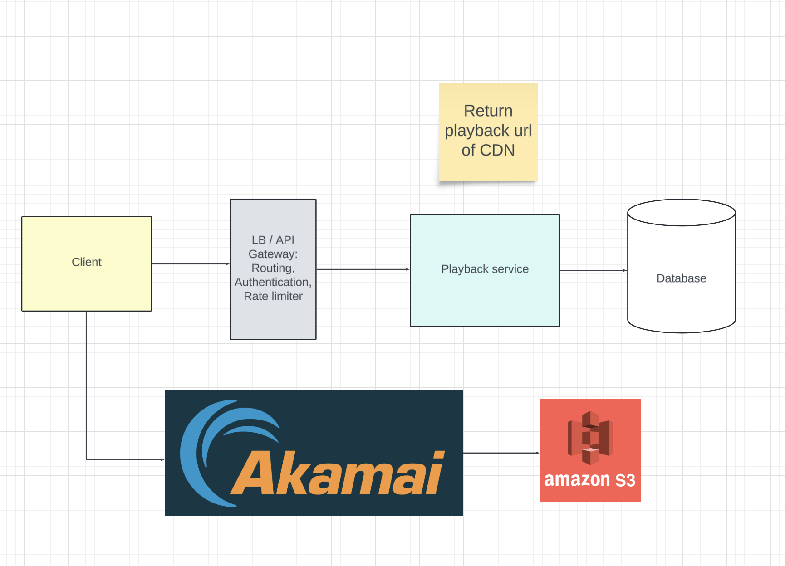

# YouTube
## Functional Requirements
- Users can upload videos
- Users can watch videos
- Users can search for videos
- Users should be able to see homepage

## Non functional requirements
- The system should have low latency for uploading / watching videos
- The system should be available

## Capacity estimations
```
- 100 M Users monthly
- 50% Active users daily
- 1% of them upload videos - 5L people upload videos daily
- Each video is roughly 400 MB in size on average
- Total storage daily for storing original videos: 5 * 10^5 * 400 * 10^6 = 2 * 10^14 = 200 TB / day

- Total data per sec uploaded = 200 TB / 86400 = 2 * 10^12 / 864 = 2.3 GBPS

- Each video is transcoded into multiple resolutions (480P, 720P, 1080P), Lets consider we need another 2X data, so total storage daily = 600 TB / day
```

## Entities
- original_video_metadata
```
{
    id,
    name,
    uploaded_by,
    status (UPLOADED, IN_PROGRESS),
    size,
    fingerprint,
    S3 Url
}
```
- original_video_chunk_data
```
{
    file_id,
    chunk_id,
    chunk_size
}
```

- transcoded_video_metadata
```
{
    id,
    name,
    uploaded_by,
    size,
    resolution,
    fingerprint,
    S3 Url
}
```

## API
GET `youtube/v1/presigned_url?file_name={file_name}`
```
accesstoken is headers for userId
```

POST `presigned_url`
```
{
    chunk_data
}
Basically we do multipart upload here and then once all the chunks are completed, we send a request to s3 to complete the multipart so that S3 can combine all the chunks to a single file
```

GET `youtube/v1/videos/:videoId`
```
accesstoken in headers for userId
{
    playback_url (CDN urls)
}
```

GET `playback_url`
```
Returns master manifest file

720P - link to 720P media manifest file
360P - Link to 360P media manifest file
1080P - ...
```
Now according to internet speed of the client, the player choses the appropiate media manifest file

GET `playback_media_manifest`
```

1.ts, duration = 4s
2.ts, duration = 4s
...
```


GET `/youtube/v1/calalog`
```
accesstoken in headers for user id

{
    videos: [
        {
            id,
            name,
            thumbnail,
            ...
        }
    ]
}
```

## Design
### Uploading of videos


### Transcoding of videos


## Search videos


## Catalog of videos in homepage


## View videos

