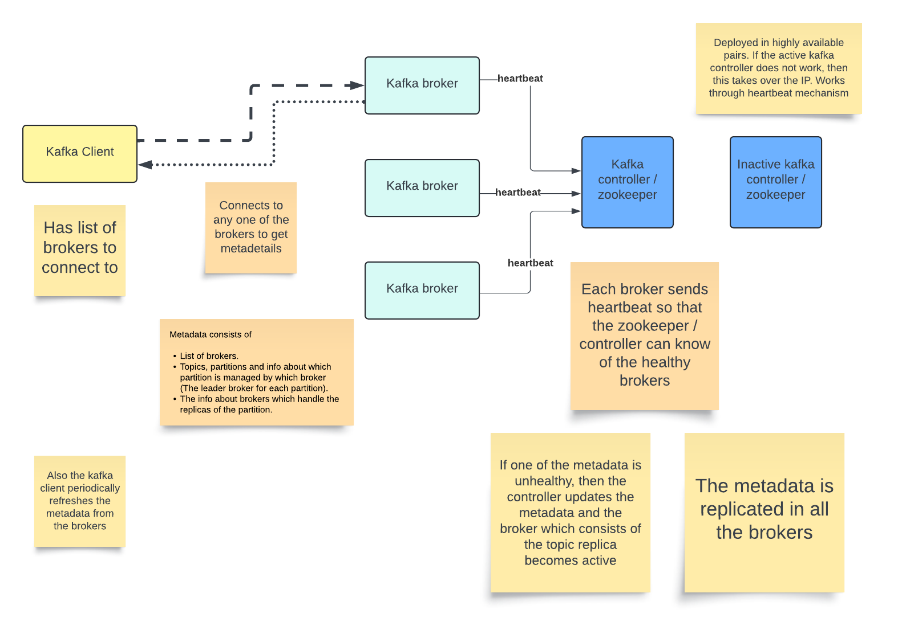

# Kafka Overview (Go through the slides first!)

When a producer connects to any of the brokers, it gets the metadata which consists of
- List of brokers.
- Topics, partitions and info about which partition is managed by which broker (The leader broker for each partition). 
- The info about brokers which handle the replicas of the partition.

Each broker has the metadata.

## How is the metadata managed

- In older versions of kafka, <b>Zookeeper</b> was used to manage metadata, but now <b>Kafka controller</b> manages this metadata.
- Each broker sends heartbeat to the controller. If a broker does not send a heartbeat, then the controller would consider it dead and update the metadata. Brokers periodically synchronise the metadata internally and with the controller / zookeeper.
- The producer regularly fetches the metadata to update the list of brokers for each partition. The refresh would also be triggered in case of an error while publishing the message.
- Kafka controller has the metadata of brokers (which broker maintain which partitions, replicas and leaders) and also does leadeer election in case a broker goes down.



Also refer the mongo design [here](../../Database/Database%20Fundamentals/Mongo%20Overview/README.md)

## Kafka guarentees atleast once delivery

- Kafka maintains this reliability due to partition replicas.
- When data is written to leader partition, data gets replicated to other replicas asyncronously by default (We can configure this).
- If we set `acks=1`, it means we get an acknowledgement from broker when only the leader partition write is completed. If the leader fails and the replicas are not in sync, then the controller can elect a leader from not in sync replicas and in this case, there would be data loss.
- We can set the below config for replication.
```
acks=all
min.insync.replicas=2
```
- `acks=all` does not mean kafka broker would wait till all replicas write the data. `acks=all` means it would wait till minimum number of in sync replicas have the same data as leader which is 2 in the above case.

### Example
```
Partition P0:

Broker 1 (Leader)   → [M1, M2, M3]
Broker 2 (ISR)      → [M1, M2, M3]
Broker 3 (Follower) → [M1, M2] (not in ISR)
```

Now:

- Broker 1 crashes
- Broker 2 crashes

ISR = empty. In this case, Kafka has two possible behaviors, depending on config:

### Case 1: Unclean leader election = FALSE (default safe mode)
```
unclean.leader.election=false
```
Kafka will NOT elect Broker 3 (out of sync) and Partition becomes unavailable.
Result:
- No data loss
- But system is down for that partition

### Case 2: Unclean leader election = TRUE
```
unclean.leader.election=true
```

Kafka will pick Broker 3 as new leader (even though it's behind)
Result:
- New Leader → [M1, M2]
- M3 is permanently lost

## So what about at-least-once guarantee?

It depends on what survived:

### Case A: All ISR replicas lost permanently
- Data is gone
- Kafka cannot deliver it even once
- Guarantee is broken at system level

### Case B: ISR nodes temporarily down (not dead)
- Partition unavailable for a while
- When ISR comes back → data still exists
- Guarantee still holds

## Safe Configuration
```
replication.factor = 3
min.insync.replicas = 2
acks = all
unclean.leader.election = false
```

---

## Scenario: Leader Crashes

### Before Crash
- Leader (R1) → M1, M2
- Follower (R2) → M1, M2 (in ISR)
- Follower (R3) → M1 (lagging, not in ISR)

### What Happens

- Controller selects **R2** (from ISR) as the new leader  
- Message **M2 is preserved**

### Result

- No data loss  
- System continues operating  

---

## Worse Scenario: ISR Shrinks

### State
`ISR = {R1 only}`

### Configuration Constraint
`min.insync.replicas = 2`

### What Happens

- Kafka rejects new writes  
- Prevents unsafe acknowledgments  

---

## Extreme Scenario: All ISR Fail

### State
`ISR = {}`
---

### Case 1: Unclean Leader Election Disabled

`unclean.leader.election = false`

#### What Happens

- Kafka does not elect an out-of-sync replica  
- Partition becomes unavailable  

#### Result

- No data loss  
- Downtime occurs  

---

### Case 2: Unclean Leader Election Enabled
`unclean.leader.election = true`

#### What Happens

- Kafka elects an out-of-sync replica as leader  
- Missing messages are lost due to log truncation  

#### Result

- Data loss occurs  
