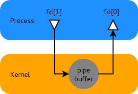

# Inter-Process Communication
IPC stands for Inter-Process Communication which refers to mechanisms used by different processes to share data (communicate) with each other.

# IPC Mechanisms
## 1. Pipes


Pipes provide a simple and efficient way to transfer data between two or more processes <b>running on the same machine</b>.

Writes to a pipe in Unix-based operating systems, including Linux and macOS, are typically implemented using a <b>shared memory buffer</b>. When one process writes data to a pipe, the data is copied into a shared memory buffer that is accessible by other processes that have the pipe open for reading.

The shared memory buffer used by pipes allows for efficient communication between processes, as data can be transferred between processes without the overhead of writing to a file or using network sockets. The shared memory buffer acts as an intermediary between the processes, allowing data to be passed between them in a more direct and efficient manner.

Some Notes:
<ul>
    <li>
        <b>File Descriptors</b>: File descriptors are basically references for files in a particular process. They are used by the operating system to uniquely identify open files within a process, and allow the process to perform various I/O operations on the file, such as reading, writing, and seeking.
    </li>
    <li>
        <b>Fork: </b> fork() method is used to create child process. The child process is an exact copy of the parent process, including its code, data, file descriptors, and other process attributes.

The fork() function returns twice, once in the parent process and once in the child process. In the parent process, the return value is the process ID (PID) of the newly created child process, while in the child process, the return value is 0, indicating that it is the child process.
    </li>
</ul>

```cpp
#include <iostream>
#include <unistd.h>
#include <sys/wait.h>

int main() {
    int fd[2]; // File descriptors for pipe

    if (pipe(fd) == -1) {
        std::cerr << "Failed to create pipe." << std::endl;
        return 1;
    }


    pid_t pid = fork(); // Create a child process

    if (pid == -1) {
        std::cerr << "Failed to fork." << std::endl;
        return 1;
    }

    if (pid == 0) {
        // Child process
        close(fd[0]); // Close the read end of the pipe

        int data = 42;
        write(fd[1], &data, sizeof(data)); // Write data to the write end of the pipe

        close(fd[1]); // Close the write end of the pipe
    } else {
        // Parent process
        close(fd[1]); // Close the write end of the pipe

        int received_data;
        read(fd[0], &received_data, sizeof(received_data)); // Read data from the read end of the pipe

        std::cout << "Received data from child process: " << received_data << std::endl;

        close(fd[0]); // Close the read end of the pipe

        wait(nullptr); // Wait for the child process to exit
    }

    return 0;
}

```

### Why pipes are unidirectional?
Unidirectional pipes are optimized for efficient communication between processes. By restricting data flow to one direction, unidirectional pipes can be implemented using shared memory buffers, which allow for fast and efficient data transfer without the need for complex synchronization mechanisms. This results in minimal overhead and faster data transfer between processes.

### What happens if both parent and child process try to write to one end of the pipe?
As locking mechanisms are not implemented in pipes, writing to the same end of the pipe by both parent and child process may lead to data corruption and race conditions.

### Pipes can be used for communication between any two processes, Not just parent-child processes
If the relationship is not parent-child, then they can communicate using named pipes.
Example:

Process A
```cpp
#include <iostream>
#include <fcntl.h>
#include <unistd.h>
#include <sys/types.h>
#include <sys/stat.h>
#include <string>

int main() {
    std::string message = "Hello from Process A!";
    int fd;
    mkfifo("/tmp/myfifo", 0666); // Create a named pipe (FIFO)

    // Open the named pipe for writing
    fd = open("/tmp/myfifo", O_WRONLY);
    write(fd, message.c_str(), message.length() + 1); // Write message to the named pipe
    close(fd); // Close the named pipe

    return 0;
}

```
Process B
```cpp
#include <iostream>
#include <fcntl.h>
#include <unistd.h>
#include <sys/types.h>
#include <sys/stat.h>
#include <string>

int main() {
    char buffer[100];
    int fd;

    // Open the named pipe for reading
    fd = open("/tmp/myfifo", O_RDONLY);
    read(fd, buffer, sizeof(buffer)); // Read message from the named pipe
    close(fd); // Close the named pipe

    std::cout << "Received message: " << buffer << std::endl; // Print the received message

    return 0;
}

```
## Message Queues


A message queue is a communication channel that allows one or more processes to send and receive messages of a defined structure. Messages are placed in a message queue by sending processes and are retrieved from the queue by receiving processes.

```cpp
#include <iostream>
#include <cstring>
#include <mqueue.h>
#include <cstdlib>
#include <ctime>

// Define message structure
struct Message {
    int id;
    char text[256];
};

int main() {
    // Seed random number generator
    std::srand(std::time(0));

    // Define message queue attributes
    struct mq_attr attr;
    attr.mq_flags = 0;
    attr.mq_maxmsg = 10;     // maximum number of messages in the queue
    attr.mq_msgsize = sizeof(Message);  // size of each message in bytes

    // Create a message queue with a name and attributes
    mqd_t mqd = mq_open("/my_message_queue", O_CREAT | O_RDWR, 0666, &attr);
    if (mqd == (mqd_t)-1) {
        std::cerr << "Failed to create message queue." << std::endl;
        return 1;
    }

    std::cout << "Message queue created successfully." << std::endl;

    // Send messages to the message queue
    for (int i = 1; i <= 5; ++i) {
        Message msg;
        msg.id = i;
        std::sprintf(msg.text, "Message %d", i);
        mq_send(mqd, reinterpret_cast<const char*>(&msg), sizeof(Message), 0);
        std::cout << "Sent message: " << msg.text << std::endl;
    }

    // Receive messages from the message queue
    char buffer[sizeof(Message)];
    unsigned int priority;
    while (true) {
        int received = mq_receive(mqd, buffer, sizeof(buffer), &priority);
        if (received > 0) {
            Message* msg = reinterpret_cast<Message*>(buffer);
            std::cout << "Received message: " << msg->text << std::endl;

            // Check for termination message
            if (std::strcmp(msg->text, "Terminate") == 0) {
                break;
            }
        }
    }

    // Close and unlink the message queue
    mq_close(mqd);
    mq_unlink("/my_message_queue");

    return 0;
}

```

### What happens if the message queues are not unlinked?
Message queues are a form of inter-process communication (IPC) mechanism in Unix-like operating systems, and they are persistent, meaning they can survive beyond the lifetime of the process that created them.

If a process terminates without explicitly closing or unlinking the message queue using mq_close() and mq_unlink() respectively, the message queue will continue to exist until it is explicitly closed or unlinked by another process or by manually deleting the message queue object.

It's important to ensure that all processes that use a message queue properly close the message queue using mq_close() and unlink it using mq_unlink() when they are done with it, to prevent potential resource leaks and ensure proper cleanup.

## Sockets
Sockets are a <b>communication endpoint</b> for sending and receiving data over a network. They provide a means for processes running on <b>different machines</b> to communicate with each other, enabling interprocess communication (IPC) across a network.

<b>Sockets are identified by an IP address and a port number, which together uniquely identify a particular communication endpoint. Processes can create sockets, bind them to a specific IP address and port number, and then use them to send and receive data to and from other processes using the same IP address and port number.</b>

Server Code:
```cpp
#include <iostream>
#include <unistd.h>
#include <arpa/inet.h>

int main() {
    int sockfd, newsockfd;
    sockaddr_in serv_addr, cli_addr;
    socklen_t clilen;
    char buffer[256];

    // Create socket
    sockfd = socket(AF_INET, SOCK_STREAM, 0);
    if (sockfd < 0) {
        std::cerr << "Error opening socket." << std::endl;
        return 1;
    }

    // Initialize server address
    serv_addr.sin_family = AF_INET;
    serv_addr.sin_addr.s_addr = INADDR_ANY;
    serv_addr.sin_port = htons(12345);

    // Bind socket to server address
    if (bind(sockfd, (sockaddr*) &serv_addr, sizeof(serv_addr)) < 0) {
        std::cerr << "Error binding socket." << std::endl;
        close(sockfd);
        return 1;
    }

    // Listen for incoming connections
    listen(sockfd, 5);
    std::cout << "Server listening for connections..." << std::endl;

    clilen = sizeof(cli_addr);

    // Accept incoming connection
    newsockfd = accept(sockfd, (sockaddr*) &cli_addr, &clilen);
    if (newsockfd < 0) {
        std::cerr << "Error accepting connection." << std::endl;
        close(sockfd);
        return 1;
    }

    // Read data from client
    int n = read(newsockfd, buffer, sizeof(buffer));
    if (n < 0) {
        std::cerr << "Error reading from socket." << std::endl;
        close(newsockfd);
        close(sockfd);
        return 1;
    }

    std::cout << "Received data from client: " << buffer << std::endl;

    // Write data back to client
    const char* response = "Hello from server!";
    n = write(newsockfd, response, strlen(response));
    if (n < 0) {
        std::cerr << "Error writing to socket." << std::endl;
        close(newsockfd);
        close(sockfd);
        return 1;
    }

    close(newsockfd);
    close(sockfd);

    return 0;
}

```

Client Code:
```cpp
#include <iostream>
#include <unistd.h>
#include <arpa/inet.h>

int main() {
    int sockfd;
    sockaddr_in serv_addr;
    char buffer[256];

    // Create socket
    sockfd = socket(AF_INET, SOCK_STREAM, 0);
    if (sockfd < 0) {
        std::cerr << "Error opening socket." << std::endl;
        return 1;
    }

    // Initialize server address
    serv_addr.sin_family = AF_INET;
    serv_addr.sin_addr.s_addr = inet_addr("127.0.0.1"); // IP address of the server
    serv_addr.sin_port = htons(12345); // Port number used by the server

    // Connect to server
    if (connect(sockfd, (sockaddr*) &serv_addr, sizeof(serv_addr)) < 0) {
        std::cerr << "Error connecting to server." << std::endl;
        return 1;
    }

    // Send data to server
    const char* message = "Hello from client!";
    int n = write(sockfd, message, strlen(message));
    if (n < 0) {
        std::cerr << "Error writing to socket." << std::endl;
        close(sockfd);
        return 1;
    }

    // Read data from server
    n = read(sockfd, buffer, sizeof(buffer));
    if (n < 0) {
        std::cerr << "Error reading from socket." << std::endl;
        close(sockfd);
        return 1;
    }

    std::cout << "Received data from server: " << buffer << std::endl;

    close(sockfd);

    return 0;
}

```


