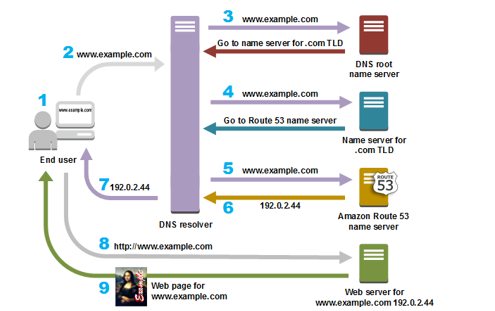

# Networking Basics

## Protocol 
A protocol is a set of rules of communication between two computers. Communications between two devices require that the devices agree on the format of data that is being exchanged. 

## HTTP 
HTTP stands for <b>Hypertext transfer protocol</b> which is basically a set of rules for communication between web browser (client) and server. 
HTTP is based on request/response cycle.  

## Requests 
A request from client to a server includes the following: 
<ul>
  <li>Request Method</li>
  <li>Request Header</li>
  <li>Request Data</li>
</ul>

### Request Methods 
There are various methods for a request:  

<ul>
  <li> GET (To get specified document) </li>
  <li> POST (To post data in server) </li>
  <li> PUT (To modify a complete resource in server) </li>
  <li> PATCH (To modify some parts of resource in server) </li>
  <li> HEAD (To get only the header information from the document) </li>
</ul>
  
  
### Request Header: 
<table>
  <tr>
    <td><b>Request Header</b></td>
    <td><b>Description</b></td>
  </tr>
  <tr>
    <td>Accept </td>
    <td>The format of the response the client can accept (Json, xml, html, image etc)</td>
  </tr>
  <tr>
    <td>Authorization</td>
    <td>Used if the user wants to authenticate with the server </td>
  </tr>
  <tr>
    <td>User-agent</td>
    <td>The information about the client (Name and version of client software)</td>
  </tr>
  <tr>
    <td>Host</td>
    <td>The host and port number of the server to which the request is being sent.</td>
  </tr>
</table>

### Request Data: 
The data to be sent with request methods like POST, PATCH, PUT requests. In case of request methods like GET, HEAD etc, the data is empty. 

## Responses: 

The responses from the server includes the following: 
<ul>
  <li>Status Code</li> 
  <li>Response header</li> 
  <li>Response data</li> 
</ul>
  
  
## Status Code 

<table>
  <tr>
    <td>
      Status Code 
    </td>
    <td>
      Meaning
    </td>
  </tr>
   
  <tr>
    <td>
      200
    </td>
    <td>
      OK
    </td>
  </tr>
    
  <tr>
    <td>
      302
    </td>
    <td>
      Redirection to New URL
    </td>
  </tr>
    
  <tr>
    <td>
      401 
    </td>
    <td>
      Unauthorized
    </td>
  </tr>
    
  <tr>
    <td>
      404 
    </td>
    <td>
      Forbidden
    </td>
  </tr>
    
  <tr>
    <td>
      500
    </td>
    <td>
      Server Error
    </td>
  </tr>
    
</table>

## Response Headers 

<table>
  
  <tr>
    <td>
      Response Header 
    </td>
    <td>
      Description
    </td>
  </tr>
  
  <tr>
    <td>
      Server
    </td>
    <td>
      The name and version of the server 
    </td>
  </tr>
  
  <tr>
    <td>
      Date 
    </td>
    <td>
      The current date
    </td>
  </tr>
  
  <tr>
    <td>
      Content-type 
    </td>
    <td>
      The content type of the data 
    </td>
  </tr>
  
  <tr>
    <td>
      Content-length 
    </td>
    <td>
      The length of the data that follows 
    </td>
  </tr>
  
</table>
  
## Response Data 
The response data for the request is sent by the server. 

  
# DNS
DNS: DNS stands for Domain naming system. The domain names such as mdn.com or espn.com is converted into Internet protocol address so that the request can be sent to the computer with that address. Using DNS, we dont have to remember the IP address to connect to other computer. 

Authoritative DNS Server: This server contains the map with domain name as key and ip address as value.  
           
Recursive DNS Server or DNS Resolver: The DNS Resolver is a server designed to receive queries from client machines through applications such as web browsers. Typically the resolver is then responsible for making additional requests to root server, TLD server, Authoritative server (at the last) in order to satisfy the client’s DNS query. 

  
<ul>
  <li>
    A user types ‘example.com’ into a web browser and the query travels into the Internet and is received by a DNS recursive resolver. 
  </li>
  
  <li>
    The resolver then queries a DNS root nameserver (.). 
  </li>
  
  <li>
    The root server then responds to the resolver with the address of a Top Level Domain (TLD) DNS server (such as .com or .net), which stores the information for its domains. When searching for example.com, our request is pointed toward the .com TLD. 
  </li>

  <li>
    The resolver then makes a request to the .com TLD. 
  </li>
  
  <li>
    The TLD server then responds with the IP address(es) of the domain’s nameserver (Authoritative DNS Server), example.com. 
  </li>
  
  <li>
    Lastly, the recursive resolver sends a query to one of the domain’s nameserver. 
  </li>
  
  <li>
    The IP address for example.com is then returned to the resolver from the nameserver. 
  </li>
  
  <li>
    The DNS resolver then responds to the web browser with the IP address of the domain requested initially. 
  </li>
  
</ul>

  

## TCP and UDP:

### TCP (Taken from https://networkengineering.stackexchange.com/questions/24068/why-do-we-need-a-3-way-handshake-why-not-just-2-way)
Transmission Control Protocol (TCP) is connection-oriented, meaning once a connection has been established, data can be transmitted in two directions. TCP has built-in systems to check for errors and to guarantee data will be delivered in the order it was sent, making it the perfect protocol for transferring information like still images, data files, and web pages.

But while TCP is instinctively reliable, its feedback mechanisms also result in a larger overhead, translating to greater use of the available bandwidth on your network. 

TCP Establishes a 3-way handshake.

In TCP, the two parties keep track of what they have sent by using a Sequence number. Effectively it ends up being a running byte count of everything that was sent. The receiving party can use the opposite speaker's sequence number to acknowledge what it has received.

But the sequence number doesn't start at 0. It starts at the ISN (Initial Sequence Number), which is a randomly chosen value. And since TCP is a bi-directional communication, both parties can "speak", and therefore both must randomly generate an ISN as their starting Sequence Number. Which in turn means, both parties need to notify the other party of their starting ISN.

So you end up with this sequence of events for a start of a TCP conversation between Alice and Bob:

Alice ---> Bob    SYNchronize with my Initial Sequence Number of X

Alice <--- Bob    I received your syn, I ACKnowledge that I am ready for [X+1]

Alice <--- Bob    SYNchronize with my Initial Sequence Number of Y

Alice ---> Bob    I received your syn, I ACKnowledge that I am ready for [Y+1]

Notice, four events are occurring:

Alice picks an ISN and SYNchronizes it with Bob.

Bob ACKnowledges the ISN.

Bob picks an ISN and SYNchronizes it with Alice.

Alice ACKnowledges the ISN.

In actuality though, the middle two events (#2 and #3) happen in the same packet. What makes a packet a SYN or ACK is simply a binary flag turned on or off inside each TCP header, so there is nothing preventing both of these flags from being enabled on the same packet. So the three-way handshake ends up being:

Bob <--- Alice         SYN

Bob ---> Alice     SYN ACK 

Bob <--- Alice     ACK     

Notice the two instances of "SYN" and "ACK", one of each, in both directions.

So to come back to your question, why not just use a two-way handshake? The short answer is because a two way handshake would only allow one party to establish an ISN, and the other party to acknowledge it. Which means only one party can send data.

But TCP is a bi-directional communication protocol, which means either end ought to be able to send data reliably. Both parties need to establish an ISN, and both parties need to acknowledge the other's ISN.

So in effect, what you have is exactly your description of the two-way handshake, but in each direction. Hence, four events occurring. And again, the middle two flags happen in the same packet. As such three packets are involved in a full TCP connection initiation process.

TCP can be used for emails, file transfers etc.

### UDP
UDP stands for User Datagram Protocol. It is also known as connectionless protocol (Why? Because It does not establish a handshake with the client to notify that it will send data). UDP justs sends data without the guarentee that the packets would be received in order.

It is faster than TCP because it does not have to resend the lost packets, or it does not have to keep track of the order of packets. This protocol is used in streaming live videos where low latency is required.

### TCP vs UDP

