# Fundamentals of networking

## OSI Model


Layer 6 - Presentation is all about encoding and serialization. For eg., sending json payload: This needs to be converted to string and can be encoded also to utf-8 for example.

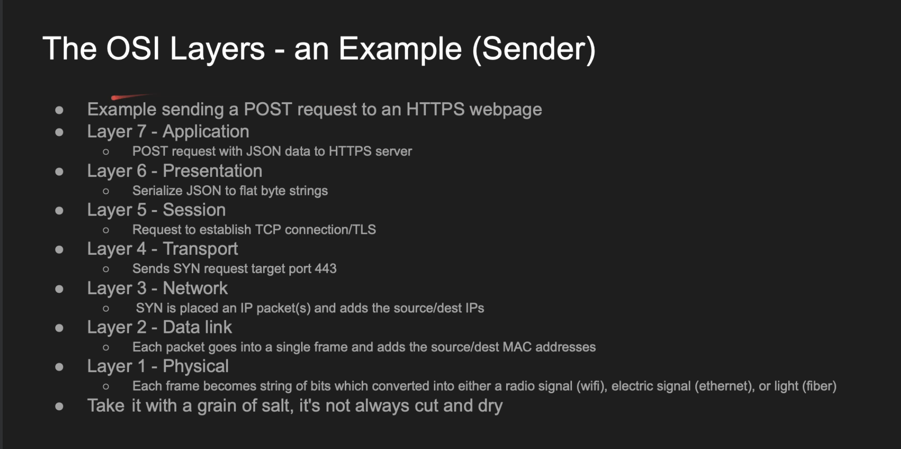

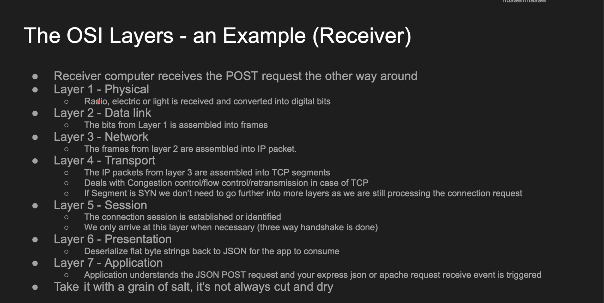

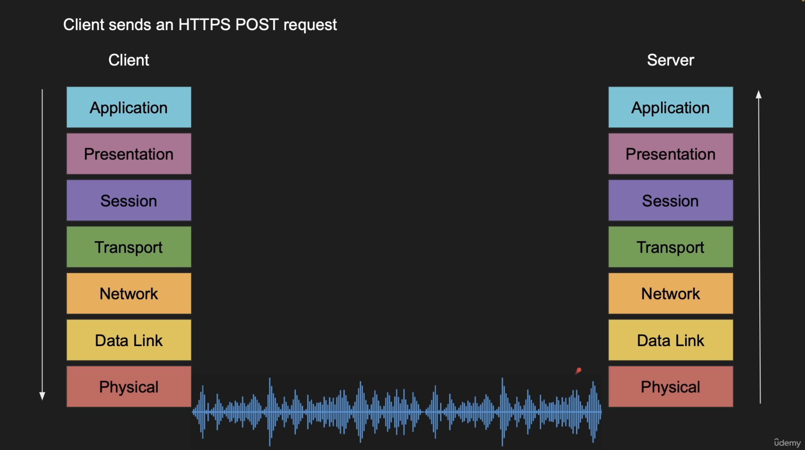

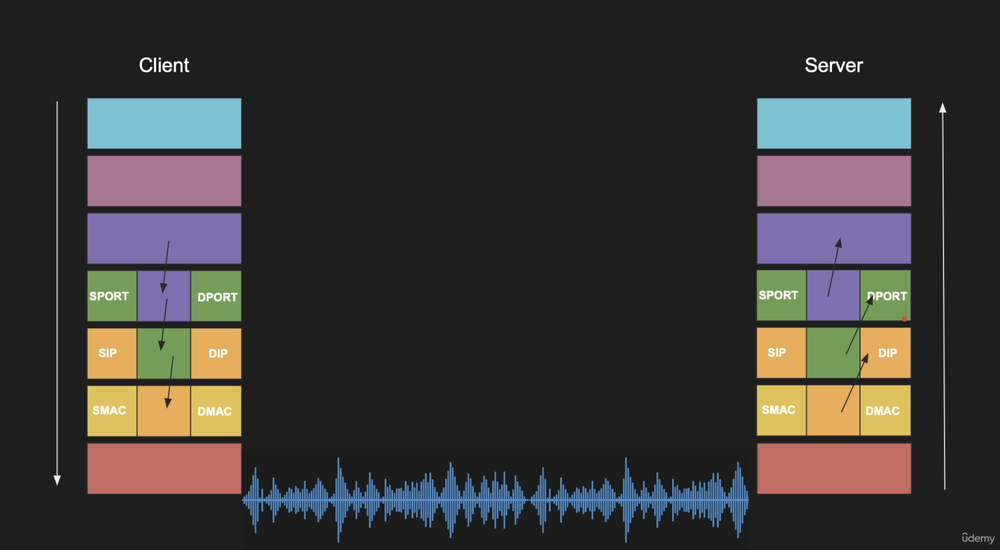
- SPORT: Source Port
- DPORT: Destination Port
- SIP: Source IP
- DIP: Destination IP
- SMAC: Source Mac
- DMAC: Destination Mac


The above images depict how the data travels through the layers from client to server. In my point of view, Presentation and Session layer also can be included in the application layer. 

Session layer deals with maintaining sessions like using auth tokens for requests etc.

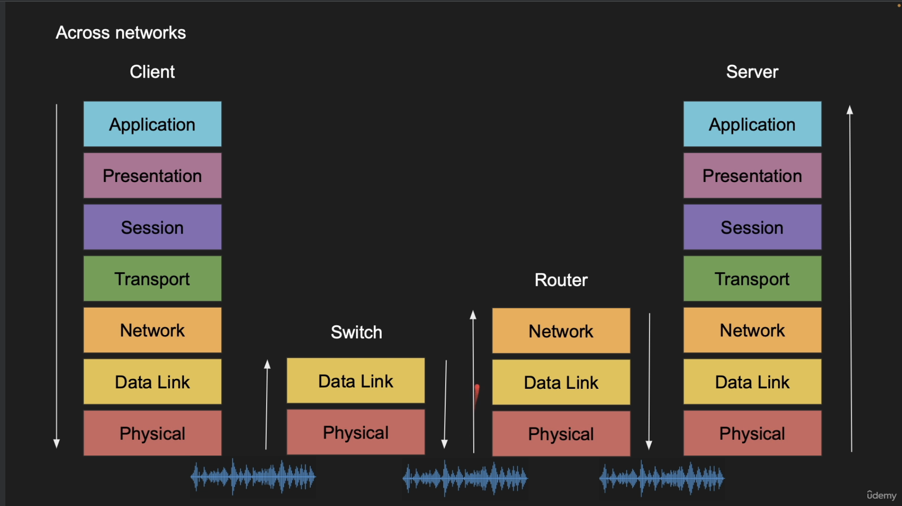
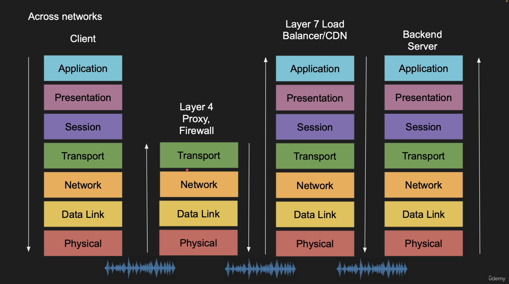

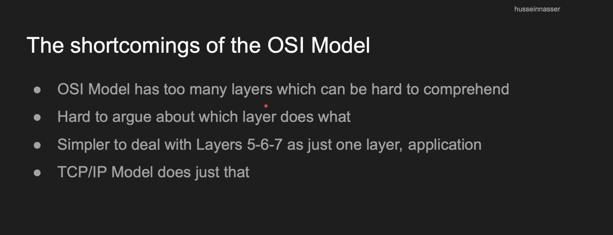

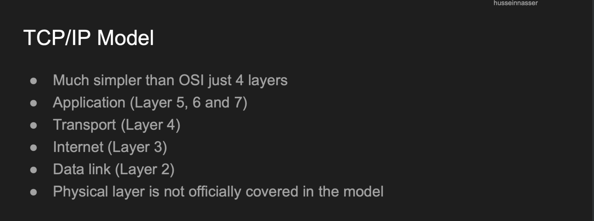

## Host to Host Connection

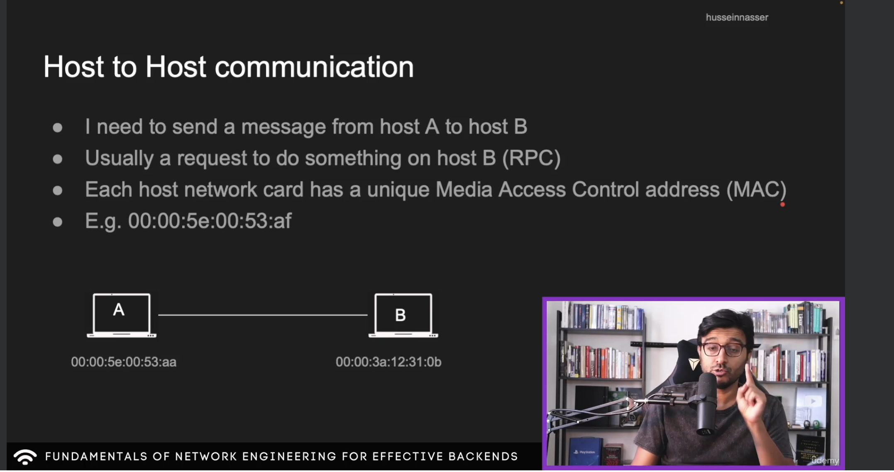

### MAC addresses (Media Access Control addresses)
MAC addresses are intended to be unique for each network interface on a device.

A network interface is a software or hardware interface between a computer and a network. It enables a device to communicate with other devices on a network. Common examples of network interfaces include Ethernet ports, Wi-Fi adapters, and Bluetooth adapters.

A device can contain multiple network interfaces, and each interface will have its own unique MAC address. For example:

- A laptop might have an Ethernet adapter and a Wi-Fi adapter, each with its own unique MAC address.
- A router may have several Ethernet ports and one or more Wi-Fi bands (like 2.4 GHz and 5 GHz), each with a different MAC address.

### 2.4 GHz vs 5 GHz
- These numbers are frequencies. Wifi can have both these bands or just one band.
- Frequency is inversely proportional to wavelength and so `5 GHz` has less wavelength. Less wavelength indicates that `5 GHz` has `less penetration power` and so it is good for `short distances`.
- Many devices like oven etc operate on `2.4 GHz`. When our device is configured to listen to `2.4 GHz` wifi signals, it would also listen to other `2.4 GHz` signals, which would cause `slow network speeds`. But it has `longer wavelength`, so its penetration power is more and it can be used for `long distances` also. 

```
More frequency -> More data can be sent per cycle -> Higher speeds -> But less penetration power -> less coverage.


Less frequency -> Less data can be sent per cycle (And also interference with other devices with operate in same frequency) -> Less speed -> But high penetration power -> More coverage.
```

- In summary,

    (a) If we want `more coverage`, but can deal with `slow speeds` (Due to other devices which operate on the same band), then we can go for `2.4 GHz` wifi band.
    
    (b) If we want `high speeds`, but can deal with `low coverage`, then we can go for `5 GHz` wifi band.

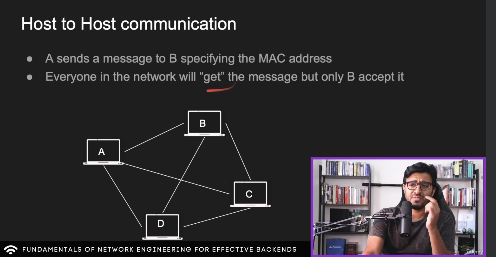

If I want to send a msg to another device (which would have its own mac address), then we don't have a way to know where exactly to send it to and in the above example, the machines are on the same network and to send a message to another device, it needs to send the msg to all the other devices in the same network, (Go to level 2 in the data link layer to know the mac address) and then only the correct device would accept the message.

But this is also very dangerous security wise. Any malicious user can put a "sniffer" which would not reject any messages even though it was not intended for his mac address.


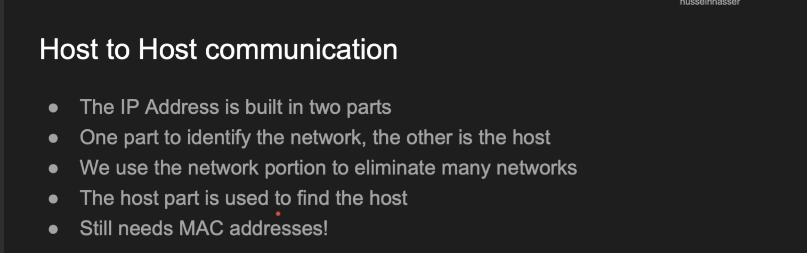

## My understanding of IP and MAC addresses

IP address is allocated to a device when the device connects to a network and the mac address is a permanent address of the NIC (Network interface card) of the device (WiFi, bluetooth, ethernet ports). 

### Communication between devices within same network
- Device 1 -> Switch -> Device 2

### Switch vs router
- A switch is like a manager for local traffic, ensuring data gets to the right device within the same network efficiently. Many routers are also integrated with switch.
- A router acts as a gateway between your local network and the outside world (like the internet), managing and directing incoming and outgoing traffic appropriately.


### Communication between 2 different networks
- Device 1 -> Switch -> Router -> Router -> Switch -> Device 2


### IP Addresses are used to find the network and mac addresses are used to find the device within the network

But why not only use the IP address instead of the mac address as IP addresses are also unique? Because IP addresses can change dynamically. Let's say we only use IP addresses to send messages between device 1 and device 3 and now if the IP address gets swapped between device 2 and device 3, then it becomes a problem.

### Network address tranlation (NAT) table
Also the wifi router maintains <b>Network Address Translation</b> table. Now when a message is to be sent to an external network, the device sends the message to the router. The router then changes the source IP, source port, source mac of the packet to the router's public IP, port and mac and then routes to another router. (Because we cant just communicate with the internet using the private IP addresses)

When the router gets the response, it checks the NAT table to check which device to route it. The response would contain the destination port, destination IP which are the router's port, and IP

The NAT table looks like this
- Device 1: Internal IP 192.168.1.10, Internal Port 12345 → External IP x.x.x.x, External Port 40001
- Device 2: Internal IP 192.168.1.11, Internal Port 54321 → External IP x.x.x.x, External Port 40002

If the IP Address changes during the request / response period, then the device broadcasts the new IP address and it would be updated in the NAT table.

Each connection would contain unique port. Now using this table, the router knows which table to direct it to.

### Subnet mask and CIDR
CIDR stands for classless interdomain routing. Both subnet mask and CIDR does the same thing, Identifying the network of an IP address.

When we connect to a network, both IP address as well as a subnet mask gets assigned.

Examples:
- Suppose IP address is `192.168.0.1` and subnet mask is `255.255.255.0`, then the network portion is `IP Address & subnet mask` and in this case, it would be `192.168.0.0`

- Suppose the CIDR is `192.168.0.0/24`, it means the first 24 bytes define the network portion and in this case, the network is `192.168.0.0`. The .0 address is reserved as the network identifier, and the last address in the range (e.g., 192.168.0.255 in this case) is typically used as the broadcast address for the network, used to send messages to all hosts within that network segment.

```
For the CIDR notation 192.168.195.1/16, the network address and the broadcast address can be determined as follows:

Network Address:

The /16 suffix indicates that the first 16 bits of the IP address are used for the network portion, which corresponds to the first two octets.
Therefore, the network address is obtained by setting the last two octets to 0.
So, the network address for 192.168.195.1/16 is 192.168.0.0.

Broadcast Address:
The broadcast address for a subnet is obtained by setting all the host bits to 1. For a /16 subnet, this means setting the last two octets to 255.
Therefore, the broadcast address for 192.168.195.1/16 is 192.168.255.255.
In summary, for the CIDR block 192.168.195.1/16:

The network address is 192.168.0.0.
The broadcast address is 192.168.255.255.
```

```
Subnet Mask: 255.255.255.0
Binary Form: 11111111.11111111.11111111.00000000
CIDR Notation: /24
Explanation: There are 24 bits set to '1' in the subnet mask, which are the first three octets.

Subnet Mask: 255.255.0.0
Binary Form: 11111111.11111111.00000000.00000000
CIDR Notation: /16
Explanation: Here, the first two octets are all '1's, so there are 16 bits set to '1'.

Subnet Mask: 255.255.255.128
Binary Form: 11111111.11111111.11111111.10000000
CIDR Notation: /25
Explanation: In this case, there are 24 '1' bits in the first three octets, and 1 '1' bit in the fourth octet, totaling 25.
```

### Traditional Classful Networking
Originally, IP addresses were divided into classes (A, B, C, D, and E) based on the first few bits of the address. Each class had a fixed size network portion and host portion:
- Class A had a large number of hosts and a small number of networks (network portion was 8 bits long).
- Class B was for medium-sized networks (network portion was 16 bits long).
- Class C was for large networks (network portion was 24 bits long).

This classful system was rigid and led to inefficient use of IP address space because organizations were often allocated more addresses than they needed. And that is why CIDR was introduced which was flexible (Classless interdomain routing).


## Classless vs classful networking

In classful networking, the first bits of an IP address were fixed to determine the class of the network, which helped in identifying the range of addresses that belonged to each class and how the rest of the address should be interpreted (i.e., which part is the network portion and which part is the host portion). Here’s how it worked:

- ### Class A
    Fixed Bits: The first bit of a Class A address was always 0 and network portion is 8 bits.

    Implication: This fixed bit meant that Class A addresses ranged from 0.0.0.0 to 127.255.255.255. Because the first bit is fixed and 0, only 7 bits are left for the network portion, leading to 2^7 = 128 possible network addresses (0-127).

- ### Class B
    Fixed Bits: Class B addresses had the first two bits fixed as 10 and network portion is 16 bits.

    Implication: This pattern meant that Class B addresses ranged from 128.0.0.0 to 191.255.255.255. The fixed 10 at the beginning left 14 bits for the network portion, allowing for 2^14 = 16,384 possible network addresses.

- ### Class C
    Fixed Bits: Class C addresses had the first three bits fixed as 110 and network portion is 24 bits.

    Implication: This configuration meant that Class C addresses ranged from 192.0.0.0 to 223.255.255.255. With the first three bits fixed, 21 bits were left for the network portion, providing 2^21 possible network addresses.

- ### Purpose of Fixed Bits
    Simplification of Routing: The fixed bits in the classful addressing scheme allowed routers to easily determine the class of an address by just looking at the first few bits. This simplified routing decisions in the early days of networking.

    Historical Context: When the internet was in its nascent stages, the volume of networks and devices was significantly lower than today. The classful addressing system was sufficient and offered a straightforward way to allocate addresses and route traffic.

    The classful system became inefficient and led to the wastage of IP addresses because the rigid class boundaries did not accommodate the varying size needs of organizations and networks. For example, a small entity needing just over 256 addresses would have to be allocated a Class B address block, wasting potentially tens of thousands of addresses.

    Classless Inter-Domain Routing (CIDR) was introduced to overcome these limitations. CIDR removed the concept of fixed bits for network classes and introduced variable-length subnet masking, allowing for more granular and efficient allocation of IP addresses.

    In summary, the fixed bits in classful networking were a design choice that helped in the straightforward categorization and routing of IP addresses based on classes. However, due to its inherent inefficiency and the growth of the internet, it was replaced by the more flexible and efficient CIDR system.

### Wastage example of classful

- Class A had a network portion of 8 bits and a host portion of 24 bits, allowing for 128 networks (2^7, because the first bit was fixed as 0) and 16,777,214 hosts per network (2^24 - 2, accounting for network and broadcast addresses).

- Class B had a network portion of 16 bits and a host portion of 16 bits, allowing for 16,384 networks (2^14, as the first two bits were fixed as 10) and 65,534 hosts per network (2^16 - 2).

- Class C had a network portion of 24 bits and a host portion of 8 bits, allowing for 2,097,152 networks (2^21, as the first three bits were fixed as 110) and 254 hosts per network (2^8 - 2).

    Imagine a company needs 300 host addresses. Under classful networking, a Class C network wouldn’t suffice because it only supports 254 hosts. Therefore, the company would need to be assigned a Class B network, which supports up to 65,534 hosts. This leads to a massive wastage of IP addresses because the company uses fewer than 500 of over 65,000 available addresses.


    CIDR allows for variable-length subnet masking, enabling more flexible allocation of IP addresses based on actual need rather than fixed classes. This reduces wastage by allowing networks to be sized more appropriately for the number of hosts.


    With CIDR, the same company could be allocated an IP block with a custom subnet mask length that suits its needs. Instead of a whole Class B network, the company could be given a /23 subnet (also known as a CIDR block), providing up to 512 IP addresses (2^9 - 2 for network and broadcast addresses).

    For example:

    Network: 192.168.2.0/23
    This network can use addresses from 192.168.2.0 to 192.168.3.255, providing 512 addresses in total, which fits the company’s requirement without wasting thousands of addresses.

## Ports


## Quiz
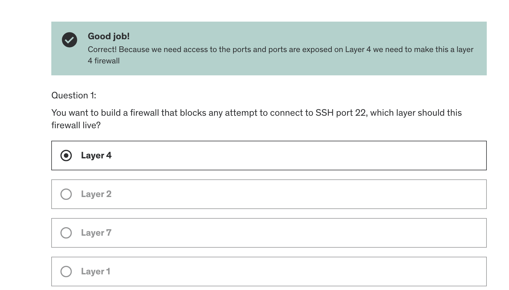
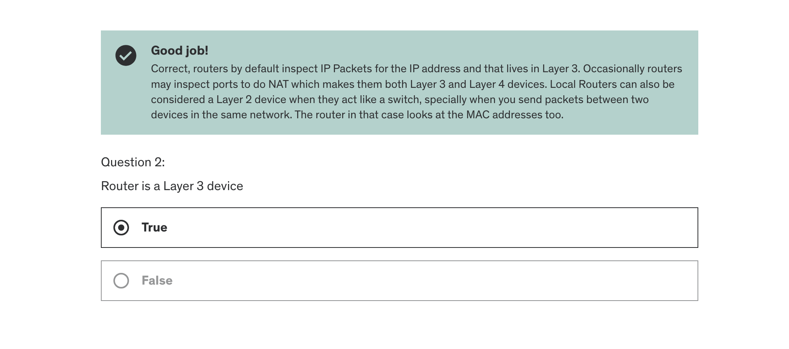
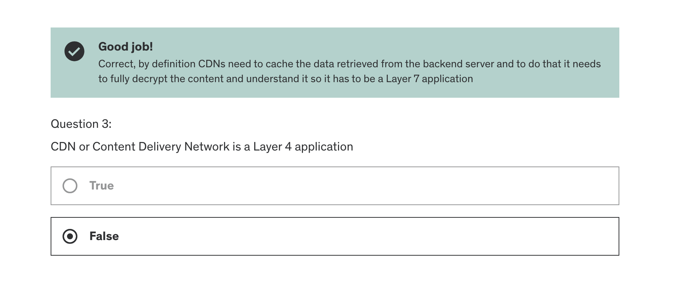
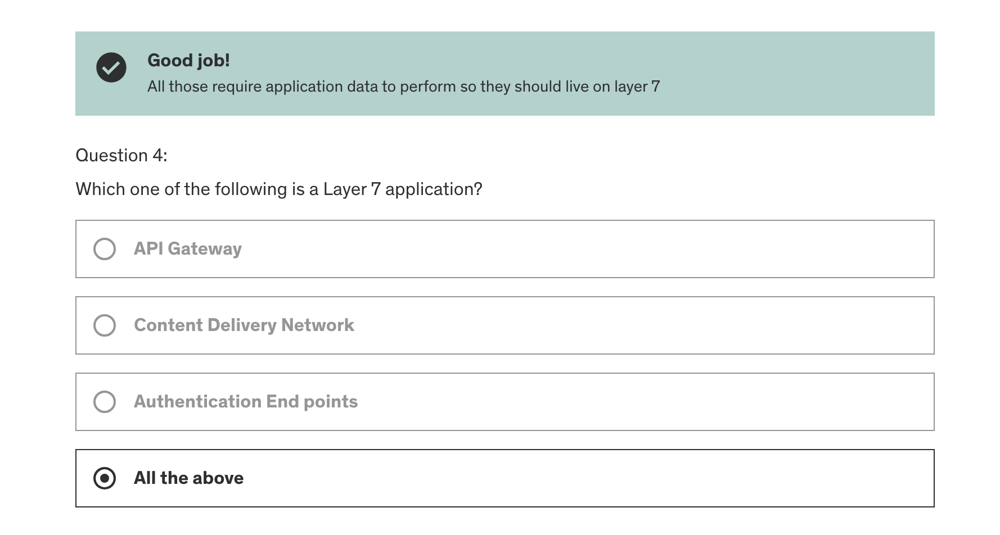

## Frames
Frames is a layer 2 protocol data unit (IP Packet is a layer 3 protocol data unit).
- Frame contains header, trailer and data sections. (The data section contains IP Packet and the header contains the source and destination mac addresses along with other stuff like length etc).
- <b>MTU (Maximum Transmission Unit): </b>This is the maximum frame size.
- A frame can carry one IP Packet at a time.

