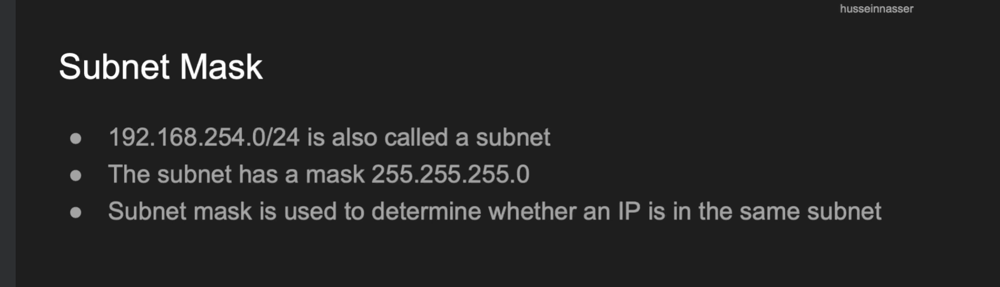
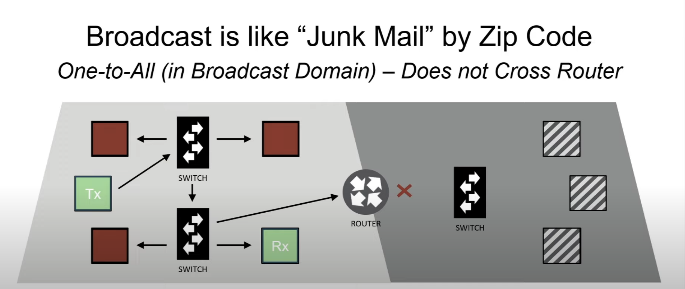

# The internet protocol





In most cases, the wifi router acts as a default gateway.


Here in the above image, the wifi router also has a switch 


## Routers are special. They have 2 or more IP addresses
Routers are special because they have two (or more) IP addresses. An IP address is assigned to each of the router’s two “interfaces”. The first router interface is called the WAN (Wide Area Network) interface. This is the side of the router that faces the Internet and has a public IP address. The second router interface is called the LAN (Local Area Network) interface. This is the side of the router that faces the home network’s computers and has a private IP address.


Reference: https://www.lmi.net/support/common/dsl-support/ip-addresses

## ASSIGNING IP ADDRESSES TO COMPUTERS DYNAMICALLY

One of the primary jobs of a router is to assign IP addresses to the computers on a home network. 

1. Device gets connected to wifi network (Using wifi protocols).
2. Device does not have IP Address allocated, nor does it know the IP address of DHCP server (Dynamic host configuration protocol) which assigns an IP address.
3. Device `broadcasts` a `DHCP discovery message` which goes through the switch using broadcast mac address `ff:ff:ff:ff:ff:ff`. 
4. The DHCP server gets the broadcast message, and sends a `DHCP offer message` which contains the IP address and other network parameters like `DNS IP` (Read about this in Section 6) to the mac address of the device.

## STATIC IP ADDRESSES

The opposite of a dynamically assigned IP address is a static IP address. A static IP address has to be manually configured on the device that is going to use it. 

## For backend apps
- Do not put your database to a different subnet and your application code to another subnet as the calls would have to go through router (it's ok but we are going to see delays).

## IP Packet


To know more about IP packet: https://jlri.udemy.com/course/fundamentals-of-networking-for-effective-backend-design/learn/lecture/31161122

## Anatomy of IP Packet


IP Packet header has minimum of 20 bytes (Not considering the options, 5 rows * 4 Bytes). 

### First row

- Version: It is allocated 4 bytes, which means it can have 0 to 15. But it is mostly 4 or 6 (For IPv4 or IPv6).
- IHL: Internet header length (Defines the options length). We can think of it as number of rows in the above packet. Without options, there are 5 rows. But if IHL > 5, then that means that the options are enabled.
- Total Length: Describes the total length of the header + data. Total length of the packet. (It is 2 bytes => It can go upto 65535).
- ECN (Explicit congestion notification): This is used to denote when a router starts to face network congestion because of many packets it has to route. 
    ```
    ECN comprimises of 2 bits.

    (a) 00: Non-ECN-Capable Transport, Non-ECT: Means that the sender would not be able to act upon congestion notifications.
    
    (b) 01: ECN Capable Transport, ECT(1)
    
    (c) 10: ECN Capable Transport, ECT(0)
    
    (d) 11: Congestion Encountered, CE
    ```
    The sender marks the ECN bit to `00` or `01` or `02` and when the router face congestion, the router mark the ECN bit to `11` which means congestion encountered. 

    #### In case of TCP
    The reciever receives the packet and In case of TCP, to notify the server it sets `ECE (Explicit congestion notification echo)` to 1 in TCP header. Once the sender receives the packet, It reduces the congestion window size and replies back with `CWR (Congestion window reduction)` set to 1.

    #### Why not just set the ECN flag to 1 in IP from receiver to sender
    The `ECN` flag would be misleading because the congestion occured in the forward path (From sender to receiver) and ECN flag set would now cause confusion because we won't know whether the congestion occured in forward or backward path.


### Fragmentation (Second row)
- The second row belongs to the fragmentation layer. See, a frame (Which is a layer 2 protocol data unit), can fit a single IP packet, But the frame size is also governed by MTU (Maximum transmissible unit). So if `MTU < IP packet size`, then we have to options here: 
- Either notify the client, that reduce the IP packer size
- Or fragment the packet (Break the packet into smaller chunks)
- The `identification` field is used to denote the `fragment id`.
- `Flags` is used to denote whether the IP packet should be fragmented or not, along with other info, since it is 3 bits.
- `Fragment Offset` is used to denote the fragment number. Fragment 0 comes before Fragment 1 and so on...


### Third row
- In third row, we have TTL (Time to live) which denotes maximum hops over the router a packet can take to reach the destination. (It is necessary to avoid infinite cycles in the routers which may be caused by router errors and this can lead to network congestion). The ttl gets decremented with every hop and if it reaches 0, an ICMP message gets generated.
- Protocol: TCP, UDP, ICMP etc.
- Header checksum: To validate the headers.

### Fourth and fifth row
- Consists of source IP and destination IP address.
- Spoofing IP Addresses is not an easy task :) When you change the source IP in the packet, the packet goes to the first router which is your ISP and ISP checks, "Hey, this is not the sender's IP address (Maybe through ARP cache of mac IP mapping), and blocks the packet".

## ICMP Protocol (Internet Control Message Protocol)


This protocol is mainly used for error reporting.

It is a layer 3 protocol even though it detects errors for port unavailibility which is basically layer 4, But we call it layer 3 because it's main functionality is to talk about errors like IP unreachable, fragmentation needed, ttl expired which belongs to layer 3.

From ICMP errors, we would also know in which router it faced error (From source IP address).


In some cases, ping may not work because it may be blocked. And it is blocked due to denial of service attacks.

### Ping command
The ping command uses the ICMP (Internet Control Message Protocol) Echo Request and Echo Reply messages to check network connectivity. Here's what these messages contain:

Echo Request (Ping Request)
When you initiate a ping, your device sends an ICMP Echo Request message. This message includes:

- Type: Set to 8 for Echo Request.
- Code: Set to 0 for Echo Request.
- Checksum: Used for error-checking of the header and data.
- Identifier: An identifier to match Echo Requests with their Echo Replies. Often set to the process ID of the ping command.
- Sequence Number: Used to order the Echo Reply messages in relation to their Echo Request messages.
- Data: Typically, a sequence of bytes used to fill the packet, which helps in measuring the round-trip time and detecting any data corruption.

Echo Reply (Ping Reply)
The target device, upon receiving an Echo Request, responds with an ICMP Echo Reply message. This message includes:

- Type: Set to 0 for Echo Reply.
- Code: Set to 0 for Echo Reply.
- Checksum: Similar to the request, it's used for error-checking of the header and data.
Identifier: This matches the identifier in the Echo Request, helping to correlate requests and replies.
- Sequence Number: Matches the sequence number of the Echo Request to pair responses with requests.
- Data: The same data sent in the Echo Request is usually returned in the Echo Reply, allowing the sender to verify the integrity of the data received.


Additional Information
- Size: The size of the ICMP packet can be adjusted in the ping command. The default size of the data payload is 32 bytes in Windows and 56 bytes in Unix-like systems, leading to a total ICMP packet size of 64 bytes in Windows and 84 bytes in Unix-like systems when considering the ICMP header and data.
- Time to Live (TTL): Each ICMP packet has a TTL value, which is decremented by each router it passes through. If the TTL reaches zero before the packet reaches its destination, the packet is discarded, and an ICMP Time Exceeded message is sent back to the sender.


The ping utility measures the round-trip time from when the Echo Request is sent until the Echo Reply is received and can report packet loss and other statistics, helping diagnose the state and quality of the network connection between the two hosts.


In the above image, time is basically the round trip time.

ping command with ttl
`ping -t 5 google.com`


### traceroute command


Traceroute command is used to determine all the routers IP address our request takes from sender to receiver. 

command: `traceroute <ip_address> | <host>`

How it works is, it first sends a packet with ttl 1 (And immediately we get the ICMP message with ttl expired which contains source IP as router's address which is our ISP address).


Then it sends a packet with ttl 2 and gets the next router's IP address (With icmp message as ttl expired and so on)


Like this, the traceroute command lists the route of the packet from sender to receiver.

Also notice that when two devices are connected to the same network, when we `traceroute <device_2_ip>`, from `device_1_ip`, we wont see the ip address of the router. Because the request goes through switch so it does not appear. <b>Why? Switch is a layer 2 device and it goes upto the layer 2 only for the mac address and so IP address does not get printed because it is in layer 3 and there is no ttl also if we send in same network (As ttl also lives in layer 3)</b>

## ARP Protocol (Address resolution protocol)


In the below image, the two devices are on the same network


<b>Note: We can check the arp cache using `arp -a` command.</b>

### Same network routing

Suppose device with the ip: 2 (Please consider it as short form) wants to communicate with the device of ip: 5, But it does not know the mac address. (Here host 2 first checks if host 5 is on the same subnet (same network))


Host 2 now needs the mac address of Host 5, Host 2 checks its ARP tables (In the device cache), and finds mac address of host 5 is not present. 

Now Host 2 sends a broadcast request to all machines in the network saying "Who has the ip address of 5?" and all the machines get this message since it is a broadcast message (The broadcast mac address is used in this case: `ff:ff:ff:ff:ff:ff` since ARP is a layer 2 protocol and not the broadcast IP address). 

Now host 5 replies back with its mac address to host 2 (This is a unicast message and Note here ARP poisoning can also happen. Suppose host 3 replies with its mac address right? Then it would be a problem). Now Host 2 stores the mac address in its ARP cache and now constructs the frame.

After it constructs the frame, it sends it to the switch (Switch is a layer 2 application and most modern routers come with a switch) and then the switch forwards it to the correct device.

Now let's say the device with IP 5 has been disconnected.

- Now when device with IP 2 wants to send a message, It will look in its ARP cache and get the mac address of IP 5 (Note that the ARP cache also has a ttl and assume that the ttl has not expired). The frame gets constructed and sent to switch. But the switch is now unable to find the mac address. So now after a timeout period, the device with IP 2 gets error that destination is unreachable and updates its ARP cache.

- When the same device gets connected, but now with different IP. And another new device gets connected with the same IP of the previous device which is 5. In this case, when device wants to send a message to the new device (Assumng that the ARP cache has not been expired), then it sends the message to previous device with IP 5 (Because the mac address still points to the previous device), But at Layer 3, there is a mismatch between IP addresses and it does not send a reply. So now device 1 would invalidate the ARP cache and again send an ARP broadcast request if needed.

Different network routing


```
ARP is a layer 2 protocol (It is also called as layer 2.5 protocol). But whyyy isn't it layer 3 protocol as it deals with IP addresses? Because it just provides the mapping of IP address to mac address.
```


#### ARP commands
- `arp -a`: Lists down the ip mac address mapping.

    The IP and mac addresses given below are just examples.

```
arp -a
? (172.163.1.1) at 34:4a:72:cd:12:99 on en0 ifscope [ethernet]
```

The above IP and mac belongs to the router
1. <b>en0</b> specifies ethernet interface 0, which may be ethernet or wifi interface. 
2. <b>ifscope</b> specifies that the particular network action for this IP should happen through the designated network interface (which is en0 in this case).
3. `?` specifies that there is no host name for this ip.
4. Also `permanent` means that the ARP cache for this ip mac mapping is not going to invalidate.

Now ping another device in your network using `ping 172.163.1.8` and run `arp -a` command.

```
arp -a
? (172.163.1.1) at 34:4a:72:cd:12:99 on en0 ifscope [ethernet]
? (172.163.1.8) at 31:41:78:da:13:44 on en0 ifscope [ethernet]
? (172.163.1.255) at ff:ff:ff:ff:ff:ff on en0 ifscope [ethernet]
? (239.255.255.250) at 1:2:5f:7e:ff:fa on en0 ifscope permanent [ethernet]
```
1. The second IP is the IP we pinged.
2. The third IP is the `broadcast IP to broadcast mac address` mapping. What happens here is an ARP request was made to know the mac address, so this IP-mac address is also listed (Maybe it depends on operating system also just like displaying the multicast IP).
3. The fourth IP is the `multicast IP`. Multicast IP and the corresponding multicast mac address is not assigned to any specific device, But it represents a group of devices in a network that want to connect and send / receive info.

```
NOTE: Some operating systems and network tools will show multicast entries in the ARP cache or neighbor tables. These entries are not there because of an ARP resolution process (since ARP is not used for multicast IP addresses in the traditional sense), but rather to indicate that the local machine is set up to listen for or send multicast traffic on these addresses.
```

## Unicast vs broadcast vs multicast
### Unicast
Unicast is simply one to one communication between two devices.

For eg: 
```
A device with IP 192.145.12.2 pings device with IP 192.145.12.1

In the above communication, we send ICMP messages from one device to another device.
```


But sending multiple same messages to various receivers can be very extensive because now the sender is duplicating messages 


### Broadcast
Broadcast is simply one to many communication between a device and all the other devices in the network.

For eg:
```
ARP request is a broadcast request which happens in level 2. When a device wants to know the mac address of another device in the same network, it sends a broadcast request with mac ff:ff:ff:ff:ff:ff, to all the other devices and gets the mac address of the other device.
```

Similarly for level 3 and above communication, broadcast IP address is used.

In broadcast, the content is duplicated at the network level, but not at the client level. 

There are two types of broadcast:
- Local broadcast: In this, the content is broadcasted to all the other devices in the network and is rejected by the router.

- Directed broacast: In this, the content is broadcasted to all the other devices in a specific network. This is not supported by many routers due to rapid network congestion.



In this broadcast, the machines would get the frame, even if they don't want it and this can cause network congestion.

### Multicast
Think of this as `one to many`. In this, the publisher device sends the data to multicast IP address. A group which is interested in multicast subscribes to that multicast address and the switch maintains the list of subscribers here. 

So when the publisher sends the data to multicast IP address, the switch looks into the subscriber list and sends the packets to all the subscribers.

In multicast, hosts use a protocol called `IGMP (Internet group management protocol)` to join or leave a group. For eg, hosts send an IGMP message to the switch to join a multicast address and the switch makes a note of it. 


#### Practical example

Create a server which sends a video through multicast
```
ffmpeg -re -i video.mp4 -c:v libx264 -preset ultrafast -tune zerolatency -c:a aac -f mpegts udp://239.255.0.1:1234?pkt_size=1316
```

Now open vlc media player on another device in the same network `Media > Open Network Stream` and type `udp://239.255.0.1:1234`. We would now see the video getting played.

So here, switch notes that whenever a frame comes to `239.255.0.1:1234`, then it would send it to the subscribers.

## Multicast is difficult to setup in public internet.
- Not all routers support multicast and the switches would have to maintain the subscription list of the subscribers.

- Many live streaming applications do live streaming with the help of cdn through unicasting.

## tcpdump

`tcpdump` command is used to capture packets.

1. `tcpdump -i en0`: Listen to all the packets on interface en0. (i denotes interface)

2. `tcpdump -i en0 arp`: Listen to all the arp packets on interface en0 

In the below example, the IP and mac addresses are changed due to security reasons.

```
13:57:28.948402 ARP, Request who-has 167.168.1.11 (5c:e9:1e:b6:56:32 (oui Unknown)) tell 167.168.1.6, length 28
13:57:28.948487 ARP, Reply 167.168.1.11 is-at 5c:e9:1e:b6:56:32 (oui Unknown), length 28
```

3. `tcpdump -i en0 icmp`: Capture icmp packets.
```
14:02:20.235667 IP 167.168.1.6 > 167.168.1.11: ICMP echo request, id 1003, seq 1, length 64
14:02:20.235762 IP 167.168.1.11 > 167.168.1.6: ICMP echo reply, id 1003, seq 1, length 64
```

4. `tcpdump -v -i en0 icmp`: Capture icmp packets with verbose option
```
14:05:06.346203 IP (tos 0xc0, ttl 64, id 6589, offset 0, flags [none], proto ICMP (1), length 124)
    167.168.1.1 > 167.168.1.11: ICMP 167.168.1.1 udp port netbios-ns unreachable, length 104
	IP (tos 0x0, ttl 64, id 7875, offset 0, flags [none], proto UDP (17), length 96)
```

In the above example, we can see the IP packer header: id, offset, flags belong to fragmentation.

5. `tcpdum -v -i em0 src 167.168.1.1`: Capture all packets coming from 167.168.1.1

6. `tcpdum -v -i em0 src 167.168.1.1 or dst 167.168.1.5`: Capture all packets coming from 167.168.1.1 or going to 167.168.1.5

## Routing example


Eg: 
- <b>A wants to talk to B</b>: 

    A checks whether B is in the same subnet or not and verifies that using the subnet mask.
    A does not know the mac address of B. A sends an ARP to switch with broadcast mac address. Switch gets it, and broadcasts it to every other device along with the router. The correct device gets it and sends an ARP reply to device A through switch. 

    Now A constructs the frame and sends to the switch, switch reads the mac address from the frame and sends it to B.

- <b>D wants to talk to X</b>

    D checks whether X belongs to the same subnet or not. X does not belong in the same network. D now has to know the mac address of the router. D sends an ARP broadcast to switch with broadcast mac address and switch sends to all the devices and now the router replies back with its mac address. 

    D constructs the frame, sends it to switch which in turn sends it to router. Router checks that this IP belongs to another private network of the router and sends it to that device (A router can have multiple private IP addresses).

- <b>B wants to talk to X</b>

    Now B sends the frame to router and the router checks that this IP is not within the router networks, So, it changes the packet's source ip and mac address (To hide device IP and mac address from outside network) and routes it to another router. To map the responses with the requests, it uses NAT table.

## Quiz


For the above question, There are 9 bits in the subnet mask which are 0, so 2^9 = 512 and last address is the broadcast ip and first address is of network. So in total 510 address.

