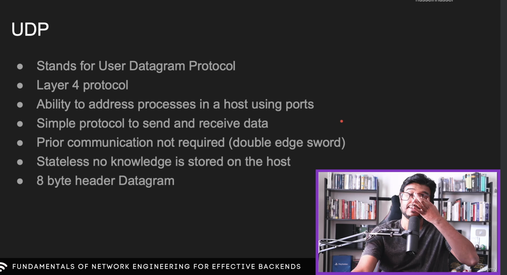
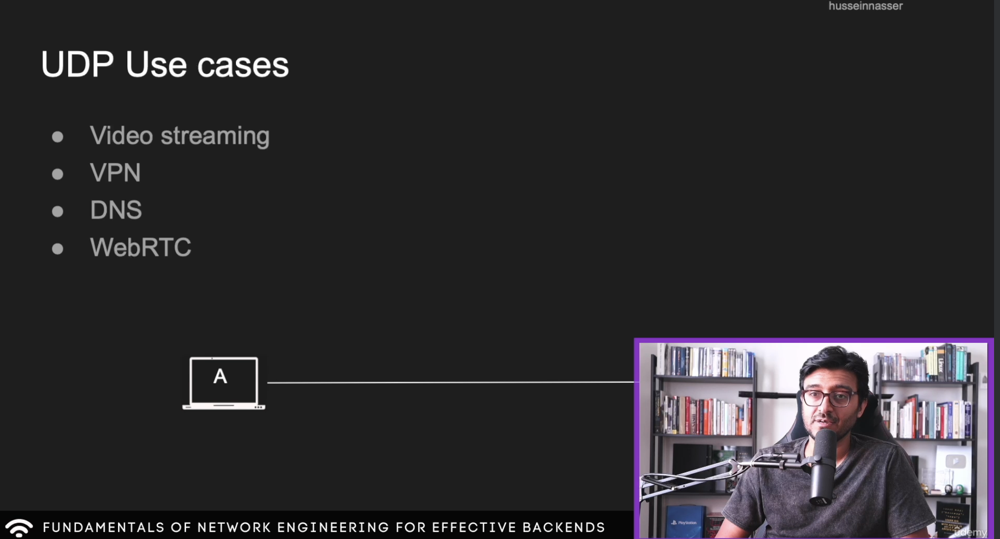
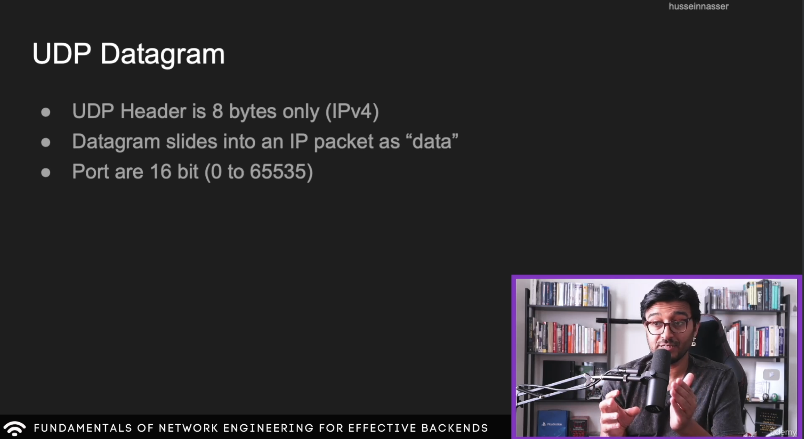
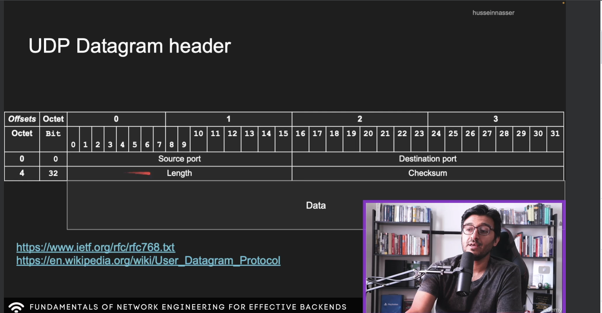
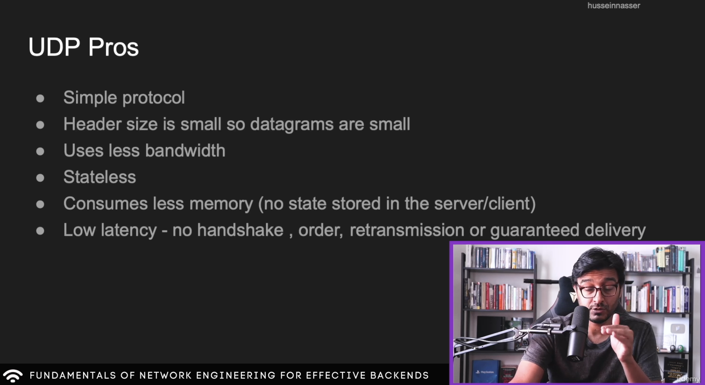
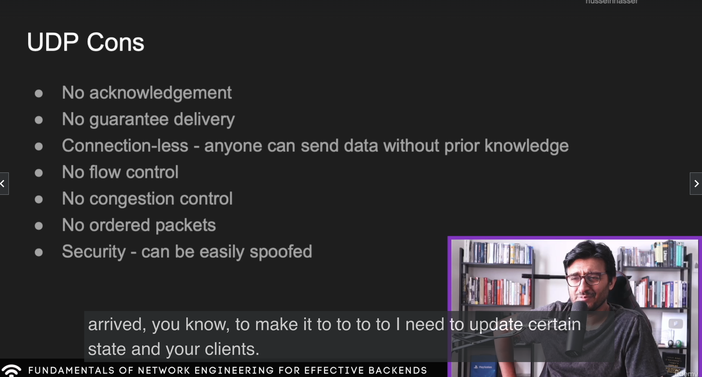

# UDP

## Detour
How does VPN work? 
When we connect to a VPN (With ip: 54:12:12:6), and want to send a packet another IP: 34:12:09:45, 
The VPN application creates an IP packet with the destination IP as the VPN IP, and includes the actual destination IP in the IP data section.

When the VPN server gets the IP packet, it decrypts the the destination IP from the data and sends it to the actual server.

VPN acts as a middleman here.

## UDP Datagram

See, at the end of the day, the packets are sent through the physical medium, and there may be a case where the header or data bit(s) are flipped. To verify the integrity, we can use checksum. Even if any bit of checksum is flipped, we would still know that the packet received is bad.

## UDP Pros

## UDP Cons

Also for second layer, packets are called frame, and likewise udp packets are called datagrams.