# TCP

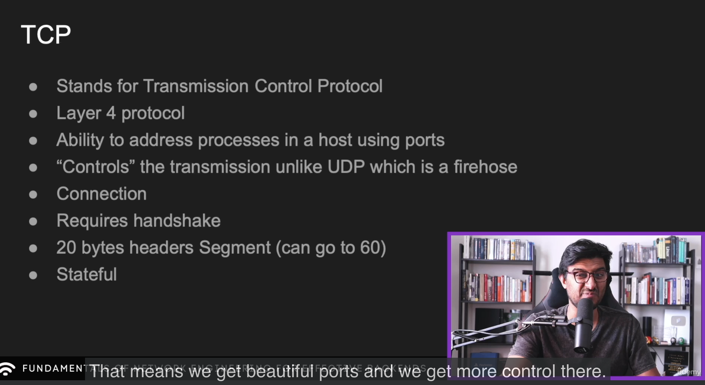

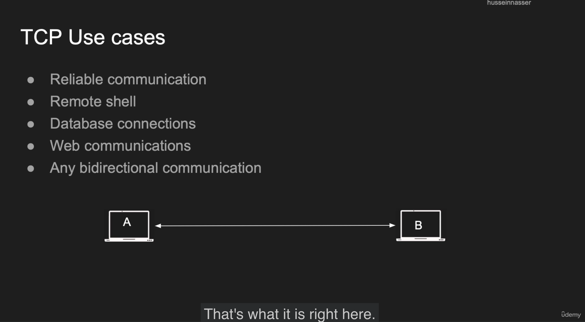

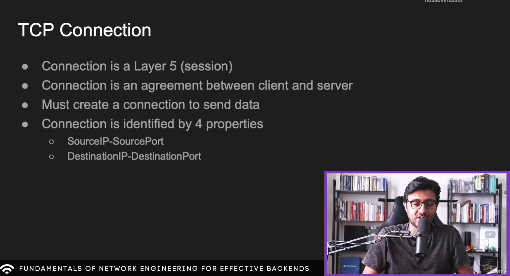

A connection between 2 devices mean that now two devices maintain the hash of the `f(source_ip, destination_ip, source_port, destination_port)`, also maintain the sequence numbers of the packets to maintain ordering. This takes up cpu and RAM (Imagine many connections to a server, we would have to calculate hash and store in RAM). Also other kinds of data like sequence numbers of packets etc, we need to store in RAM.

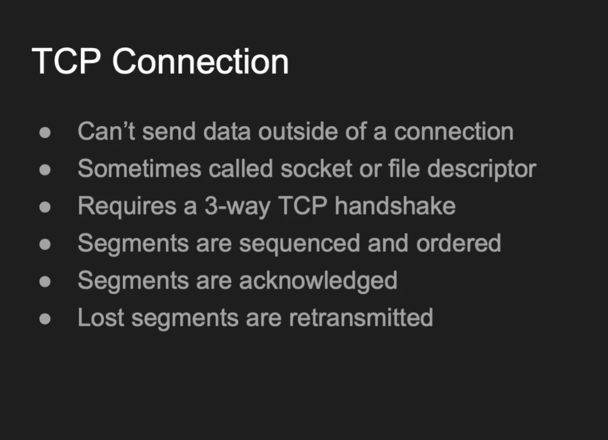

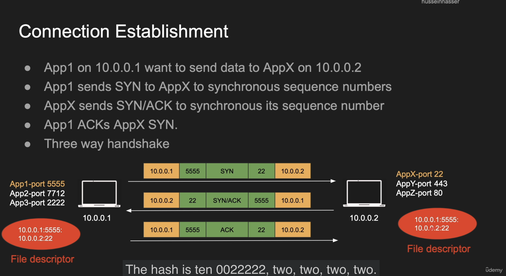
In the above image, the devices maintain a file descriptor, (Which basically uniquely identifies a connection using `source_port, destination_port, source_ip and destination_ip`).

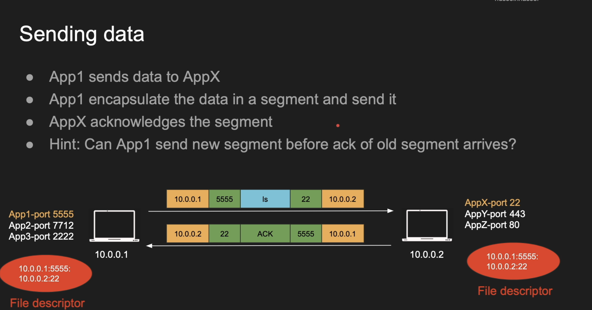
Yes, App1 can send new segment(s) until the window size exceeds because that is when it has to wait for an acknowlegment (See IP Header anatomy below).

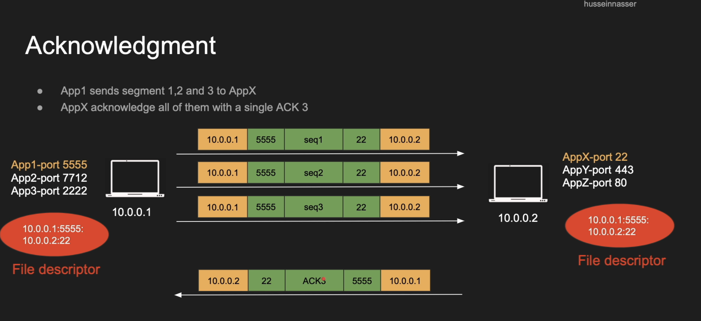

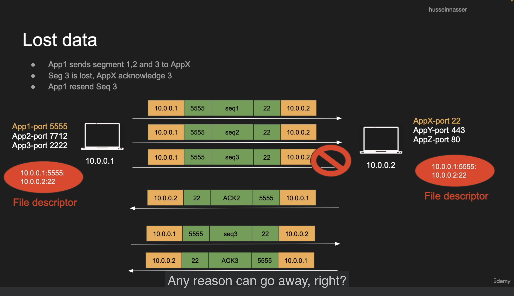

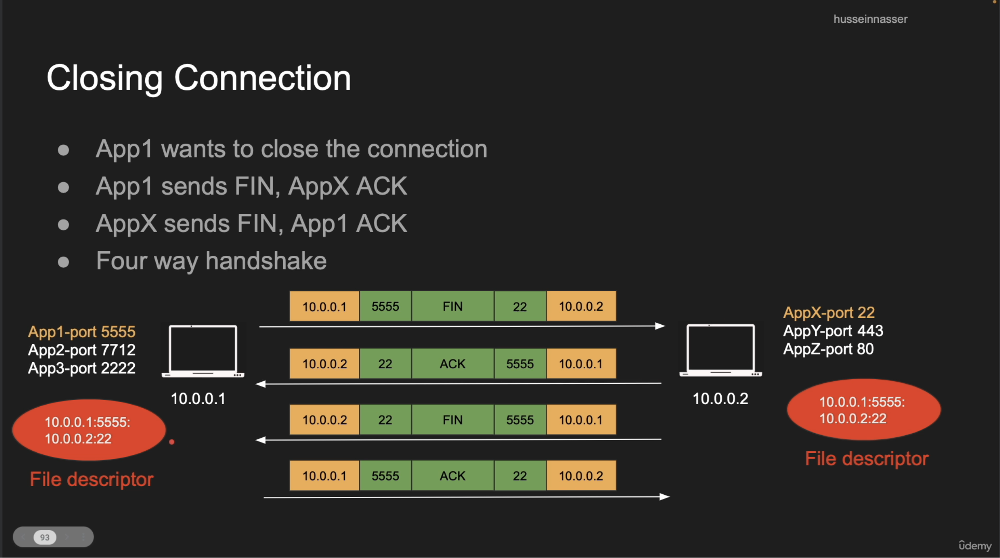

- In TCP (Transmission Control Protocol), closing a connection involves a four-way handshake process to ensure that both sides of the connection have successfully transmitted and received all packets. Here’s how it works:

- FIN from Sender: The process begins when one side of the TCP connection (the sender) decides to close the connection. The sender sends a FIN (finish) packet to the receiver, indicating that it has no more data to send.

- ACK from Receiver: The receiver acknowledges the FIN packet from the sender by sending an ACK (acknowledgment) packet back. At this point, the sender knows that the receiver is aware of its request to close the connection.

- FIN from Receiver: However, the receiver might still have data to send. Once it finishes sending all its data, it sends its own FIN packet to the sender, indicating that it has no more data to transmit.

- ACK from Sender: Finally, the sender acknowledges the receiver's FIN packet with an ACK packet. This concludes the connection termination process.

## TCP Segment
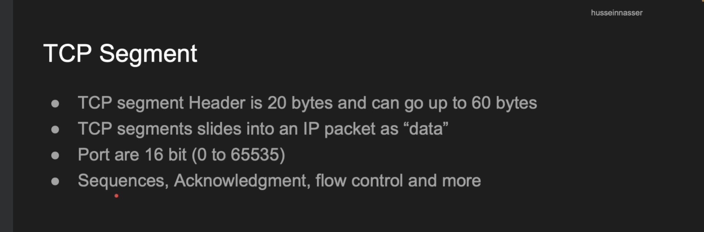

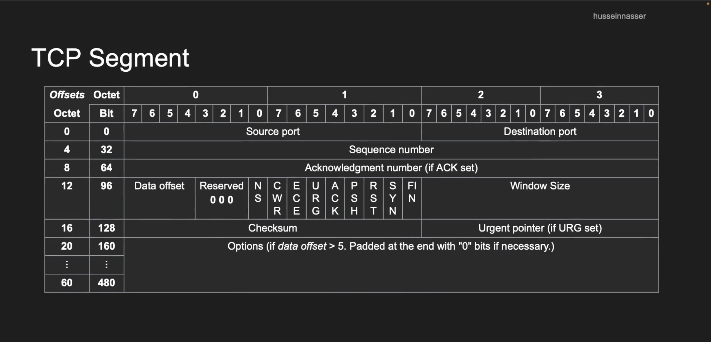

- <b>Source Port and Destination Ports</b>
- <b>Sequence number</b>: The sequence number of the packet the sender is sending to the receiver.
- <b>Acknowledgement number</b>: The sequence number of the packet the receiver sent to the sender. (Acknowlegment of another packet is being sent in this packet).
- <b>Data offset</b>: Similar to IHL (Internet header length) in tcp packet.
- <b>Window size</b>: The window size specifies the maximum data that the sender can send to the receiver before receiving an acknowlegment.

```
Example Scenario
Imagine two devices, A and B, communicating over a TCP connection. A is sending data to B.

Connection Establishment: When the TCP connection is established, B tells A that its window size is, say, 4,000 bytes. This means A can send up to 4,000 bytes of data to B before it must wait for an acknowledgment.

Data Transfer Begins: A starts sending data to B and has sent 4,000 bytes. Now, A must wait for an acknowledgment from B before sending more data.

Acknowledgment and Window Update: B processes some of the received data, freeing up, let's say, 2,000 bytes in its buffer. B then sends an acknowledgment to A for the received data and indicates that its window size is now 2,000 bytes.

Continuation of Data Transfer: Upon receiving this acknowledgment and the updated window size, A can now send another 2,000 bytes of data to B.

Dynamic Changes: If B processes data more quickly, it can advertise a larger window size, allowing A to send more data before waiting for the next acknowledgment. Conversely, if B is slow in processing data, it may advertise a smaller window size to prevent buffer overflow.
```

- Next we see several flags
    
    (a) `FIN`: FIN stands for `finish` (To close a connection).

    (b) `SYN`: SYN stands for `Synchronise` (For synchronising the packets and is used in initial handshake).

    (c) `ACK`: ACK stands for `Acknowledgment` (For acknowledging a packet).

    (d) `RST`: RST stands for `Reset` (For resetting the connection).

    (e) `PSH`: PSH stands for `Push` (This flag is set when we are pushing data. (sending data)).

    (f) `URG`: Urgent stands for `Urgent` (This flag is set when a packet needs to be given priority).

    (g) `ECE, CWR and NS`: Flags related to congestion.

     ECN comprimises of 2 bits.

    (a) 00: Non-ECN-Capable Transport, Non-ECT: Means that the sender would not be able to act upon congestion notifications.
    
    (b) 01: ECN Capable Transport, ECT(1)
    
    (c) 10: ECN Capable Transport, ECT(0)
    
    (d) 11: Congestion Encountered, CE
    ```
    The sender marks the ECN bit to `00` or `01` or `02` and when the router face congestion, the router mark the ECN bit to `11` which means congestion encountered. 
    ```

    #### In case of TCP
    The reciever receives the packet and In case of TCP, to notify the server it sets `ECE (Explicit congestion notification echo)` to 1 in TCP header. Once the sender receives the packet, It reduces the congestion window size and replies back with `CWR (Congestion window reduction)` set to 1.

    #### Why not just set the ECN flag to 1 in IP from receiver to sender
    The `ECN` flag would be misleading because the congestion occured in the forward path (From sender to receiver) and ECN flag set would now cause confusion because we won't know whether the congestion occured in forward or backward path.


## Maximum segment size
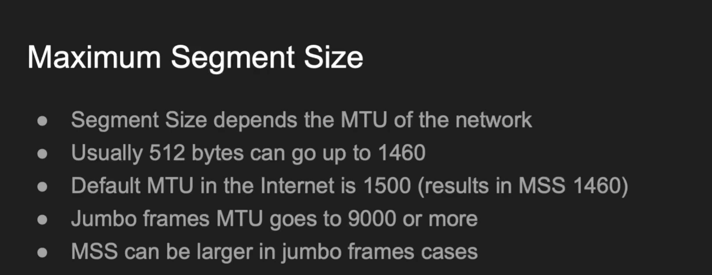

How do we get 1460? Because IP header min size is 20 bytes and TCP header min size is 20 bytes. So 1500 - 40 = 1460 bytes.

## Flow control
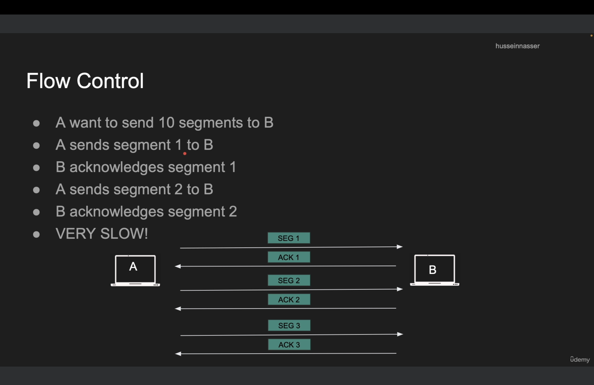

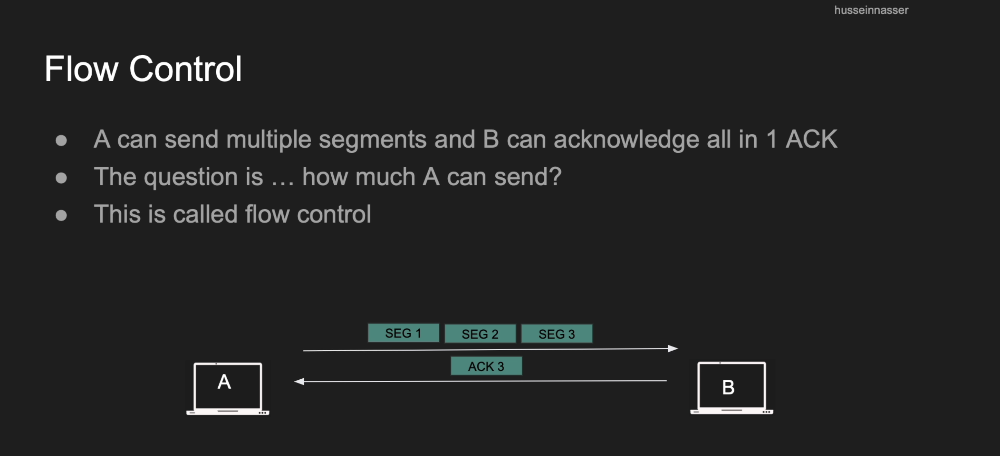

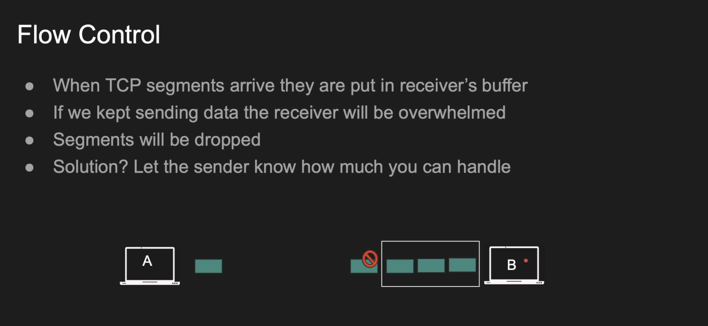
And this is managed by the `Window Size` field in TCP packet header.

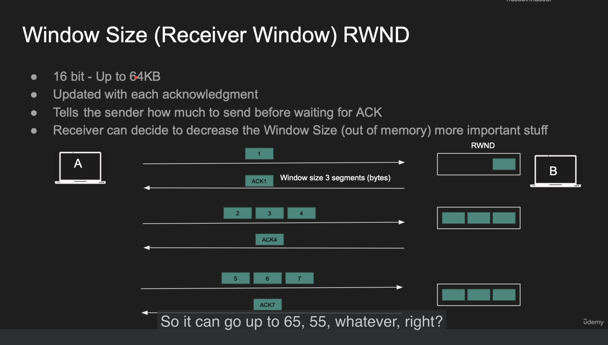

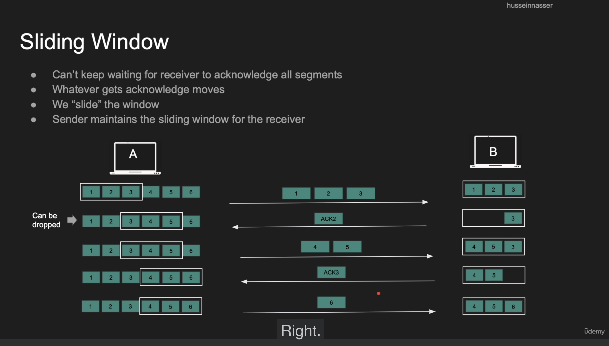

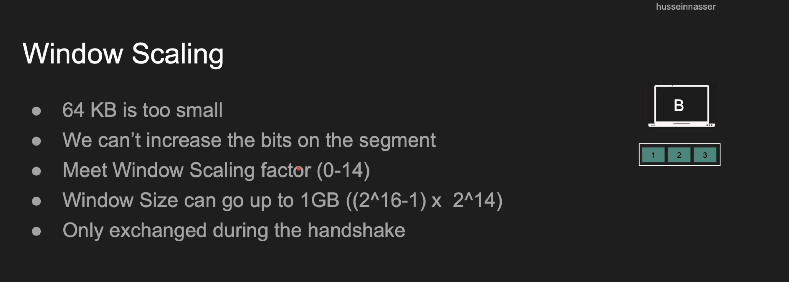
Window scaling factor is included in the options for increasing the window size because default window size is 2^16 = 64 KB.

## Congestion control
Think of it as the "flow control" for routers. See, even if we have very high window size of the receiver, the packets has to go through the routers right? And the routers may not support these high amount of packets and may start to drop them.


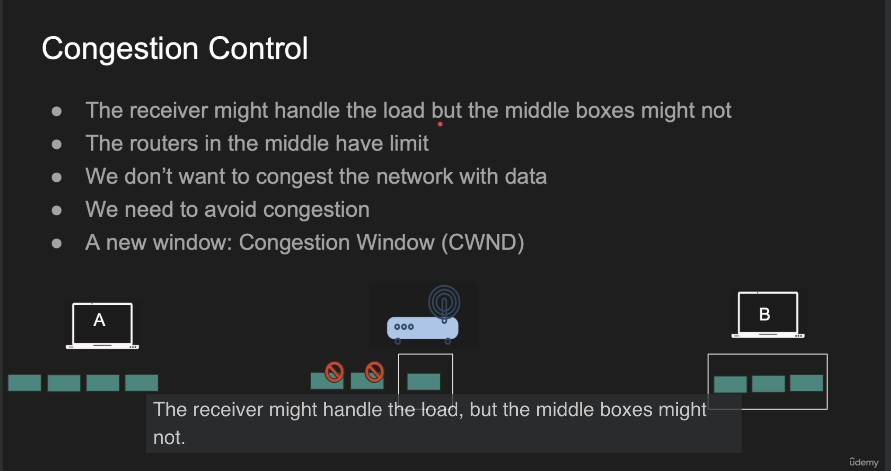

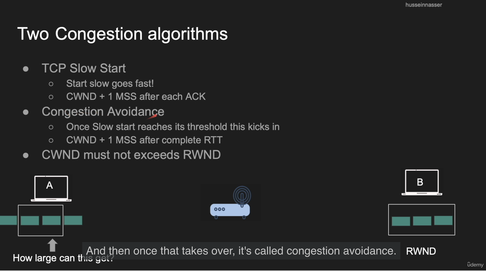
RTT stands for round-trip time (It will be clearer in the below pictures).

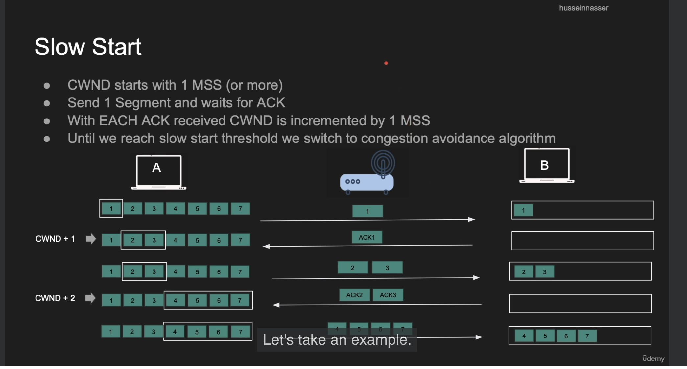
MSS stands for Maximum Segment Size.

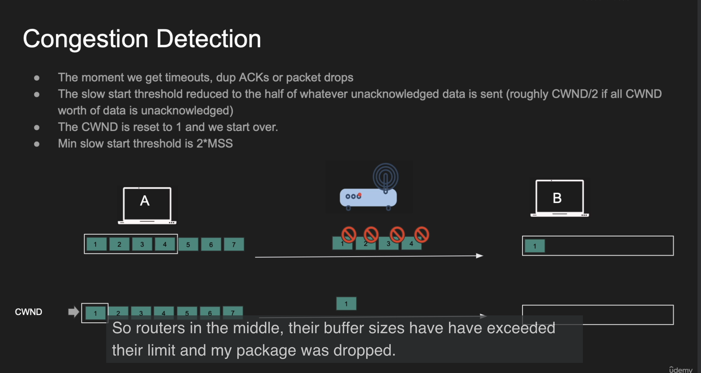

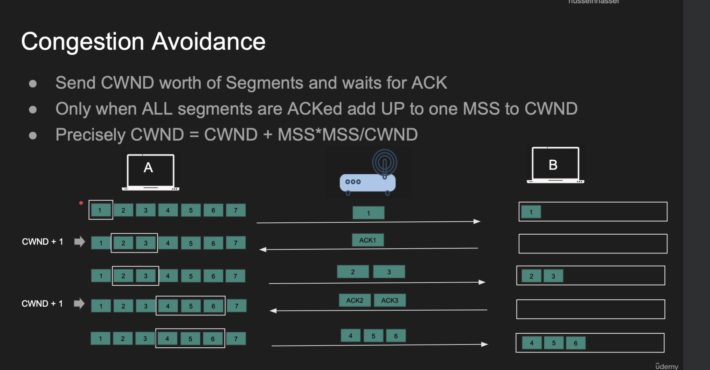

## Network Address Translation (NAT)

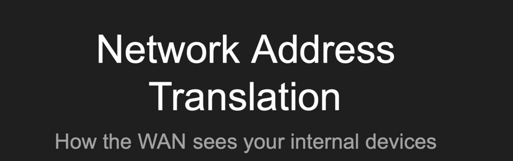

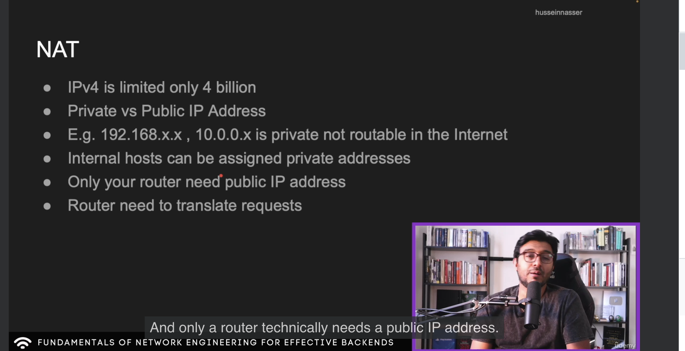

Devices can talk to each other in the same network with private IP address, but we cannot use the private IP addresses to talk to internet.

The wifi router maintains <b>Network Address Translation</b> table. Now when a message is to be sent to an external network, the device sends the message to the router. The router then changes the source IP, source port, source mac of the packet to the router's public IP, port and mac and then routes to another router. (Because we cant just use private IP to connect to the internet)

When the router gets the response, it checks the NAT table to check which device to route it. The response would contain the destination port, destination IP which are the router's port, and IP

The NAT table looks like this
- Device 1: Internal IP 192.168.1.10, Internal Port 12345 → External IP x.x.x.x, External Port 40001
- Device 2: Internal IP 192.168.1.11, Internal Port 54321 → External IP x.x.x.x, External Port 40002

If the IP Address changes during the request / response period, then the device broadcasts the new IP address and it would be updated in the NAT table.

Each connection would contain unique port. Now using this table, the router knows which table to direct it to.

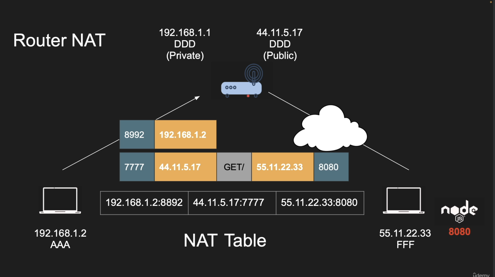

# IMPORTANT
```
See, In the ethernet frame (second layer), mac address of source and destination are changed with every hop (Because that is needed for point to point communication). But the source IP, source port are changed only once in the wifi router and the router maintaines the NAT table.
```

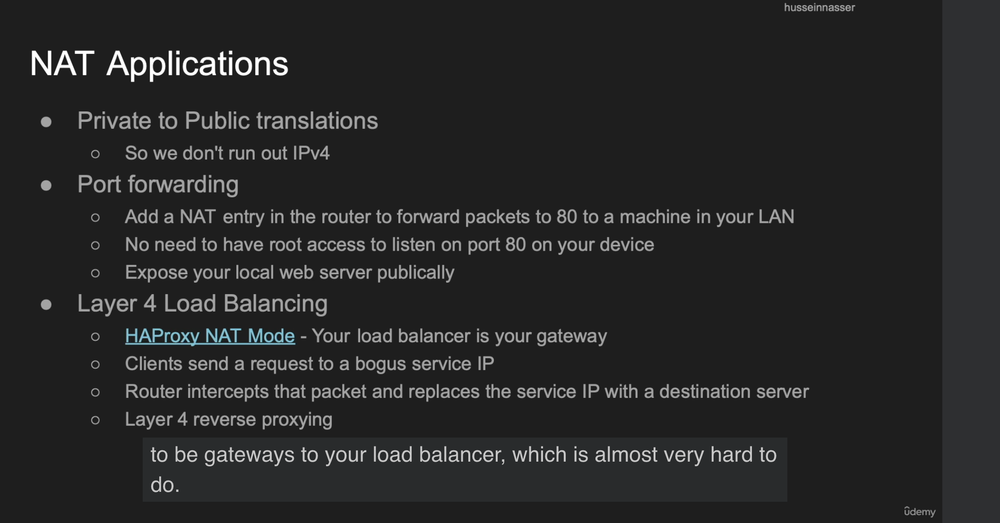

### Port forwarding
Access the Router’s Admin Interface:

Open a web browser and enter the router's IP address (commonly 192.168.0.1, 192.168.1.1, or 10.0.0.1) in the address bar.

Log in with the admin username and password. If you haven’t changed these from the default settings, they are often listed in the router’s manual or on the device itself.

Navigate to the Port Forwarding Section:

Look for a section labeled “Port Forwarding”, “Applications and Gaming”, or “Advanced Settings” in the router's admin interface.

Click on it to access the port forwarding settings.
Create a New Port Forwarding Rule:

Click on an option like “Add Service”, “Add Rule”, or “Create” to start setting up a new port forwarding entry.

Service Name: Enter a name for the service or application you want to forward ports for (e.g., WebServer, GameServer).

Port Range: Enter the port number or range of ports you want to forward (e.g., 80 for HTTP, 443 for HTTPS).
Local IP Address: Enter the IP address of the device within your network that the ports should be forwarded to (e.g., 192.168.1.100).

Protocol: Select the protocol (TCP, UDP, or both) depending on the requirements of the service or application.

 mEnable the Rule: Make sure the rule is enabled or active, which is often a checkbox or toggle.
Save and Apply the Changes:

Click on the “Apply”, “Save”, or “OK” button to save the configuration.
The router may need to reboot for the changes to take effect.