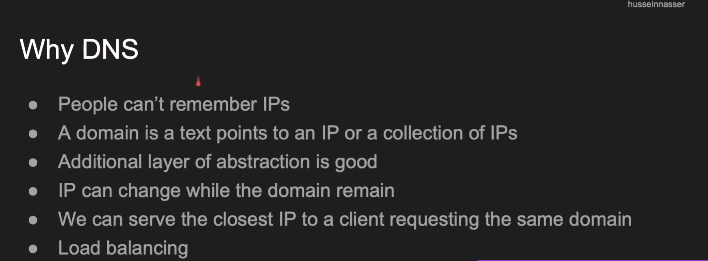
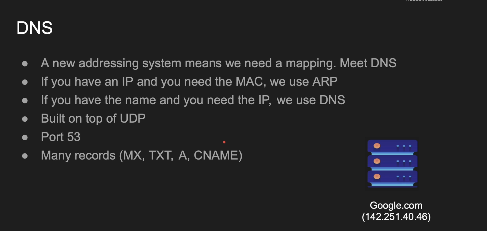
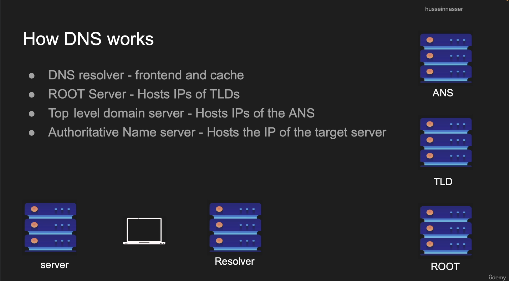
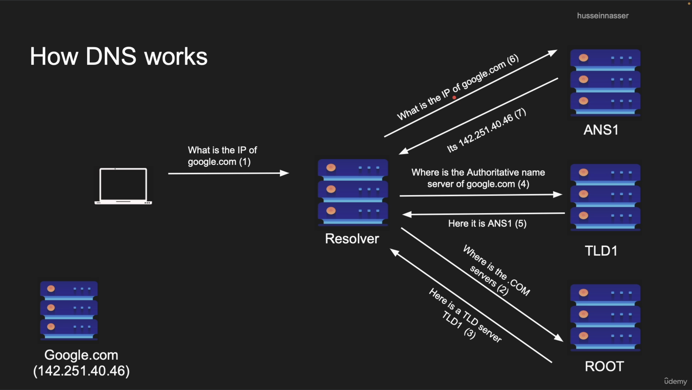

# DNS (Domain name server)
Whenever we enter an url, first thing we do is
- Query our `DNS Resolver` to get the ip of the domain.



### The point `We can serve the closest IP to a client requesting the same domain` is important. 

- Based on our IP, The DNS server would know the location of the request and then the DNS can give an IP of the server that is closest to that location.

- But how does the DNS server know the location from IP? The `Internet Service Providers` assign your IP according to the location. `See that means if you move your wifi router from Karnataka to Jammu, then your ISP is going to assign an IP address for that region`

- Organizations maintain databases that map IP addresses to geographic locations. These databases contain information about ranges of IP addresses and the geographical locations they correspond to. Examples of companies that provide such databases include `MaxMind`, `IP2Location`, and others.

- When a DNS server receives a query, it can refer to these IP geolocation databases to determine the approximate location of the user based on their IP address.
Based on this geographical data, the DNS server can respond with the IP address of the server that is geographically closest to the user. 

- <b>This is basically called GEO DNS </b>

### Also used in load balancing (This is typically called client side load balancing)
- For domains mapped to multiple IP addresses, we can request dns to get all the mapped IP addresses and then implement the load balancing client side

```javascript
const dns = require('dns');
const http = require('http');

// Domain to resolve
const hostname = 'example.com';

// Resolve DNS to get IP addresses
dns.resolve4(hostname, (err, addresses) => {
    if (err) throw err;

    console.log(`IP addresses: ${JSON.stringify(addresses)}`);

    // Randomly select an IP address
    const selectedIP = addresses[Math.floor(Math.random() * addresses.length)];
    console.log(`Selected IP for connection: ${selectedIP}`);

    // Use the selected IP to make a HTTP request
    const options = {
        hostname: selectedIP,
        port: 80,
        path: '/',
        method: 'GET',
        headers: {
            'Host': hostname // Important: Host header should be the original hostname
        }
    };

    const req = http.request(options, (res) => {
        console.log(`STATUS: ${res.statusCode}`);
        res.setEncoding('utf8');
        res.on('data', (chunk) => {
            console.log(`BODY: ${chunk}`);
        });
        res.on('end', () => {
            console.log('No more data in response.');
        });
    });

    req.on('error', (e) => {
        console.error(`problem with request: ${e.message}`);
    });

    // End the request
    req.end();
});

```


## Domains

An url is a combination of protocol, host and port.

For https://www.google.com: 
- Protocol is https
- host is www.google.com
- port is 443

Note: if port is not mentioned, then by default for https, port is 443 and for http, port is 80.

And in the same example, domain is `google.com`. Domain is basically a part (subset) of host. The "com" in google.com is called `Top Level Domain (TLD)` and "google" in google.com is `Second Level Domain (SLD)`. And "www" is the `Sub Domain`.

```
Domain is basically the combination of TLD + SLD.
```

Then what is the difference between host and domain? As I said, domain is a part of host. Host is more specific. For eg., in www.google.com, google.com is the domain and www.google.com is the host.

#### Another example: 

In https://mail.google.com/dir1/resource1
- https is the protocol
- mail.google.com is the host
- google.com is the domain
- mail is the subdomain
- port is 443 by default
- dir1/resource1 is the path.

Two URLs are said to be of same origin, if their protocol, host and port are SAME. (Note: Their paths may be different)



- `Port 53` is a resolved default port for `DNS`, But as we know we can run dns server on any port we want.

- DNS is built on UDP but can also operate on TCP as well (See below understanding). 
### My understanding of why DNS is built on UDP.
- UDP is a stateless protocol, It does not care about ordering nor does it care whether you got the datagram or not.

- But this is also what makes udp datagram a very light weight packet and so there is less latency.

- MTU (Maximum transmission unit) is around `1500 bytes`. So the dns response which would typically contain information like the `IP address, port` could be fixed in one frame. We won't be requiring multiple frames to transmit this data and so we won't have to worry about ordering of packets.

- The standard DNS message size over UDP is up to 512 bytes. If the response data exceeds this limit, `DNS can also operate over TCP to handle larger responses or for DNSSEC (DNS Security Extensions) that require greater data integrity and security`.


There are many types of records in DNS:
- `A` type message gives the IP address mapped.
- `CNAME` stands for `Cononical names` which is used for `aliases`. It can be used when we have several host names but mapped to the same IP(s).
```
A configuration for this in DNS may look like this

example.com.        IN  A       192.0.2.1
www.example.com.    IN  CNAME   example.com.
blog.example.com.   IN  CNAME   example.com.
store.example.com.  IN  CNAME   example.com.
```

```
In the above case, when we type www.example.com, blog.example.com or store.example.com, then it would be redirected to 192.0.2.1 ip
```

## How dns works
- See DNS servers contain mapping of domain names to IP addresses. 
- But imagine how many records it has to store right?
- Because DNS is used everywhere.
- And as they say, `the first rule of working with a billion row table is to NOT work with a billion row table` and so, DNS servers also use partitioning and sharding to store their data. 



```
To see the resolver IP address in macOS, 

Run this: scutil --dns

And look for the nameserver entries under "resolver #1."

We would mostly see the IP address of our wifi router because it acts as a resolver and also we would see the domain name servers which it uses.
```

Example output of `scutil --dns`:
```
scutil --dns
DNS configuration

DNS configuration (for scoped queries)

resolver #1
  nameserver[0] : (I am hiding this. This is basically the IP address of my router as it works as a dns resolver)
  if_index : 18 (en0)
  flags    : Scoped, Request A records
  reach    : 0x00020002 (Reachable,Directly Reachable Address)

resolver #2
  nameserver[0] : 1.1.1.1
  nameserver[1] : 9.9.9.9
  nameserver[2] : (Hiding this)
  nameserver[3] : (Hiding this)
  if_index : 28 (utun5)
  flags    : Scoped, Request A records
  reach    : 0x00000002 (Reachable)
```

The above output indicates
- Domain like google.com dns request goes to my wifi router first, wifi router has a list of dns ip addresses for getting the ip for the domain given by the `ISP` generally.

- If it does not work, then resolver#2 is used and so on...

### Some of the famous name server names
- `8.8.8.8`: Google DNS server. 
- `1.1.1.1`: Cloudfront DNS server.

## Anycast approach in DNS server IP addresses
- `8.8.8.8`: Corresponds to google DNS server, When the packet has the destination ip as `8.8.8.8`, it generally goes to nearest DNS server which has this IP (How?). 

And `in anycast, multiple servers can have the SAME IP`. 

Read about how it works.


## DHCP and DNS Assignment
- <b>Automatic Configuration</b>: When you connect a device to a network that uses DHCP (which is the case for most residential ISPs), the DHCP server not only assigns your device an IP address but also provides other network configuration details. `These details include the IP addresses of DNS servers that the device should use for domain name resolution`.

- <b>ISP DNS Servers</b>: These servers are maintained by the ISP and are designed to be optimally located and configured for fast response times within the ISP’s network. Using ISP-assigned DNS servers often provides caching benefits and faster DNS query responses for frequently accessed domains within the same region or ISP network.

## Alternatives to ISP DNS Servers
<b>Manual Configuration</b>: Users can manually configure their devices or routers to use alternative DNS servers, such as Google Public DNS (8.8.8.8 and 8.8.4.4), Cloudflare DNS (1.1.1.1), or OpenDNS. This can be done in the network settings of almost any internet-connected device.

<b>Advantages of Alternative DNS</b>: Some users prefer to use third-party DNS services for reasons such as potentially better performance, enhanced privacy features, or additional functionalities like phishing and malware protection.

## We can manually configure which DNS server our request should go to!
Device or Router Settings: While ISP DNS servers are provided automatically via DHCP, users can "hardcode" DNS settings on their devices or within their router configurations. This means setting specific DNS server IPs in the device’s or router's network settings, which overrides the DNS servers provided by the ISP.

### Step by step guide to change DNS address in macOS
```
Step-by-Step Guide:
Open System Preferences:

Click on the Apple icon in the top-left corner of your screen.
Select "System Preferences" from the drop-down menu.
Go to Network:

Click on the "Network" icon in the System Preferences window.

Select Your Network Interface:
On the left side of the Network window, you will see a list of available network interfaces (e.g., Wi-Fi, Ethernet). Select the network interface you are currently using or want to configure.

Access Advanced Settings:
Click on the "Advanced..." button in the bottom-right corner of the window.

Modify DNS Settings:
Go to the "DNS" tab in the advanced settings window.
Here, you'll see a list of current DNS servers. You can add or remove DNS servers here:
To add a DNS server: Click the "+" button under the DNS Servers list, then enter the IP address of the new DNS server.

To remove a DNS server: Select the DNS server you want to remove and click the "-" button.

Apply Your Changes:
Click "OK" to close the Advanced settings window.
Click "Apply" in the Network window to save your changes.
```

### And also when we buy a domain, generally we can attach any subdomain we want in that domain for free!



- But let's say the resolver did not get response from `TLD1` for a certain request. So How would the resolver know which request to try again?
- See, dns works on UDP, so there would be no connection established and in case of TCP, we receive an acknowledgement that a server has received a packet. But in case of DNS request, we won't receive an acknowledgment.
- So to solve this, DNS packet maintain a `txID`, which is shared in every packet that travels to and from `resolver root, or tld or ans`.
- The resolver maybe stores this txID in its ram, and once it gets the final response, it marks the transaction as complete (Delete the txID from ram) and return to client.
- There can be some sort of job running that checks if there are any pending requests which has not received a response and tries another IP from root/TLD/ANS to get the final response.


`There is a txID header in DNS packet present in UDP datagram data section for this.`


## Using `nslookup` (name server lookup)
```
nslookup google.com

Server:		1.1.1.1
Address:	1.1.1.1#53

Non-authoritative answer:
Name:	google.com
Address: 172.217.27.206
```


```
nslookup husseinnasser.com
Server:		1.1.1.1
Address:	1.1.1.1#53

Non-authoritative answer:
Name:	husseinnasser.com
Address: 216.239.34.21
Name:	husseinnasser.com
Address: 216.239.36.21
Name:	husseinnasser.com
Address: 216.239.38.21
Name:	husseinnasser.com
Address: 216.239.32.21
```

Dissecting the output
- `Server`: It is basically the `resolver` address (We might get the wifi router ip address also because it also acts as a resolver)
- `Address: Resolver address + port`
- `Non-authoritative answer`: This indicates that the information provided about the domain google.com was obtained from a DNS server that is not the authoritative source for the domain's DNS records. 

    Non-authoritative servers cache DNS responses from authoritative servers to increase DNS resolution speed and reduce load on authoritative servers. These cached responses are valid only for the time specified in the DNS records' TTL (time-to-live).

### To get authoritative name servers, use `-type=ns` option
```
nslookup -type=ns google.com
Server:		1.1.1.1
Address:	1.1.1.1#53

Non-authoritative answer:
google.com	nameserver = ns3.google.com.
google.com	nameserver = ns2.google.com.
google.com	nameserver = ns4.google.com.
google.com	nameserver = ns1.google.com.
```

In the above output
- We now get the `authoritative name servers` like `ns3.google.com`, `ns2.google.com`, but we get again `Non-authoritative answer`, which means, we got this list from cache of dns resolver

Now use one of the authoritative name servers to get the ip address (get ip from cache):

```
nslookup google.com ns3.google.com
Server:		ns3.google.com
Address:	216.239.36.10#53

Name:	google.com
Address: 142.250.183.206
```

In the above output, now we dont see `Non authoritative answer`, because the result is not from `cache`.

The IP address of `ns3.google.com` is found through the same flow of resolving dns.


## Interesting facts!
```
There are a total of 13 root name servers in the Domain Name System (DNS). These servers are designated by the letters A through M. Each server is operated by a different organization and, through the use of Anycast, each of these 13 root name servers is replicated across multiple locations around the world to ensure redundancy and high availability.
```

```
These are the servers:
A Root Server - Managed by Verisign, Inc.
B Root Server - Managed by the University of Southern California, Information Sciences Institute.
C Root Server - Managed by Cogent Communications.
D Root Server - Managed by the University of Maryland.
E Root Server - Managed by NASA Ames Research Center.
F Root Server - Managed by Internet Systems Consortium, Inc.
G Root Server - Managed by the U.S. Department of Defense (DoD) Network Information Center.
H Root Server - Managed by the U.S. Army Research Lab.
I Root Server - Managed by Netnod in Sweden.
J Root Server - Managed by Verisign, Inc.
K Root Server - Managed by RIPE NCC in the Netherlands.
L Root Server - Managed by ICANN (the Internet Corporation for Assigned Names and Numbers).
M Root Server - Managed by WIDE Project in Japan.
```


