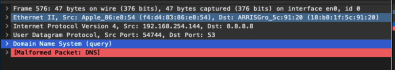
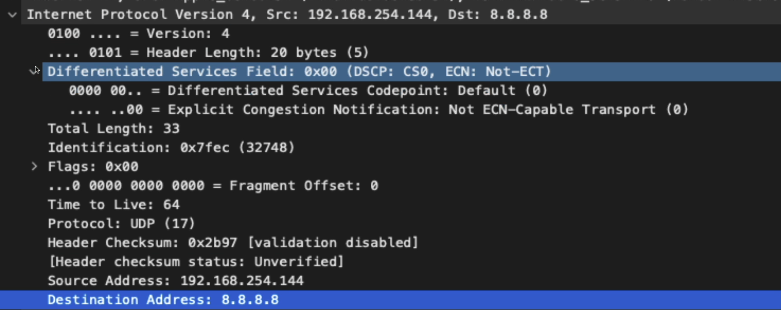
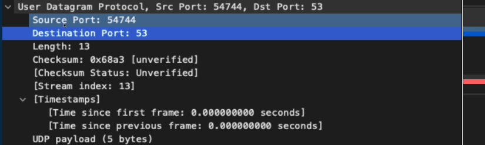
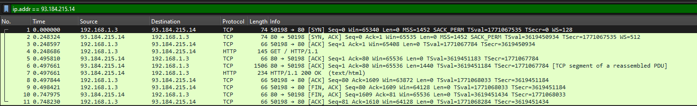
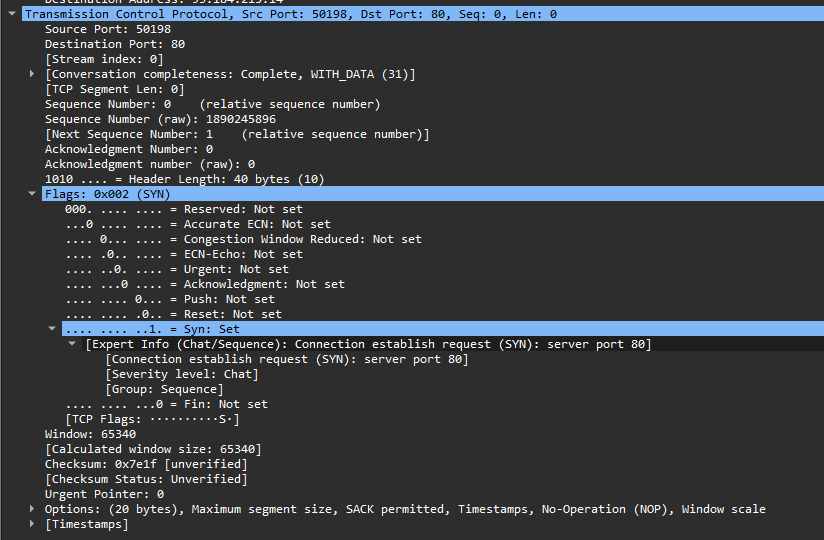
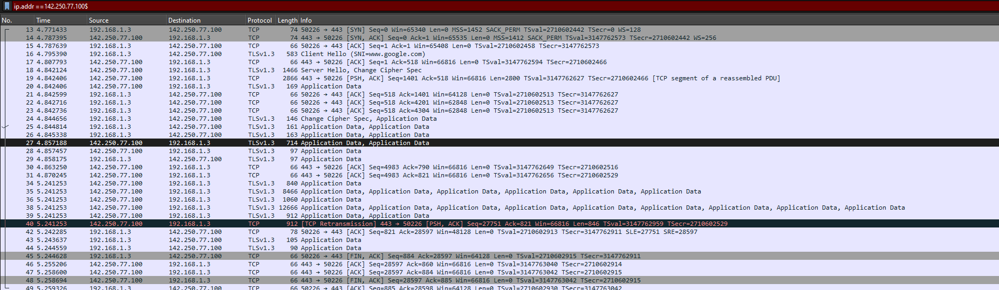
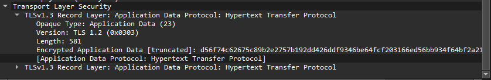
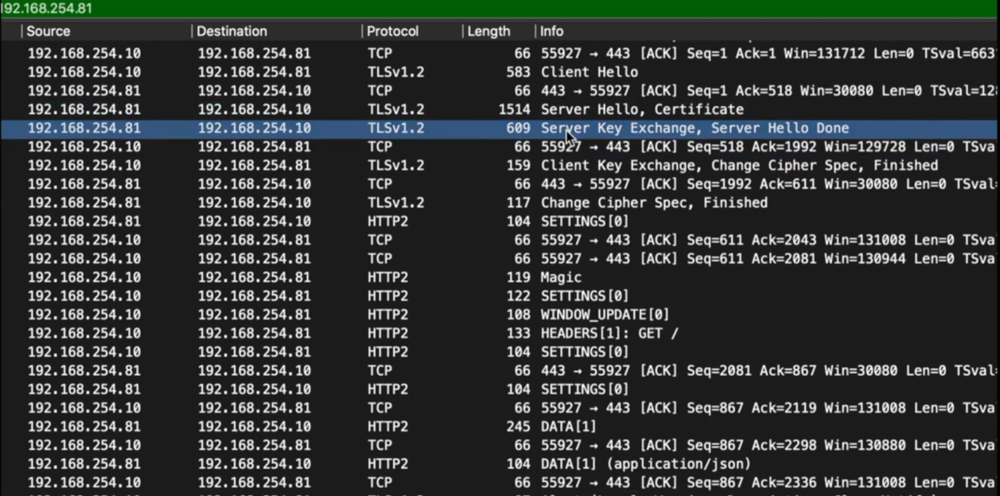

# Wireshark
Wireshark is a tool that allows us to sniff packets!

Download wireshark from the official website

## Capturing UDP packets
The below image is a dns request packet.


We can expand the data to see all the fields we studied in the previous sections!

The IP packet has the following data:



The datagram, as we can see, has mainly source and destination ports


## Capturing TCP/HTTP packets
Do a curl request like this to get the ip
```curl http://www.example.com -v```

And then filter the packets using `ip.addr == <ip>`

And we can see the TCP Handshake in action!


And this is a tcp packet


## Capturing HTTPS packets


And now, suddenly, we cannot see the parsed http packets, because the info is encrypted using TLS :(

In the above image, after initial handshake
1. We can see a `Client Hello` from client to server
2. And we can also see a `Server Hello`. This is where the assymetric key exchange by the server is done.
3. Next in the third tls message: `Change Cipher Spec`, the client key exhange is done with the server. (The client combines the `symmetric key` with this `assymetric key` and this key would be decrypted by the server to get the key used by client)
4. And when you open a message, we get encrypted content!



And if we configure wireshark to get the keys (There are many tutorials to do that), we would get something like below

