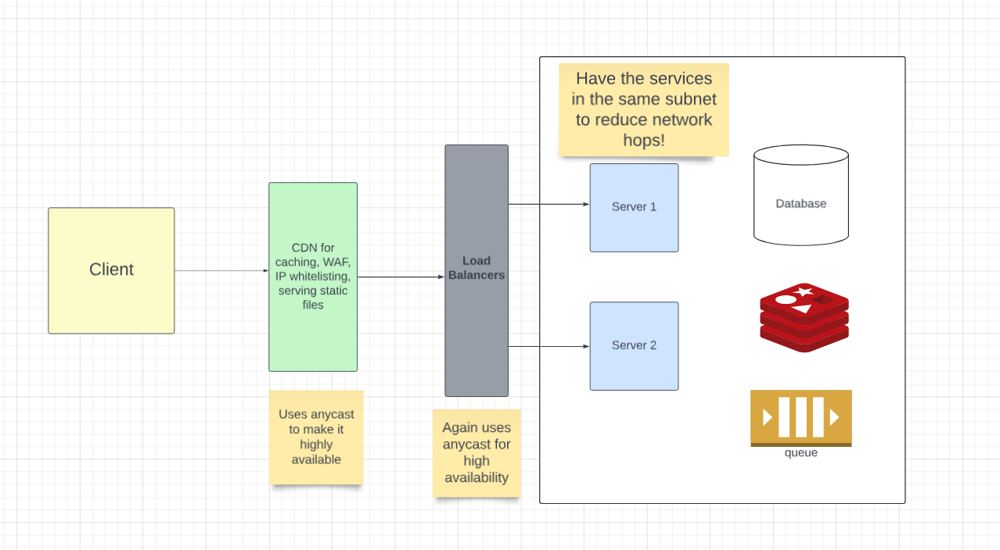

# Making Systems Scalable

This readme consists of the approaches that I would take for scaling my services. 

## Step 1: Same subnet setup

- Have same subnet setup to reduce network hops between services.
- Use anycast for LB, CDN, api gateways to ensure high availability.

## Step 2: Scaling DB

Example with postgres. (Go step by step. It is not necessary to implement all of these in one go)

- Create indices based on the filtering params (Be careful to not over do it because when we make many btrees of the same table, a write / update operation would take more time because now our db would have to update the table as well as the btrees.)

- Check with `explain analyse` command. It basically tells the approach the db is going to take to execute the query. This describes whether the db would use `normal index scan`, `bitmap index scan` or `sequencial scan using workers` and this also gives an idea on the effective index patterns.

- Consider denormalising the tables to reduce joins.

- Use `partioning` to break the tables in the same database instance. This would reduce the index size and may increase the performance.

- Use `replicas`. (Again use this with caution, because now you have the option of making the system eventually consistent or the DB can also wait till all the nodes have been replicated)

- Use `sharding`. (Please keep this as the last option because many DBs like postgres does not have native sharding implementation. This logic has to be implemented in the application logic like consistent hashing)

## Step 3: Use caching wherever possible
The goal is to reduce as many requests as possible to the origin servers.

- Use caching in the client side, cdn, origin servers and caching services like redis wherever possible.

- Also keep in mind the number of read / write ops we would be doing in redis because caching is expensive.

## Step 4: Use queues for write heavy operations and decoupling services

The goal here is to make the user experience as good as possible by asynchronous processing.

Queues can also be used to decouple and scale services.

## Step 5: Load testing!
Load testing with the calculations is required for the estimations of number of pods, db instances etc.