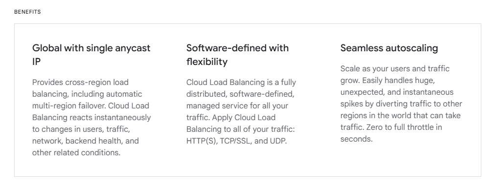

# Using anycast to scale load balancers.

Paper link: [here](./GooglePaper.pdf)

Video link by Arpit: [here](https://www.youtube.com/watch?v=WjT253DBlXk)

I have compiled my learnings from the paper above here.

## Approaches to scale load balancers.
### Approach 1
Normally what happens is when the client initiates a request, the request lands on our load balancers and the load balancer is responsible for distributing the traffic to our origin servers (Not taking into account of any other reverse proxies like api gateways in this scope).

Load balancer balances the requests among active servers and it knows the active servers through <b>heartbeat</b> mechanism.


Now what if our load balancer fails? All the requests would fail because entry point has failed. To mitigate this, the load balancers are deployed in <b>high availability pairs</b>.


Now what do we mean by <b>high availibility pairs</b>?

1. The primary idea behind High Availability pairs is redundancy. By having two (or more) load balancers instead of one, the system can continue to operate even if one of the components fails.

2. <b>Active-Passive Mode</b>: In this setup, one load balancer is active and handles all the traffic under normal conditions, while the other remains in a passive state, ready to take over if the active load balancer fails. This is the most common configuration.

How does it work?

1. <b>Heartbeat Mechanism</b>: The load balancers continuously send heartbeat signals to each other to monitor each other's status. This helps in detecting failures promptly.

2. <b>Failover Process</b>: If the active load balancer stops sending heartbeat signals (indicating a failure or a problem), the passive load balancer detects the absence of these signals and initiates a failover process. This involves taking over the IP address of the failed load balancer and starting to handle the traffic.


This is already a pretty good approach because of increased reliability!

```
What if now our servers fail but the load balancers stay active? 
```

### Approach 2
To solve the above problem, if a load balancer gets a request and sees that any of the servers that it manages are not available, then it can redirect the request to the next nearest load balancer.


```
Now what if the load balancers are not available now!!!!
```

### Approach 3
To solve the above problem, what we can do is:
1. Create a service which checks the heartbeat of all the load balancers.
2. When a load balancer is unavailable, remove the ip from the DNS server.

But it takes time to update DNS server and there is also DNS TTL (DNS entries in cache). The time it takes to propagate DNS changes would still be a downtime for the users.

And so this was decided to be a non optimal solution.


### Approach 4 (Using anycast)
The below points detail how google provides load balancing as a service using anycast
- Anycast is a routing protocol where each server broadcasts the same ip.
- The requests to this ip is handled through <b>BGP</b> (Border Gateway Protocol) in the routers where the topologically shortest path to the server is selected.
- The load balancer would stop broadcasting the IP when the load balancer is down or all the servers managed by that load balancer is down.
- This ensures high availability of the load balancers

These are the benefits of cloud load balancing. Taken from their site



