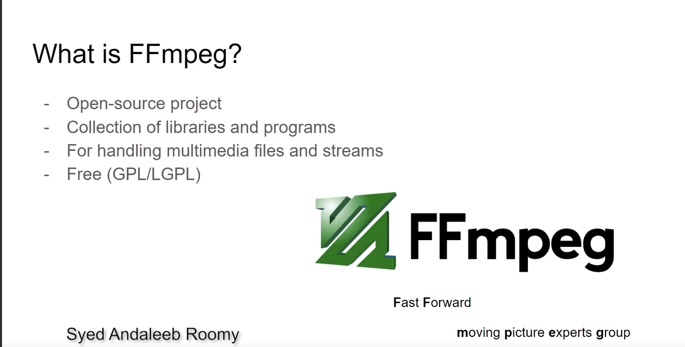
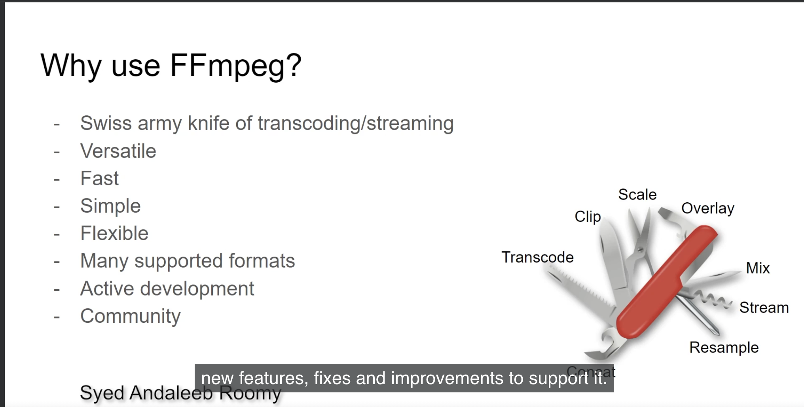

# Intro to FFmpeg
## What is FFmpeg

- mpeg stands for Moving pictures expert group.
- FF stands for fast forward.
- The mpeg group is responsible for setting up the most important video standards like mp4.

To install ffmpeg in macOS, run `brew install ffmpeg`.