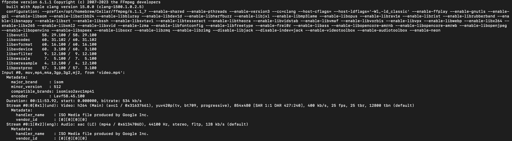

# Tools for probing and playing

## Inspecting with ffprobe

`ffprobe` is a comandline tool which comes with installing `ffmpeg`, and it is used to display information related to a media such as
- Resolution of a video
- Codec information
- Number of channels in an audio stream

Basically `ffprobe is a tool for analying media files.`


Example command: `ffprobe video.mp4`



### Output explanation
```
Version and Build Information:

ffprobe version 6.1.1: This is the version of ffprobe you are using.

built with Apple clang version 15.0.0: Indicates the compiler used to build ffprobe.

configuration:: Lists the options and external libraries that ffprobe was configured to support during its build, such as --enable-gpl, --enable-libx264, etc. These options enable various features and codecs in FFmpeg.

Library Versions:
libavutil, libavcodec, libavformat, etc.: These are the core libraries of FFmpeg, and the numbers indicate their respective versions. They provide utilities, codecs, format handling, device handling, filtering, scaling, resampling, and post-processing capabilities.
Input File Details:

Input #0, mov,mp4,m4a,3gp,3g2,mj2, from 'video.mp4': This indicates the input file video.mp4 and the formats it can be associated with (e.g., MOV, MP4, 3GP).
Metadata: Shows metadata like the major and minor brand, compatible brands, and the encoder used.

Stream Details:
The video has one video stream and one audio stream.
Video Stream (Stream #0:0):

Video: h264 (Main): The video codec is H.264 in the Main profile.

yuv420p: The pixel format, meaning it uses YUV with a 4:2:0 chroma subsampling.

854x480: The resolution of the video.

400 kb/s: The average bitrate of the video stream.

25 fps: Frames per second, the frame rate of the video.

Metadata: Includes information like the handler name and vendor id.

Audio Stream (Stream #0:1):

Audio: aac (LC): The audio codec is AAC in the Low Complexity (LC) profile. (aac stands for advanced audio coding)

44100 Hz: The sample rate of the audio.

stereo: The audio channel configuration (two channels).

128 kb/s: The average bitrate of the audio stream.

Metadata: Similar to video, includes handler name and vendor id.
```

### Terms to know from the above output
- Even though the file we supplied in the above `ffprobe` command is `.mp4`, We can see in the below line, there are numbe4r of formats it is associated with. Because extensions can be misleading, so ffprobe analyzes the file and lists down all the formats it can be associated with. 
```
Input #0, mov,mp4,m4a,3gp,3g2,mj2, from 'video.mp4': This indicates the input file video.mp4 and the formats it can be associated with (e.g., MOV, MP4, 3GP).
Metadata: Shows metadata like the major and minor brand, compatible brands, and the encoder used.
```

- `Codec`: Codec stands for `compressor-decompressor`. `Encoder` is a part of codec which encodes the files to reduce the file size while retaining as much quality as possible. For eg., `H.264` is a codec for video and `aac` is a codec for audio.

- Calculation for bitrate
```
854x480: The resolution of the video.
400 kb/s: The average bitrate of the video stream.
25 fps: Frames per second, the frame rate of the video.


854 * 480 = 409920 pixels
Assuming the display is 8 bit, which means each pixel needs 8 bits of data for rgb

So 409920 pixels = 409920 * 8 bits = 3279360 bits

And 25 is the fps, So per second data would be 25 * 3279360 bits = 81984000 bits

So 81984000 bits / second = 81 Mbps should be bitrate.
```

In the above calculation, the bitrate is for raw data. And the bitrate given in the `ffprobe` command is `400 Kbps` which is quite less. This is because, the H.264 codec and the `yuv420p` color sampling (In the YUV420p color format, not every pixel has its own color information. This format stores color information at a lower resolution than luminance. Specifically, for every 4 pixels, the color information is shared, which reduces the amount of data needed.) reduces the file size drastically.

- `Sampling`: Imagine audio recording as taking pictures of a sound wave at regular intervals. Each picture captures the wave's position at a specific moment in time. The process of taking these pictures is called sampling.

- `Sampling Rate`: This is how many of these pictures (or samples) you take in one second. For example, a sampling rate of 44,100 Hz (or 44.1 kHz) means that 44,100 samples of the audio are taken every second.

- More is the sampling rate, more clearer would be the audio.

- `Overall bitrate`: In the below output, `534` is the total average bitrate of the entire file, including all video, audio, and possibly other types of streams (like subtitles or metadata) and the overhead of the container format itself. It represents the amount of data processed per second when playing the file.

`534 (Overall bitrate) = 400 (Video bitrate) + 128 (Audio bitrate) + 6 (Bitrate for other streams like meta data)`

```
Duration: 00:11:53.92, start: 0.000000, bitrate: 534 kb/s
  Stream #0:0[0x1](und): Video: h264 (Main) (avc1 / 0x31637661), yuv420p(tv, bt709, progressive), 854x480 [SAR 1:1 DAR 427:240], 400 kb/s, 25 fps, 25 tbr, 12800 tbn (default)
    Metadata:
      handler_name    : ISO Media file produced by Google Inc.
      vendor_id       : [0][0][0][0]
  Stream #0:1[0x2](eng): Audio: aac (LC) (mp4a / 0x6134706D), 44100 Hz, stereo, fltp, 128 kb/s (default)
    Metadata:
      handler_name    : ISO Media file produced by Google Inc.
      vendor_id       : [0][0][0][0]
```

- `Container`: 


```
A container, in the context of digital media, is a file format that holds various types of data within a single file. This data typically includes video and audio streams, but it can also include other elements such as subtitles, metadata (like title, author, or description), and information about how these streams are synchronized and combined during playback. Here's how to understand it:

Wrapper: Think of a container as a wrapper or box that holds the different components of a media file together. Just like a physical container can hold various items, a digital container holds different types of digital media data.

Compatibility: Containers ensure that the bundled audio and video streams can be played together correctly across different playback systems. They manage how the data is stored and how different parts are synchronized during playback.

Examples of Containers: Common container formats include MP4, AVI, MOV, MKV, and FLV. Each of these can support a variety of audio and video codecs. For example, an MP4 file (a container) might hold video data compressed using the H.264 codec and audio data compressed using the AAC codec.

Flexibility: Containers are versatile in that they can support various codecs for audio and video. This flexibility allows users to balance between file size, quality, and compatibility requirements by choosing appropriate codecs within the desired container format.

In summary, a container format is a type of digital file that encapsulates encoded audio, video, and other media data, allowing them to be stored, transmitted, and played back as a cohesive unit. It ensures that all parts of the media file are packaged together and can be efficiently managed and played by media players.
```

## ffplay
ffplay is basically a basic media player shipped with ffmpeg as a command line tool.

- `ffplay video.mp4`: This command with play the video.mp4 file.

- `ffplay video.mp4 -an`: The command to play the video without audio.

- `ffplay video.mp4 -vn`: The command to play the file without video. This would show the audio waves.

- `ffplay video.mp4 -showmode waves`: To properly see the audio waves, use this command.
