# Media concepts
Media is a broad term which means it can have either image, video or audio

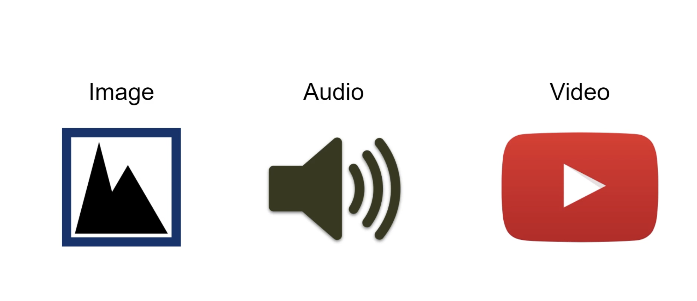

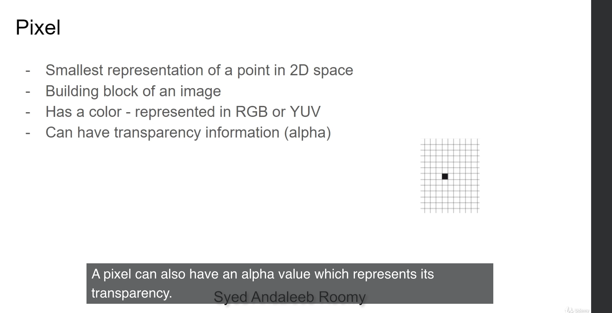


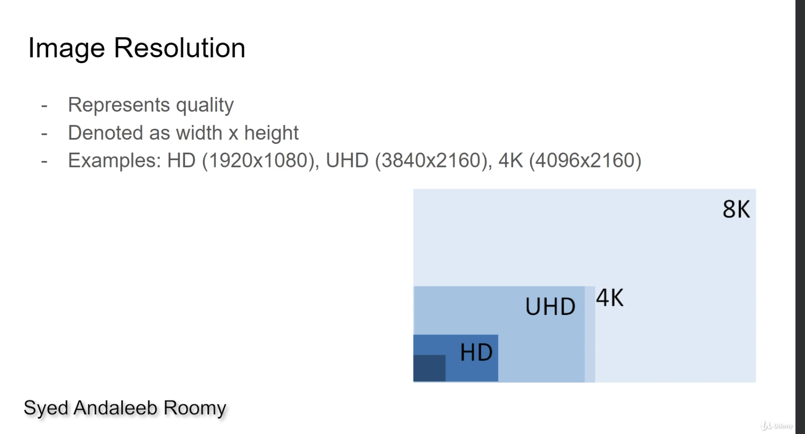


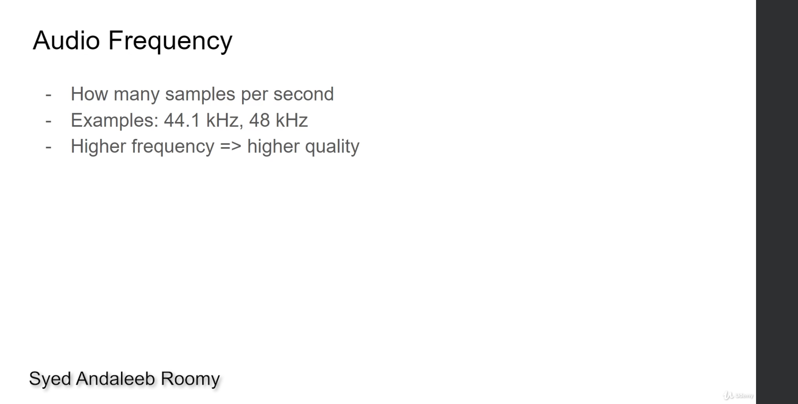


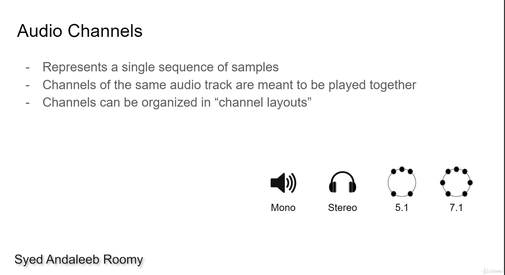

```
The phrase "channels of the same audio track are meant to be played together" refers to how multiple audio channels in a single track work in coordination to produce a cohesive sound experience. In audio recording and playback, a channel represents a stream of audio data that is intended to be heard from a specific direction or speaker in a sound system. Here's a more detailed explanation:

Mono and Stereo: In the simplest form, mono (monaural) audio uses one channel, meaning the same sound is played from all speakers. Stereo audio uses two channels (left and right), with different audio signals in each channel, creating a sense of width and direction in the sound.

Multichannel Audio: More complex systems, like surround sound, use multiple channels (such as 5.1 or 7.1 configurations) to create a more immersive audio experience. Each channel in these setups corresponds to a specific speaker location (front left, front right, center, etc.).

Cohesive Playback: When we say the channels of the same audio track are meant to be played together, it means that these distinct channels are designed to work in unison to produce a full, spatial sound experience. Each channel carries part of the sound, and when played together through a multi-speaker setup, they create a more realistic or immersive listening environment.

For example, in a 5.1 surround sound system, the audio track will have separate channels for front left, front right, center, subwoofer (bass), surround left, and surround right. These channels are synchronized to play together so that sounds meant to come from a certain direction are heard from that specific speaker, thus enhancing the realism and immersion of the audio experience.
```

### And what is .1 in 5.1 or 7.1 surround system? 
.1 in 5.1 signifies that the speaker apart from the other 5 main speakers, support low frequency sounds (It supports LFE channel which stands for Low frequency effects channel).

The subwoofer (which plays the .1 LFE channel) is not intended to stand alone but to supplement the main channels by adding depth and impact to the overall sound. This is another reason for the ".1" designation; it suggests that the subwoofer is an addition to the main set of speakers.

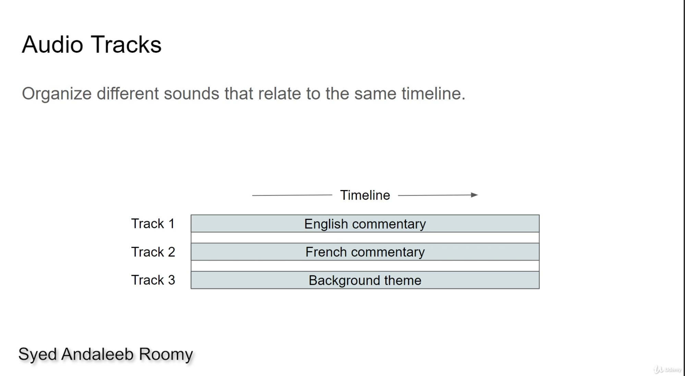
There can be different tracks in the same container for different languages or different tone etc.

Tracks can also be mixed together. For eg., French commentary and background theme can be mixed together to play the audio.

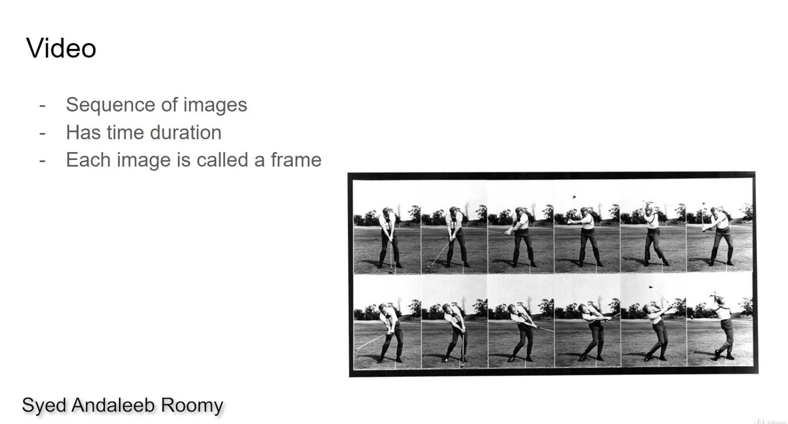

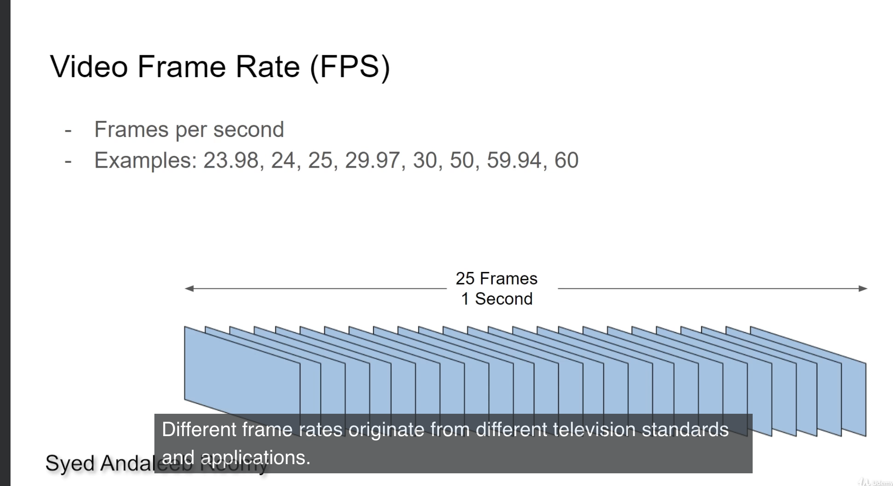

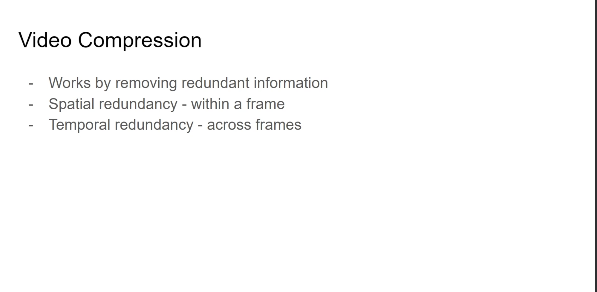

- `Spacial Redundancy`: There would be cases where within a particular area in a frame, the colors are almost same for all pixels. So here, instead of storing the colors for all the pixels in that area, color information for that whole area would be stored, thus reducing the size.

- `Temporal Redundancy`: Across frames, If there is no significant change, then the same frame would be played instead of storing the information of the other frame.

- `Quality Reduction for bitrate`: Encoders in codec are also responsible for quality reduction for low bitrates. 

## Codecs and containers
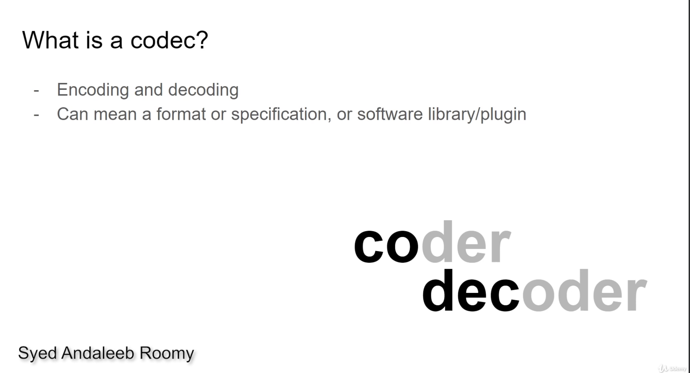
- Codec is also known as `compressor-decompressor`.

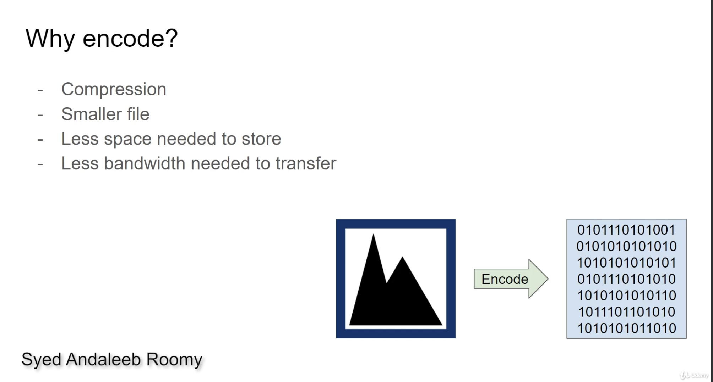

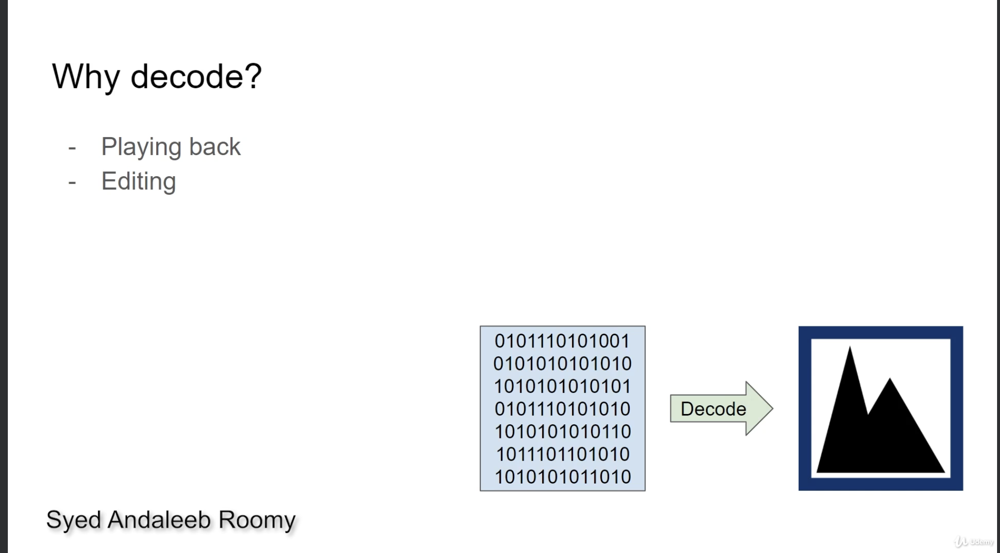

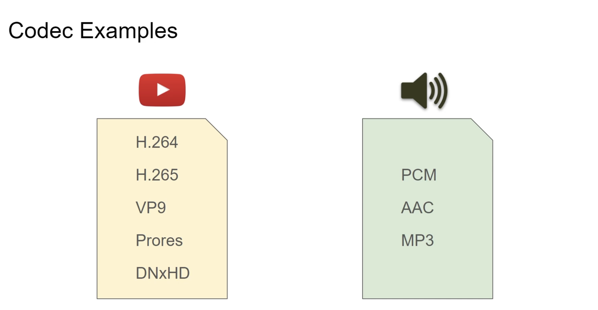

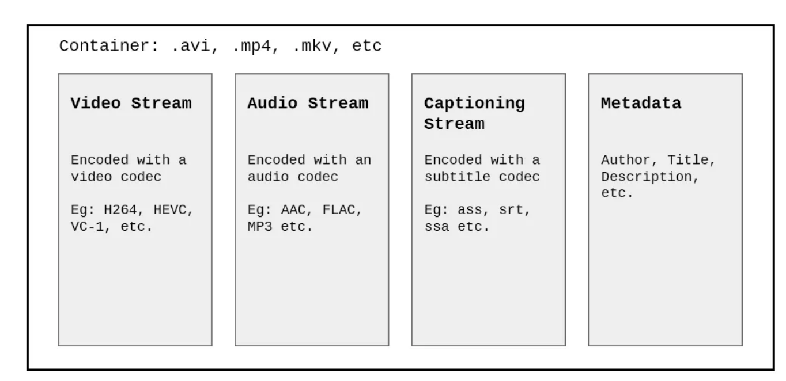

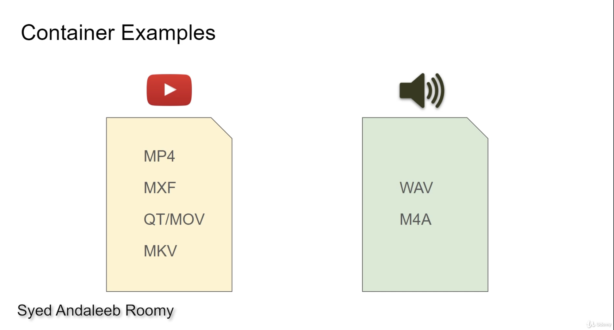

## Transcoders
The process of converting the stream from `one codec` to `another codec`.
- Transcoding would include `decoding, reformatting and re-encoding using other codec`.

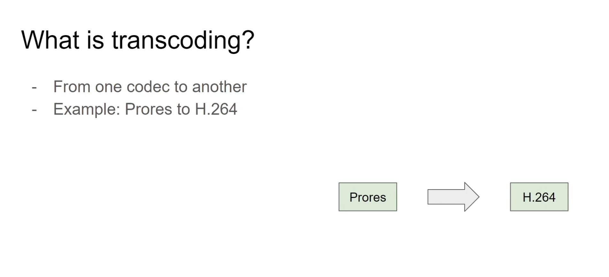

### Why transcode
- For example, many editors work with smartphone footage. These clips are often in the H264 or HEVC file format, a format that can be very processor intensive, which means it will slow down your machine. If you transcode those files into video formats like ProRes or DNx, you can more quickly edit your work.

- Some codecs are good in quality, while other codecs are good in compression
- Consuming application may not support media of a particular codec. In that case, we can transcode it to another codec. Like media from `prores codec` (Made by apple), may not be supported by smartphones. In that case, we would transform the stream to `H.264 codec` which is supported by many devices.

### The following processes also may happen during transcoding

### Transmuxing
Transmuxing is basically converting the file from `one container` to `other container`.

Transmuxing may be done in transcoding process itself.

One reason of transmuxing would be that not all applications support all containers. Most of them support `mp4` containers. So we have to transmux to `mp4` to be able to play the media.


### Framerate conversion
Framerate conversion also can happen during `transcoding` process.

### Bitrate conversion
Bitrate conversion also can happen during `transcoding` process.

### Subtitles
If the media has subtitles in the container, during `transcoding` process, we may chose to use the subtitles info to place it in a different file or burn the subtitles in the video itself.

### Timecodes
Timecodes are embedded by the camera when video is recorded. During `transcoding`, we can also change the timecode as well as burn them in the video.

### Convert video resolution
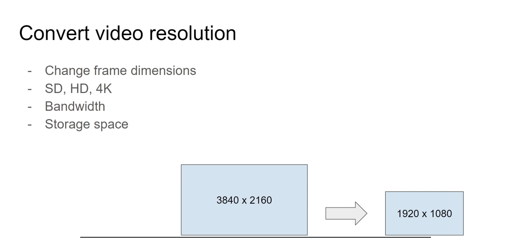
This is a common operation while `transcoding` (Specially in streaming).
In streaming, during transcoding, we would require video streams of 360p, 480p, 720p, 1080p, 2160p etc.

### Audio volume adjustment


### Audio mixing
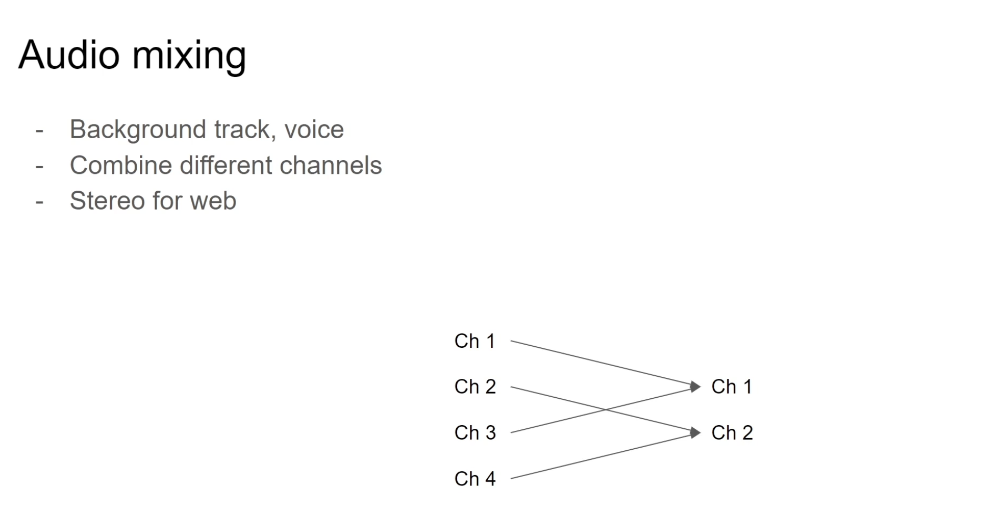

### Apply effects
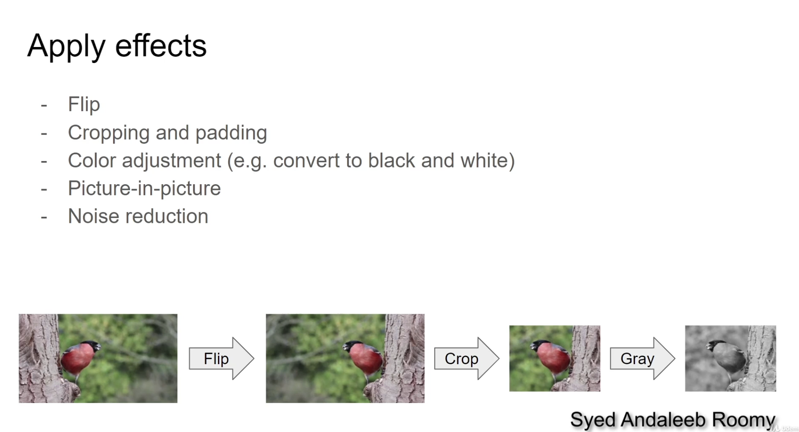

### Transcoding flow
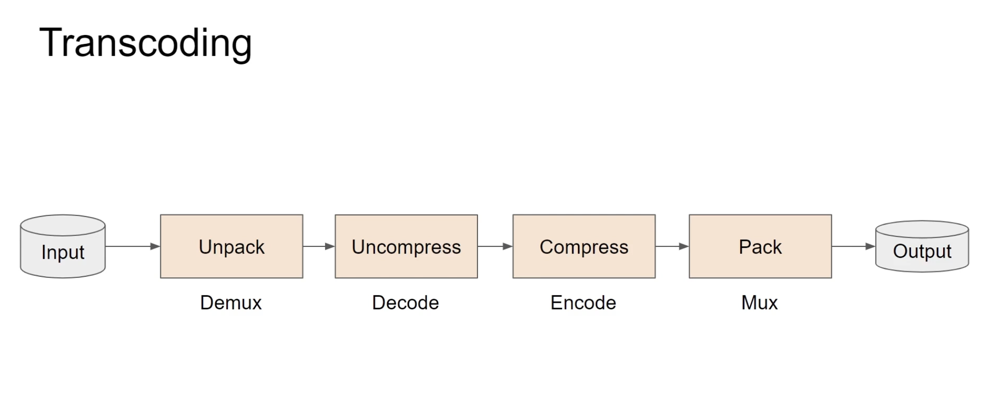

In the state between uncompress and compress, processing happens.

- Unpack means separating the multiple streams such as video, audio, subtitles etc since every stream needs to be processed individually.


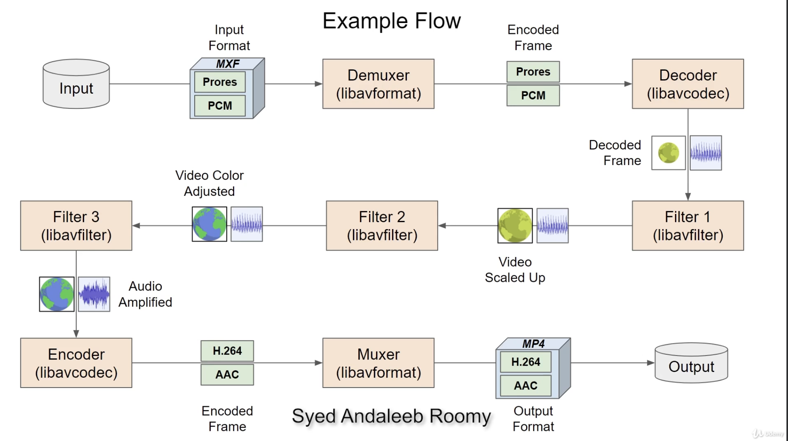

- Input media goes through the `demuxer` which separates the streams since each stream (video, audio, subtitle etc) needs to be handled separately. This is done by `libavformat` library.

- Then after `demux` process, the streams have to be `decoded`. This is done using `libavcodec` library.

- After decoding, it can go through many filters, as shown in the example. This is done by `libavfilter` library.

- Then after going through the filters, the streams go through the `encoding` process, with the help of `libavcodec` library.

- And finally, it goes through `muxing` process, where the streams are packaged into a container using `libavformat`.


```
Note: av in the libraries like libavcodec stands for audio video.
```

We can do transcoding using `ffmpeg` commands.