# Streaming
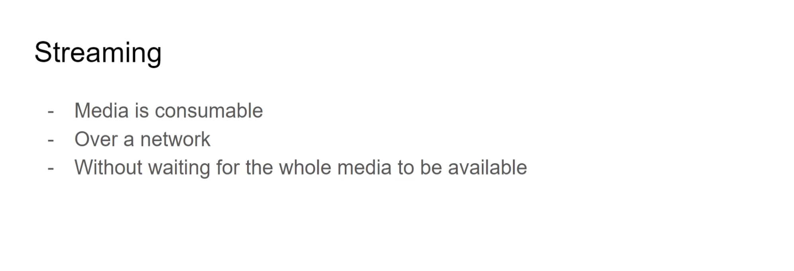
Streaming means it has to happen over a network and we don't have to wait for the whole media to be downloaded before playing.

In case, we are first downloading the whole media and then playing, it cannot be called streaming.

In streaming, the media parts are downloaded and played simultaneouly.

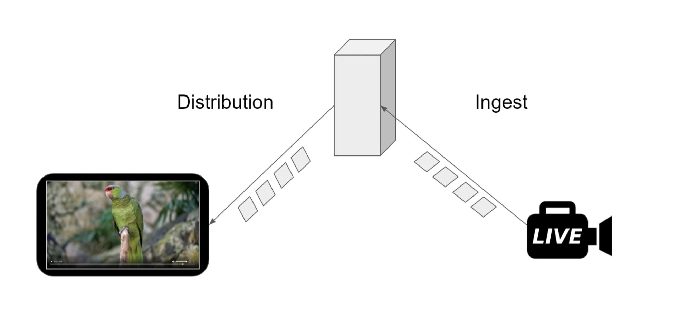
- Camera to server side is called `ingest` and server to client side is called `distribution`.

Streaming of media from camera to server is called `ingest` whereas streaming of media from server to client is called `delivery`.

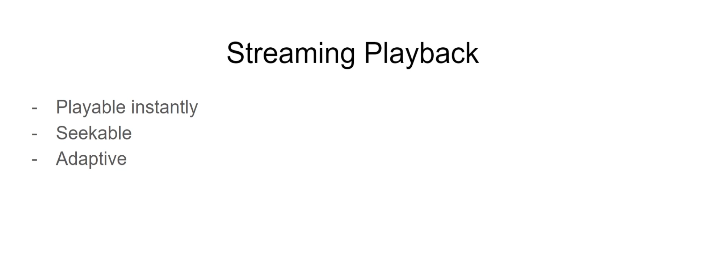

- The media should be playable instantly.
- The media should be seekable (Meaning we can play the media from a random timestamp).
- The media should be streamed in adaptive bitrate. For eg., if the media streaming currently is of 720p and if there are some network problems, then the quality should automatically be dropped to ensure smooth streaming.


# m3u

## Intro
m3u stands for `Moving Picture Experts Group Audio Layer 3 Uniform Resource Locator`. Although the name suggests it is for audio, this is used for video as well.

## file format
An M3U file is a plain text file that specifies the locations of one or more media files. The file is saved with the "m3u" filename extension if the text is encoded in the local system's default non-Unicode encoding (e.g., a Windows codepage), or with the `m3u8` extension if the text is UTF-8 encoded.

Each entry carries one specification. The specification can be any one of the following:

```
(1) an absolute local pathname; e.g., C:\My Music\Heavysets.mp3

(2) a local pathname relative to the M3U file location; e.g. Heavysets.mp3

(3) a URL
```

<a href="player/media/media.m3u8">Link to an example m3u8 file</a>

```
#EXTM3U
#EXT-X-VERSION:3
#EXT-X-TARGETDURATION:4
#EXT-X-MEDIA-SEQUENCE:6059
#EXT-X-PROGRAM-DATE-TIME:2024-04-09T16:07:28.200Z
#EXTINF:4.00000,
master_1080p_06059.ts
#EXTINF:4.00000,
master_1080p_06060.ts
#EXTINF:0.84000,
master_1080p_06061.ts
#EXT-OATCLS-SCTE35:/DA4AAAAAyiYAP/wBQb+fEmPUAAiAiBDVUVJBAAAiH/AAAAbd0AODE1QSDAwMDAwNzQyNSABAd4lm0Q=
#EXT-X-BLACKOUT:TYPE=CHAPTER_START,CAID=0x4D5048303030303037343235
#EXTINF:3.16000,
master_1080p_06062.ts
#EXTINF:4.00000,
master_1080p_06063.ts
#EXTINF:4.00000,
master_1080p_06064.ts
```
Key value pairs in m3u8 file are denoted using # notation.
- `#EXTM3U`: This tag marks the start of the M3U8 file.
- `#EXT-X-VERSION`: Specifies the version of the playlist file.
- `#EXT-X-TARGETDURATION`: The maximum duration of any media segment in the playlist.
- `#EXT-X-MEDIA-SEQUENCE`: The sequence number of the first segment in the playlist.
- `#EXT-X-PROGRAM-DATE-TIME`: Specifies the absolute date and time of the beginning of the first segment in the playlist.
- `#EXTINF`: Specifies the duration of a media segment. Followed by the filename of the segment (e.g., master_1080p_06059.ts).
- `#EXT-OATCLS-SCTE35`: Contains SCTE-35 (`Society of Cable Telecommunications Engineers` and 35 indicates standard 35) messages base64 encoded, which are used for signaling ad insertion points or other content splicing events. It contains information like ad duration etc.
- `#EXT-X-BLACKOUT`: This tag is used to indicate blackout restrictions for specific segments or chapters. A blackout period typically refers to a time when certain content, such as advertisements or specific segments of the live event, should not be displayed or should be replaced with alternate content.
- Also there are different m3u8 files for different bitrates. The above is a manifest file for 1080p.

In the above m3u8 file, it suggests that first `master_1080p_06059.ts` should be played, then `master_1080p_06060.ts` should be played, then 
`master_1080p_06061.ts` should be played and then we encounter a scte message, where ads can be played and then a blackout period where it may mean that specific segments should not be displayed or another content should be displayed in this case.

## ts (transport stream) file
ts file is short form for mpeg-ts and it stands for `transport stream`. It is also a container.
- ts containers are light weight as compared to containers like mp4 that make them preferable for streaming.
- For eg., ts containers do not have mapping of time-stamp to segments (which allow for random seeking) and also other meta data which is present in the mp4 containers.
- These containers contain a header called `Continuity Counter (4 bits)`, a sequence number that increases with each packet of the same PID, used for detecting loss or rearrangement of packets.
- Also, in live streaming, the media is split into multiple ts files of small sizes, so that even if a ts file is missed, then the player can start playing the next `ts` files and there won't be any noticable effect for this as the file sizes are very small.

## HLS (HTTP Live streaming) Protocol
- HLS is used in live streams which uses m3u8 to stream
- In HLS, the video content is divided into small segments (ts files are small segments)
- HLS protocol is designed by apple.
- HLS uses `HTTP` which in turn uses `TCP protocol` for packet delivery

# My understanding of how live streaming works using HLS (HTTP Live Streaming)
1. When client requests for a particular live stream, a master m3u8 file is generally served which contains m3u8 manifest file names (media manifest) of different streams (of different bitrates generally). According to factors like net speed and player size, A particular media manifest is then processed.
2. Using the chosen m3u8 (media manifest), the player starts to fetch and play the `.ts files`.
3. When it encounters a SCTE marker,
    
    (a) If CSAI (Client side ad insertion) is enabled, then the player would query the ad server to play the ad for a duration that is mentioned in the `SCTE` decoded message.
    
    (b) If SSAI (Server side ad insertion) os enabled, then the ad is already stiched to the incoming stream, so player may choose to ignore this in this case

4. During blackout period, the player may choose to display some dedicated content.

5. After this, the player again plays the next ts file.

6. In live streaming, the player queries for updated m3u8 files every certain interval to get the latest chunks to play.

7. For adaptive streaming, if the player detects network congestion, then it would request for another m3u8 file which contains ts files with lower bitrate.

In HLS streaming, if a TS segment is not successfully downloaded after several retransmission attempts (due to network congestion, for example), the player may skip to the next segment to maintain continuity of the stream, leading to a potential brief interruption or quality change in the video.

### TCP or UDP transport layer for live streaming. What to choose.
`Live Events with Tolerance for Slight Delay`: For live events where a slight delay (a few seconds) is acceptable, the benefits of reliable delivery and adaptive quality offered by HLS outweigh the latency advantage of UDP-based streaming.

`Real-Time Interaction`: For scenarios requiring real-time interaction, such as video conferencing or gaming, UDP-based protocols like WebRTC or RTMP are preferred due to their lower latency.


## DASH (Dynamic Adaptive Streaming over HTTP) Protocol
`Segmentation`: In DASH, the video content is divided into small segments, similar to HLS. Each segment is a portion of the content, typically a few seconds long.

`Manifest File`: DASH uses a manifest file (often called an MPD, or Media Presentation Description), which is similar to the M3U8 playlist in HLS. The MPD file describes the structure of the content, including the available segments, their URL locations, and the different quality levels (bitrates) available. 

<b>However the manifest file is an XML based file here</b>,

`Adaptive Streaming`: The DASH player reads the MPD file and decides which quality level to download based on the current network conditions and device capabilities. It then fetches and plays the segments in sequence, adapting the quality as conditions change to provide a smooth viewing experience.

This is also similar to HLS.

## Differences Between DASH and HLS:
Standardization: DASH is an international standard, developed by the Moving Picture Experts Group (MPEG), while HLS is a proprietary protocol developed by Apple. However, HLS has been widely adopted and is supported on almost all platforms and devices.

Manifest File: DASH uses an XML-based MPD file to describe the media presentation, whereas HLS uses an M3U8 playlist, which is a simpler, line-based text file format.

Codec Support: DASH is codec-agnostic, meaning it can support any video and audio codec, including H.264, H.265 (HEVC), VP9, and AV1. In contrast, HLS traditionally used H.264, but newer versions have expanded support for other codecs like H.265 and VP9.

Delivery Method: Both DASH and HLS use HTTP for media delivery, making them compatible with standard web infrastructure and capable of adaptive bitrate streaming. However, the specifics of how they handle segment fetching and indexing can differ.


## For VOD (Video on demand)
`ts` files cannot be used since they do not contain the mapping of time stamp to chunks for random seeking and this would give the users bad experience.

For this, we can use containers such as `fmp4 (fragmented mp4)` which contain the meta data like the index which then contains the mapping of timestamp to chunks for seeking.

Such containers can be used and the delivery protocol could be `HLS` or `mpeg-dash` in this case.


## Protocols for streaming
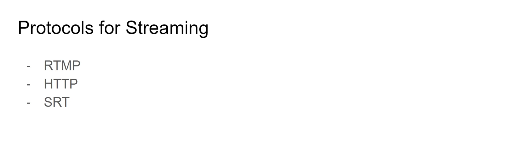

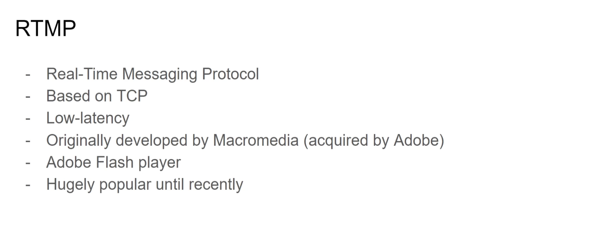

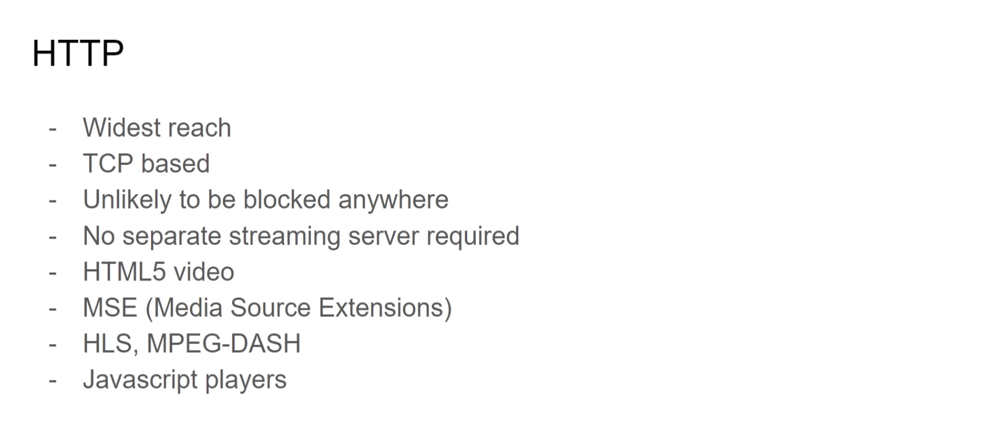

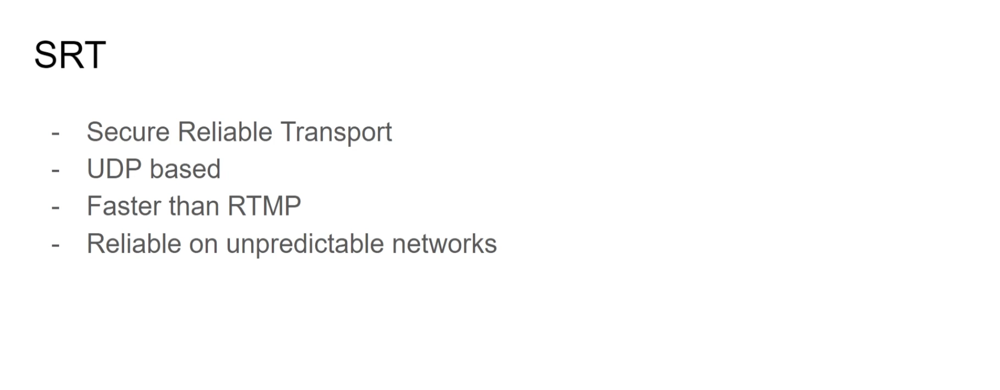


- The mp4 container has several sections and they are called `atoms or boxes`.


- `ftyp (File Type Box)`: ftyp contains info about variant of file, whether it is `mp4`, or `qt/mov` etc.
- `mdat (Media Data Box)`: Contains the media data (encoded video, audio, subtitle streams).
- `moov (Movie Box)`: This contains metadata like bitrate, fps, index (Mapping of timestamp to that frame for random seeking), codec info etc.

```
When camera records a video, the moov data is still not known and after the video has been completely recorded, then moov data is added. So it is not uncommon to see in many media files that the moov atom is placed at the end. 

This happens during the encoding phase
```

### When the moov atom is placed at the end, then it is called `non-fast-started mp4`. 

### Now if the moov atom is placed at the end of the file which contains the index (Mapping of timestamp to frame), then the player would either have to
### 1. Download the whole container to get to the moov atom
### 2. Can place a `show content` request to only get the moov data and then process the media data (This happens generally).

### But if the `moov` atom is placed before the `mdat` atom, then it would be easier for the player to play the media.

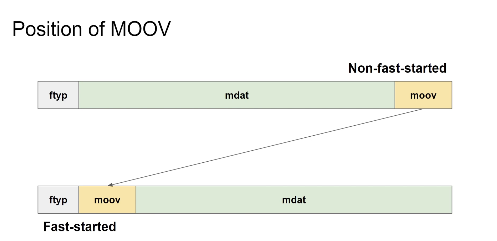


## What happens when moov atom is placed at the beginning or end?

### Case 1: Non seekable and non fast started mp4
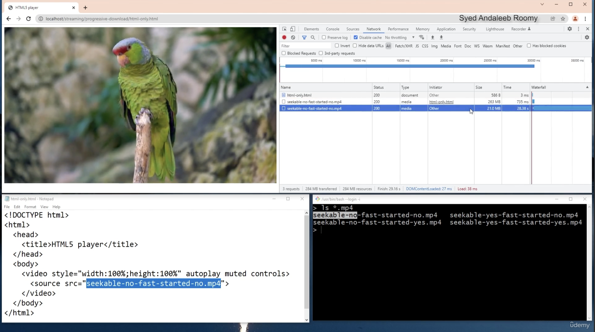

- In this case, the video is non seekable and non fast started, which means the moov atom is at end. In this case, the player first downloads the whole file (See first request in network) to get to the moov atom and then issues another request to stream.

- NOTE: The server of this video in this case, does not allow for partial download request or range requests for the moov atom and so whole file is downloaded


### Case 2: Non seekable and non fast started mp4
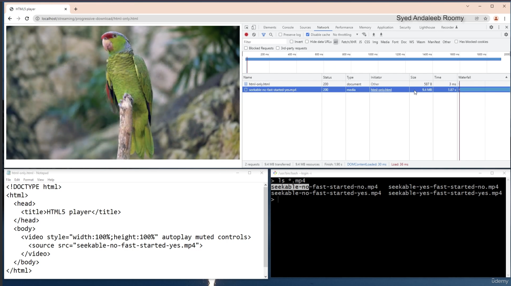

- In this case, the player starts to play the media and in the network tab, we see only one request, since the moov atom is at the start now.

### Case 3: Seekable and non fast started mp4
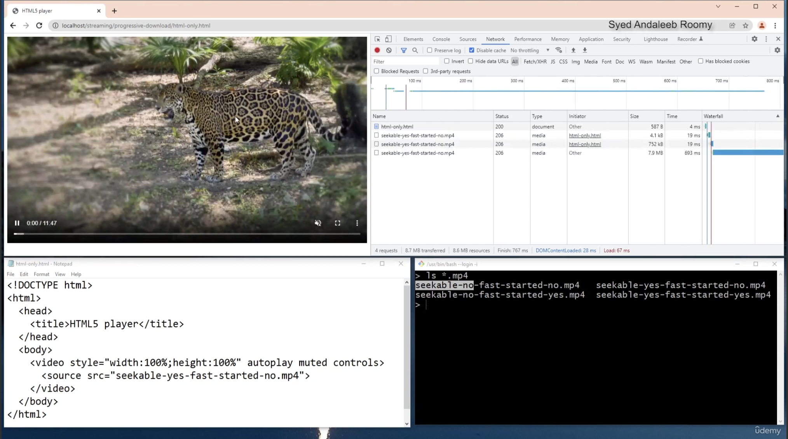

- In this case, we see that there are three requests in this case.
- In the first request, the player starts reading the file and notices that moov atom is not at the start.
- For the second request, the player issues this to get the moov atom (range requests are enabled for this server).
- Now in the third request, the player plays the media

### Case 4: Seekable and fast started mp4
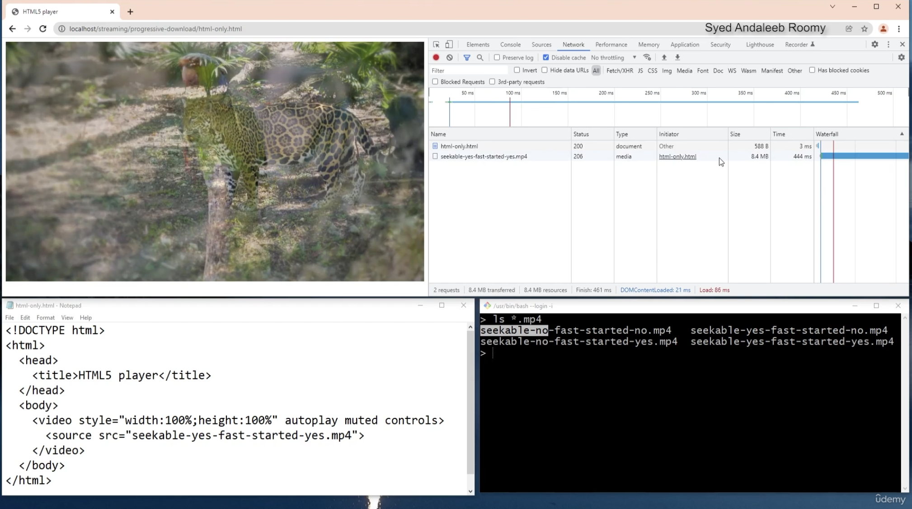

- In this case also, we see only one request in the network tab, but if we seek to any other random point, the player would issue another request to get media from that timestamp.


### In case 3, we can see that there is little bit of delay that is not present in the case 4, due to moov atom being placed at the end in case 3. So for ideal streaming, ensure moov atom is placed before the mdat atom.

Using ffmpeg, we can visualise the atom structures and also move the moov atom to start or end.

# Adaptive streaming upscaling / downscaling

In adaptive streaming, let's say the video has a resolution of `1280 * 720` and the screen has a resolution of `1920 * 1080`, then what happens is the media is streamed and then `upscaled` to fit the screen.

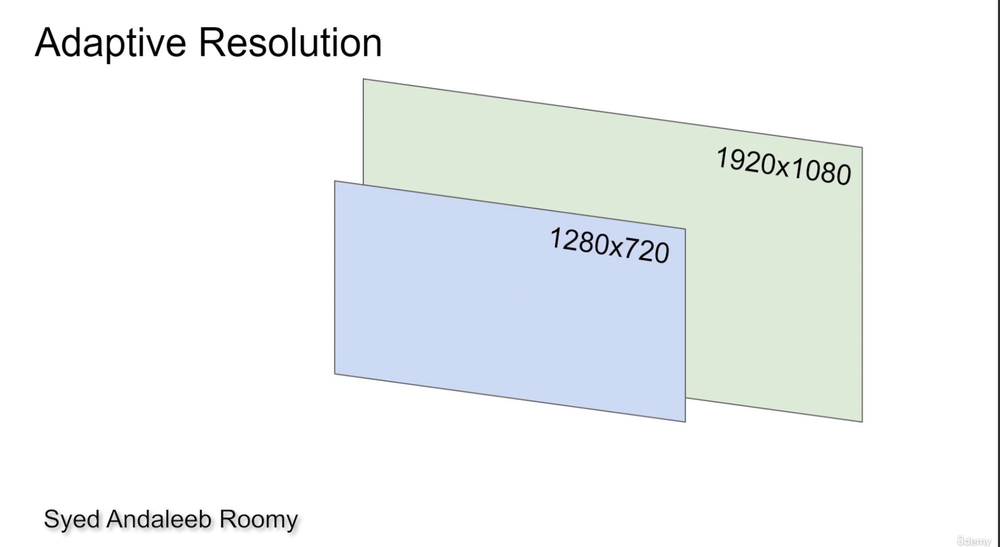

if the screen has `1020 * 576` resolution, then there are two choices here (As `1280 * 720` and `854 * 480` both streams are available), either get `720p` stream or `480p` stream. The usual choice here would be to get the `720p` stream and `downscale` to `576p` as in downscaling, the quality remains good.
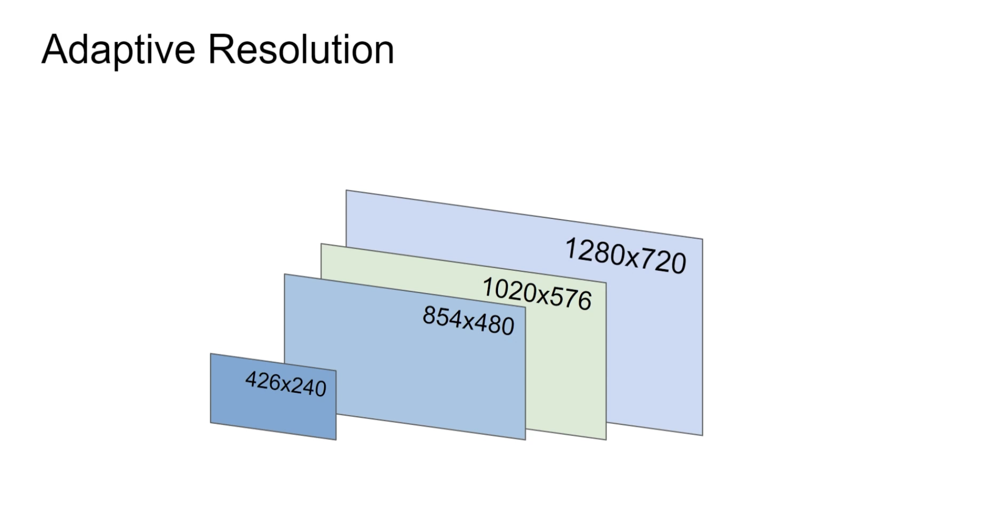


## Experiment with adaptive streaming
Suppose we have the m3u8 and ts files for different bitrates. Now, while playing the media, we would notice that if we lower the size of the player, then low bitrate ts file would be requested by the player to stream. 

And if we increase the size of the player, the player would request high bitrate ts file to be streamed.

# HLS AND DASH
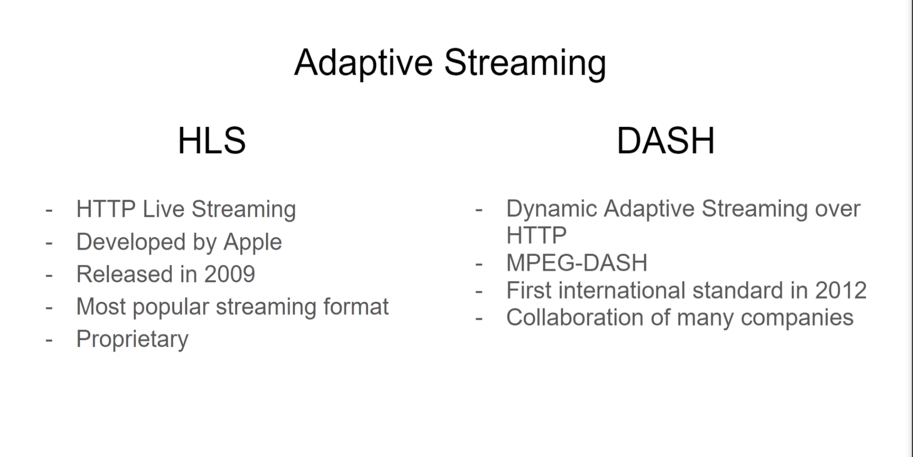

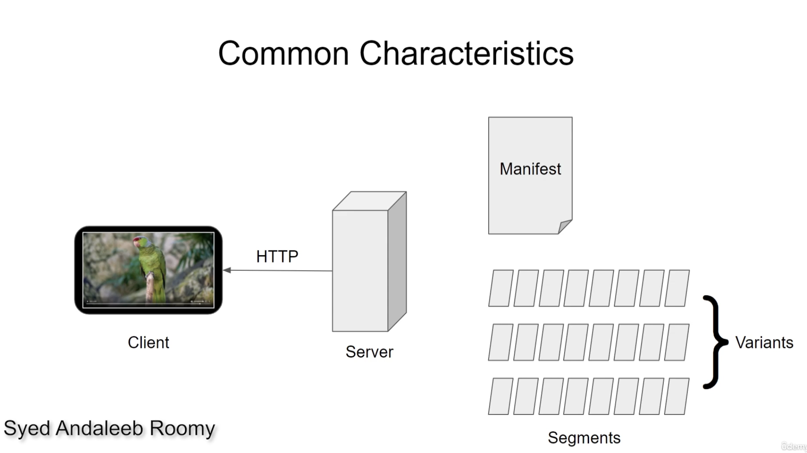
- HLS and DASH both are similar in how they work. They use http protocol, use manifest files (m3u8 for hls and xml based manifest for dash) and they both segment the media for easier delivery.

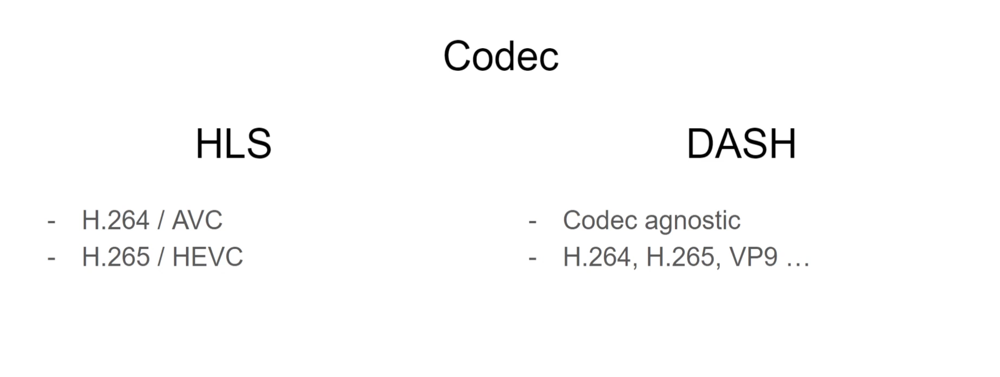
- HLS supports limited number of codecs but dash is codec agnostic (meaning it can support any codec).

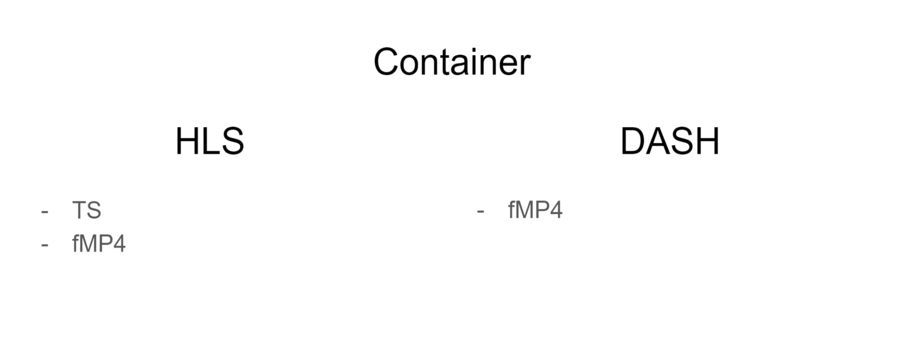
- fMP4 stands for fragment mp4 which can be used in VOD. 

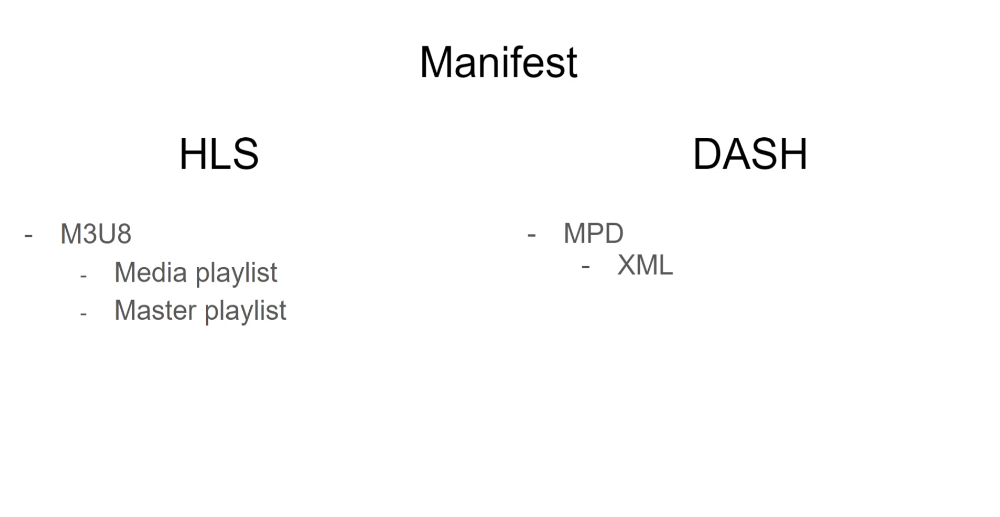

- In HLS, we have `master playlist`, which contains the file pointers to `media playlists`. 

The below is a `master` playlist which contains `media playlists` of a stream of different bitrates `(416 * 234p), (512x288p)` etc, and based on factors like net speed or player size, the corresponding `media playlist` is downloaded and then corresponding `ts` files are downloaded and streamed.
```
#EXTM3U
#EXT-X-VERSION:3
## Created with Broadpeak BkS350 Origin Packager  (version=1.11.2-24244)

# variants
#EXT-X-STREAM-INF:BANDWIDTH=212000,AVERAGE-BANDWIDTH=193000,CODECS="mp4a.40.2,avc1.42E00D",RESOLUTION=416x234,FRAME-RATE=25
hdntl=exp=1712922680~acl=%2f*~id=8968ed00e2a44a82b01bf475ce34355c~data=hdntl~hmac=7ca901e697bd4cdb68822ea744c52d8d0880d99c701f36e0e971411a739a4f30/News18_Gujarati_voot_MOB-audio_33635_eng=33600-video=148000.m3u8
#EXT-X-STREAM-INF:BANDWIDTH=467000,AVERAGE-BANDWIDTH=424000,CODECS="mp4a.40.2,avc1.42E015",RESOLUTION=512x288,FRAME-RATE=25
hdntl=exp=1712922680~acl=%2f*~id=8968ed00e2a44a82b01bf475ce34355c~data=hdntl~hmac=7ca901e697bd4cdb68822ea744c52d8d0880d99c701f36e0e971411a739a4f30/News18_Gujarati_voot_MOB-audio_98834_eng=98800-video=301200.m3u8
#EXT-X-STREAM-INF:BANDWIDTH=824000,AVERAGE-BANDWIDTH=749000,CODECS="mp4a.40.2,avc1.4D401F",RESOLUTION=864x486,FRAME-RATE=25
hdntl=exp=1712922680~acl=%2f*~id=8968ed00e2a44a82b01bf475ce34355c~data=hdntl~hmac=7ca901e697bd4cdb68822ea744c52d8d0880d99c701f36e0e971411a739a4f30/News18_Gujarati_voot_MOB-audio_98834_eng=98800-video=607600.m3u8
#EXT-X-STREAM-INF:BANDWIDTH=1122000,AVERAGE-BANDWIDTH=1020000,CODECS="mp4a.40.2,avc1.4D401F",RESOLUTION=1024x576,FRAME-RATE=25
hdntl=exp=1712922680~acl=%2f*~id=8968ed00e2a44a82b01bf475ce34355c~data=hdntl~hmac=7ca901e697bd4cdb68822ea744c52d8d0880d99c701f36e0e971411a739a4f30/News18_Gujarati_voot_MOB-audio_98834_eng=98800-video=863200.m3u8
#EXT-X-STREAM-INF:BANDWIDTH=2075000,AVERAGE-BANDWIDTH=1886000,CODECS="mp4a.40.2,avc1.64001F",RESOLUTION=1024x576,FRAME-RATE=25
hdntl=exp=1712922680~acl=%2f*~id=8968ed00e2a44a82b01bf475ce34355c~data=hdntl~hmac=7ca901e697bd4cdb68822ea744c52d8d0880d99c701f36e0e971411a739a4f30/News18_Gujarati_voot_MOB-audio_98834_eng=98800-video=1680400.m3u8
```

- In Dash, `MPD` is the manifest which is short form for `Media Presentation Description` which is an `XML` based manifest file with extension as `.mpd`. It also has pointers to `m4s` streams of different bitrates and these files in turn have pointers to actual `m4s` files which contain the media data.

Example `.mpd` file:
```
<?xml version="1.0" encoding="UTF-8"?>
<MPD xmlns="urn:mpeg:dash:schema:mpd:2011" xmlns:xsi="http://www.w3.org/2001/XMLSchema-instance" xsi:schemaLocation="urn:mpeg:dash:schema:mpd:2011 DASH-MPD.xsd" type="static" mediaPresentationDuration="PT0H3M30.5S" minBufferTime="PT2S" profiles="urn:mpeg:dash:profile:isoff-on-demand:2011">
  <Period start="PT0S" duration="PT0H3M30.5S">
    <AdaptationSet mimeType="video/mp4" segmentAlignment="true" startWithSAP="1" subsegmentAlignment="true" subsegmentStartsWithSAP="1">
      <Representation id="video_240p" bandwidth="200000" width="426" height="240">
        <BaseURL>https://example.com/video_240p/</BaseURL>
        <SegmentTemplate media="video_$Number$.m4s" initialization="video_init.m4s" timescale="90000" duration="900000"/>
      </Representation>
      <Representation id="video_480p" bandwidth="400000" width="854" height="480">
        <BaseURL>https://example.com/video_480p/</BaseURL>
        <SegmentTemplate media="video_$Number$.m4s" initialization="video_init.m4s" timescale="90000" duration="900000"/>
      </Representation>
    </AdaptationSet>
    <AdaptationSet mimeType="audio/mp4" segmentAlignment="true" startWithSAP="1" subsegmentAlignment="true" subsegmentStartsWithSAP="1">
      <Representation id="audio_en" bandwidth="64000">
        <BaseURL>https://example.com/audio_en/</BaseURL>
        <SegmentTemplate media="audio_$Number$.m4s" initialization="audio_init.m4s" timescale="48000" duration="240000"/>
      </Representation>
    </AdaptationSet>
  </Period>
</MPD>

```
In the above mpd file, we can see the `initialization` field for each stream and those `m4s` files have pointers to the `m4s` files which contain the actual media data. (Just like the master and media playlists in HLS).

## We can use `ffmpeg` to generate hls and dash streams!


