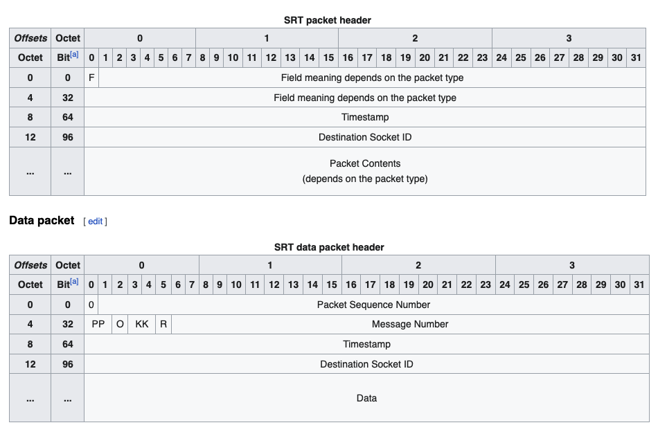

# SRT (Secure reliable transport) vs HLS

Deep dive into these topic with 
- [SRT Open Source Streaming for Low Latency Video By Haivision](./Haivision_White_Paper___SRT_Open_Source_Streaming.pdf).
- [SRT Wiki](https://en.wikipedia.org/wiki/Secure_Reliable_Transport).

## Overview
- SRT uses `UDP` and HLS uses `TCP` for transport delivery mechanisms. 

- SRT provides connection and control, reliable transmission similar to TCP; however, it does so at the `application layer`, using UDP protocol as an underlying transport layer. It supports packet recovery while maintaining low latency (default: 120 ms). SRT also supports encryption using AES.

- SRT provided the reliability mechanism by utilising similar methods for connection, sequence numbers, acknowledgements and re-transmission of lost packets but in application layer.

### Congestion control
- In TCP, we have congestion control flags such as `ECE` (Explicit Congestion Notification Echo), `CWR` (Congestion Window Reduction) and `Window size` for congestion control over a network.

- While this is good for reducing network congestion, <b>IT IS NOT APPROPIATE FOR A VIDEO SIGNAL</b> and so, these flags are not present in `SRT` packet which makes the packet light weight.

### Error correction
- TCP requires all previous packets to be transmitted before sending any new packet. This might seem like a good way, but it is not. With Video, a few lost bytes can be corrected or neglected. 

- With TCP, it is not possible to skip over `bad bytes`, instead, the protocol will continue to retry sending missing data as long as it takes. This can have a significant impact on viewers such as frozen frames.

- But with SRT, it is possible to skip over `bad bytes`, unless there is significant loss of packets which may affect the experience. In this case, the client asks the server to retransmit the packets.

## Hand shakes
SRT like TCP also begins with hand shake which is required for retransmission of packets if something goes wrong.

## SRT Packet

# Why SRT protocol is not used generally in the delivery side
- Lack of player and browser support.
- With HLS, we divide the media into multiple chunks, create master, media playlists and upload them to CDN. HLS also supports `Adaptive streaming`, which adapts to higher / lower bitrate streams according to the network speed.
- Also the error correction mechanisms are implemented in the application layer for `SRT`, which are not supported generally by CDNs.

